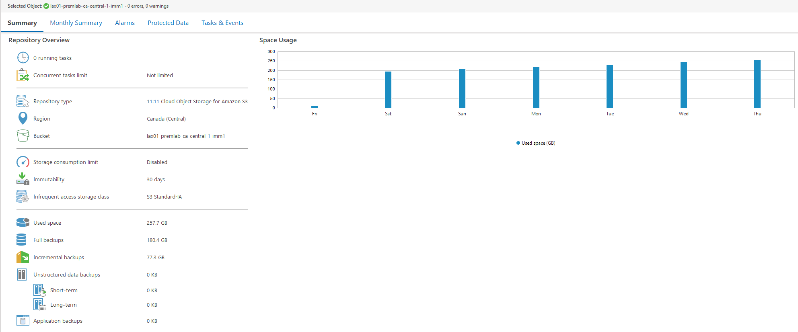
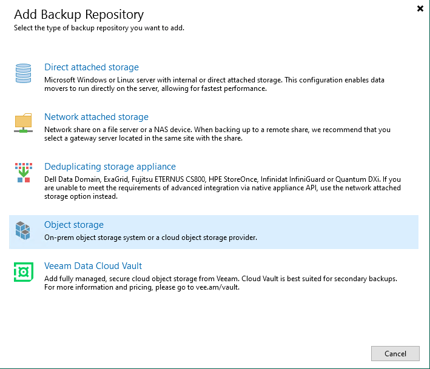
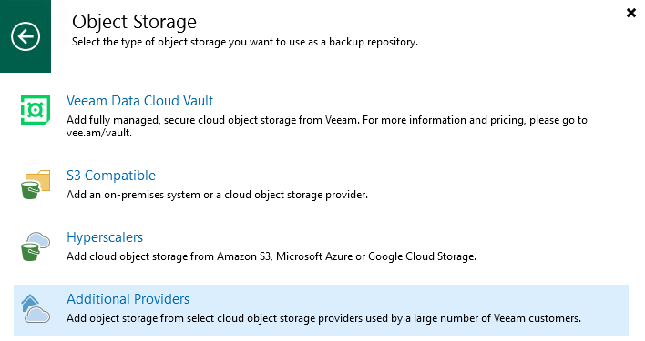
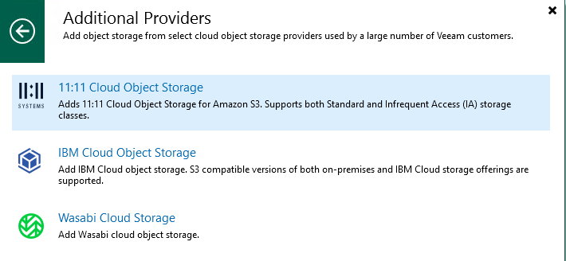
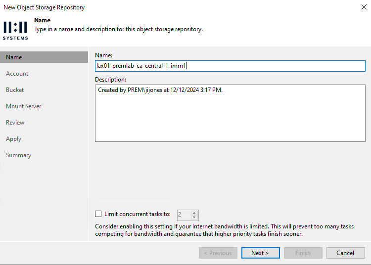
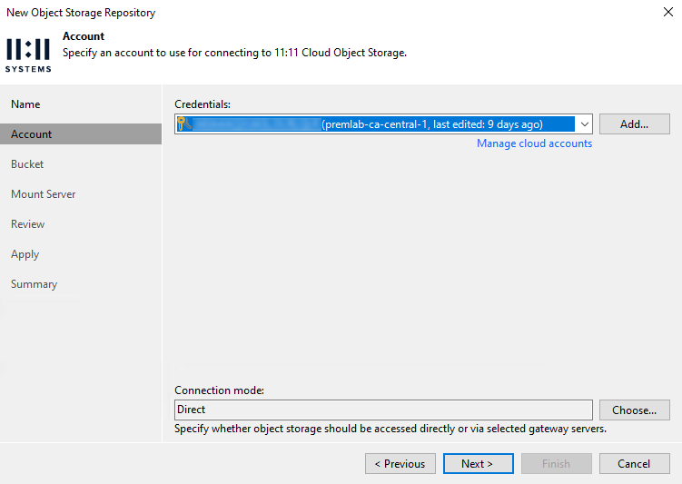
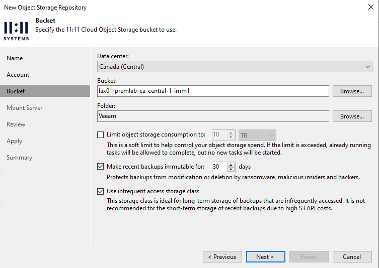
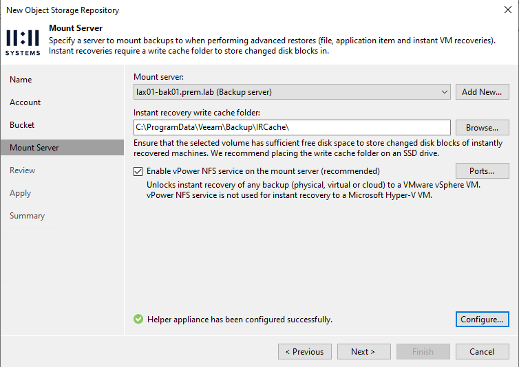
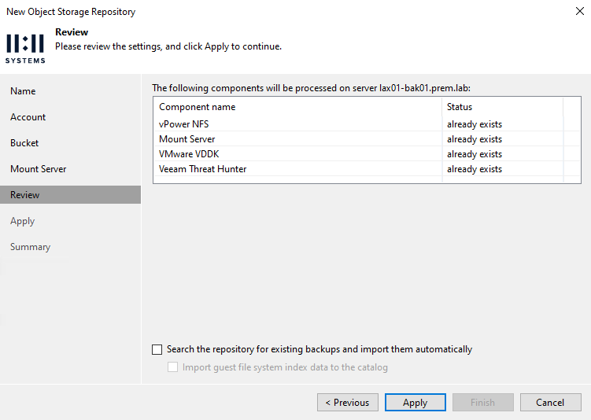
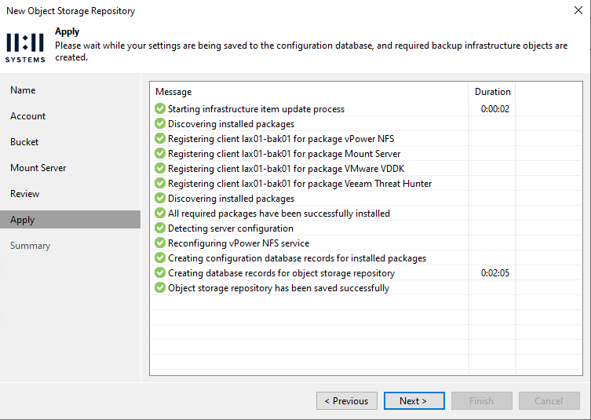

+++
title = "11:11 Systems Object Storage in Veeam Data Platform 12.3"
date = "2025-03-03T09:38:18Z"
draft = false
tags = [ "AWS", "how to", "object storage", "s3", "veeam",]
categories = [ "AWS", "Object", "Storage", "Veeam",]
featureimage = "featured.png"
+++


*\*Note: This is a modified version of a post I've written for the 11:11 Systems Innovation Blog. This post includes more nerdy bits so please choose your own adventure. The original blog can be viewed at <https://1111systems.com/blog/1111-systems-object-storage-in-veeam-data-platform-12-3/>.*

With the 12.3 release of the Veeam Data Platform 11:11 Systems low cost and Veeam optimized Cloud Object Storage product directly integrated into the Veeam UIs for both the Backup &amp; Replication and Veeam ONE products. With this integration you get the power and efficiency of 11:11 Systems' relationship with the AWS S3 with a streamlined implementation model that can be monitored separately from other AWS based storage that you may have.

While this starts with the Backup &amp; Replication Console application there are many ways to interact with this new storage with Veeam. There are new cmdlets in the Powershell modules, API calls to automate deployment, management and monitoring and finally a full suite of capabilities in Veeam ONE.



## Documentation

Veeam Help Center Docs - [https://helpcenter.veeam.com/docs/backup/vsphere/adding\_1111.html?ver=120](https://helpcenter.veeam.com/docs/backup/vsphere/adding_1111.html?ver=120)

11:11 Success Center Docs - <https://success.1111systems.com/docs/cloud-object-storage/add-aws-s3-as-vbr-direct-repository>

## Automation

To make this easy to do over and over I've written a powershell script that uses the provided AWS key pair and region to:

- Add credentials to specified Veeam Backup &amp; Replication server
- Create the AWS bucket with the correct parameters for immutability
- Add the bucket as a repository on your VBR server with all of 11:11's best practices

You can view or clone the script from <https://github.com/k00laidIT/Veeam/blob/master/New-1111AwsRepo.ps1>

## Getting Started with Manual Setup

**Adding Storage** - I am typically automation-centric so even when I want to one off create buckets I tend to lean on AWS CLI to do these. While there are other, more GUI ways with this I have a nice, reproducible method.

```bash
aws --profile premlab-ca-central-1 s3api create-bucket --object-lock-enabled-for-bucket --create-bucket-configuration LocationConstraint=us-west-2 --bucket lax01-premlab-ca-central-1-imm1
```
**Add Backup Repository**



**Choose Additional Providers**



**Choose 11:11 Cloud Object Storage**



**Name repository** - I like to use bucket name but this should align to your own needs.



**Select your added Cloud Credentials** - You may have already added these via menu &gt; Credentials &gt; Cloud Credentials. If not you can do so by selecting Add &gt; AWS access key.

For most use cases except where you may be doing a direct connectivity solution between your datacenter and AWS you will want to leave the Connection Mode to Direct.



**Select Bucket Configuration Items**

- Datacenter - specify your region. The 11:11 service is limited to a single region per account so this should be explicitly known to you.
- Bucket - your previously created bucket
- Folder - You will need to create one, I typically just call it Veeam. Do not in best practice share a bucket between repositories and definitely not between VBR servers actively backing up. If you need more repos, just create more buckets
- Immutability - If your bucket is created with object lock then you have to enable immutability. We recommend 30 days
- Use infrequent access storage class - recommendation is to leave this enabled. The 11:11 S3 product is optimized around this storage class. While there are use cases where you might want to and you can disable it and use Standard S3 instead know that those will result in burst charges on your bill.



**Mount Server** - leaving defaults is fine for most use cases.



**Confirm and search for backups** - unless you are bringing in an existing 11:11 repository you can just Apply.



**Finish up** - Once completed you will get confirmation of all the things and then prompted to Finish.



## Job Setup Recommendations

- Encryption - Please use it. You are writing data out to the cloud and we are going to secure the object storage in every way possible but you still have credentials out there, just encrypt the data before you write it.
- Health checks - As you are writing this as a secondary copy health checks are not necessarily as important as you can run them against your primary, on-prem copy. If you do need health checks be sure to limit them to no more than monthly as leveraging these too much may result in burst charges in regards to API calls fair use.

## Direct to Object Use Cases

For most Virtual Machine use cases I'll always advocate for writing the data first to a local repository then leveraging the 11:11 Systems Cloud Object Storage for your secondary, immutable copy for compliance. That said there are great use cases for writing backups directly to our object storage offering in a Veeam DR strategy including Configuration Backups and what Veeam calls Unstructured Data backups including NAS, SMB, or production object storage based data. For these use cases it's actually beneficial to take advantage of the external nature and the scalability that cloud object storage provides.

## Conclusion

As you can see from the above 11:11 Systems is now fully integrated into the flagship Veeam Data Platform Suite and is easy to implement and consume. This storage product can help you enhance your organization's cyber resiliency in a budget friendly way. If you'd like to learn more about this capability be sure to reach out and we'd be happy to help you get started!