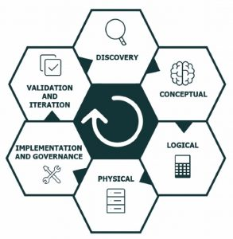

+++
title = "Achievement Unlocked: Veeam Certified Architect 2022"
date = "2021-10-27T17:45:34Z"
draft = false
tags = [ "certification", "veeam", "VMCA",]
categories = [ "Education", "Veeam",]
featureimage = "featured.jpg"
+++

I recently had a successful attempt at the latest version of the [Veeam Certified Architect (VMCA)](https://www.veeam.com/vmce-certification.html) certification exam and I’m happy to have that one done. I found this newest version of the exam to be much more approachable than the rap on the last (and first) version of the exam. I wanted to take a minute to give some thoughts about the credential and pointers about how I prepared.

## Training Requirements

Unfortunately one thing that still survives in the latest version of the Veeam certification programs, the [VMCE](https://img.veeam.com/vmce/docs/vascm_v11_course_outline.pdf) and [VMCA](https://img.veeam.com/vmce/docs/vbr_v11_ad_course_outline.pdf), is a hard course requirement for each level of certification. This means that if you want or need to achieve both levels of certification you are going to need to take 2 courses and 2 exams. Further, each are now “year versioned” exams, with versioning done on an annual basis. When it comes to renewal each exam will need to be independently renewed. As long as you pass each every year you will not be required to retake the class to upgrade but if you miss a year you will need to retake the course.  
  
I wholeheartedly disagree with this approach and consider it especially burdensome on the certified person. In my mind it is understandable to have ONE course requirement but not for both, I struggle to think of another vendor certification program that does this. Even more if you feel you need to do annual recertification, which I’m not wild about but can understand with the number of new features each release brings, doing the top level exam should recertify for both. It’s been explained to me the rationale for this is because the exams are testing for different skill sets but the VMCE is still listed on the website as a prerequisite for the VMCA so i believe it to be a bit too much. At the end of the day this whole setup screams money grab for a company that should be well past the point of needing it.  
  
That said many of you like me may have employer requirements to maintain the credential so this is for you.

## VMCE vs VMCA

While you would think that for a skill set as siloed as Veeam core backup platform, Backup &amp; Replication, that there would be two exams worth of content to cover but these really are targeted for different levels of IT Professionals. The VMCE exam really wants you to know and understand the [Veeam Availability Suite](https://www.veeam.com/data-center-availability-suite.html) of products, requiring memorization of knowledge about the various components and how they all fit together, think of this as your stereotypical memorization exam. While both exams are multiple choice exams with the VMCE the questions are all against a core set of knowledge, if you can memorize you’ve got this  
  
The VMCA on the other hand is very light on memorization but very heavy on thinking through how you would scale out the core products to work in a very large, distributed scale. Really here the focus on looking at a potential customer scenario and requirements and determining what you need to build or suggest to give them successful outcomes.

## My VMCA Back Story

I was lucky enough that through the [Veeam Vanguard](https://www.veeam.com/vanguard.html) program that I was able to take the course for the VMCA free of charge both in 2017 and again in 2021 while the courses were in beta status. Oh what a difference four years makes. In 2017 I was at that time well versed with what VBR could do but at the time I was a Systems Administrator for essentially a SMB, protecting 4 hosts and 60 VMs in a single location. While we had requirements they weren’t exactly stressing the product’s most basic capabilities. When I took the course the first time I’m not ashamed to say that it intimidated me to the point where I didn’t even consider sitting the exam because so much of it was not in line with my day to day work.   
  
Fast forward to 2021 and not only has the course been retooled to be more approachable but I am now in an architecture role where I am working with Veeam at scale every day so a good deal of it made more sense to me. I say all this to point out that I wish I would have taken the exam before because I wasn’t as far away as I thought I was and even if that is the role you are in now if you want to do more this is something you can do, you just have to think differently about it.

## The Exam Methodology

The entire exam is based on a single scenario, that in theory is stylized off of a very real Veeam customer design request. There are more than one of these so if you have to retake it won’t be the same so don’t bother with trying to brain dump this. In any case the scenario is broken up into a number of tabs and will always be present on the left side of your screen as you take the exam so you can refer back to it as needed. Even with that I will say that I do very much so recommend taking 15-20 minutes at the beginning of your exam and read through the ENTIRE scenario so you at least know where to look for information and understanding he basics of what is being asked for.

Once you get through the scenario there will be a number of multiple choice questions that all relate to the scenario, but one thing I will share from the Exam Guide is that none of the questions will build upon other questions, the all independently are asking you to provide an answer directly back against the scenario. This is nice in that it won’t create a cascading problem.

## Preparation

As I stated above I was lucky enough to be able to take the course while in beta status so my impressions of the course itself may not be in line with what is currently being put out there. That said the core idea of the class is very good, that it teaches you the Veeam architect way of thinking through a design based around customer requirements. This is especially on point because the Subject Matter Experts for the course itself were the Global Solutions Architect group within Veeam, some of the most knowledgeable people I know on the subject. The course walks you through what they consider the six stages of the solution lifecycle, which in turn make up the six sections of your exam, with each being tested against.

Further the course focuses on the four basic design principles;

1. Simplicity
2. Security
3. Cost/Benefit
4. Flexibility

All of these will be well covered in the course and in the Exam Guide that will be a part of your course materials. The guide itself is only 5 pages I think but it is jammed packed with information like the above that will really assist you so definitely give it a read through.

Once you get past the point of understanding both the life cycle and the design tenants there is a requirement to really know how to design the various Veeam components for use at scale and for this I highly recommend you consider a full read through of the Veeam Best Practices guide. This again is content created and managed by the Veeam Solutions Architecture group and is exceptional for understanding how you need to consider things both for the scope of this exam but also for right sizing your environment.

## Conclusion

In the end if you can conceptually think about designing a BCDR plan based on Veeam solutions at a large scale, understand the lifecycle of that plan and the given needs of a customer, and are familiar with the best practices for deploying such systems this exam is very doable.