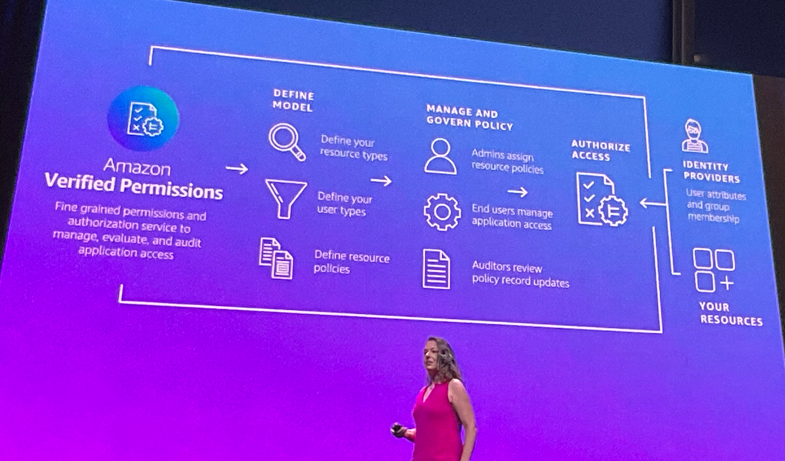

+++
title = "AWS:ReInforce 2023: Keynote&#8230; notes"
date = "2023-06-21T13:25:00Z"
draft = false
tags = [ "AWS", "conferences", "reinforce",]
categories = [ "AWS", "Community",]
featureimage = "featured.png"
+++

Hi all! I recently attended the AWS:ReInforce conference in Anaheim, CA. The show itself was my first AWS event and I greatly enjoyed it. This was due to yes, the quality of content, but more the inclusiveness of the AWS community. Many thanks specifically to Chris Williams for making so many introductions but also to those that I met there and have given me the privilege of a launchpad for starting my AWS journey.

This post is designed for me to capture and share my notes from the keynote of the event which featured a what to me was a mindboggling number of new feature announcements but I'm told is relatively low key by AWS scale. These notes are in my general notetaking format so they may not be as readable to you as they are to me but if you see anything that isn't making sense please reach out.

### CJ Moses, AWS CISO @mosescj58

- First question was the Security Shared Responsibility Model - If you have access you have responsibility
- The more you know about the why and the how, the more you know about the who
- NTT has confirmed
- Firecracker - OSS virtualization tech for function based services
    - Sec Features
        - Single VM/process
        - Mem safe language
        - Sandbox/jail VMM
- Software security
    - 7500 AppSec reviews
    - Builders have responsibility for the security of their services
    - Automated testing processes available to all internal builders
- Compliance
    - 140+ security standards &amp; certifications
    - AWS offers virtual datacenter tours via digital audit symposium to reduce access requirements to the DCs
- The more telemetry we have, the better we can reduce mean time to defense
    - 1m mitigated outbound botnet driven DDoS attacks
    - 5.4B Signals from threat sensors
    - 1k botnet C2 takedowns Q1
    - 230k+ DDoS attacks shutdown
- Wiperware- straight up just deletion of data and systems, next gen ransomware
- AWS Backup, AWS Backup Vault Lock - WORM

### Becky Weiss - Senior Principal Engineer, AWS, @Becky\_Weiss

- Security in the cloud - Customer responsibility
- Zero Trust
    - Identity, network and device monitoring and evaluation on every access
    - Microsegmentation + monitoring + IAM
    - 1 Billion API calls/second for IAM
- **Announcements**
    - [Verified Access](https://d1.awsstatic.com/events/Summits/reinvent2022/NET214_NEW-LAUNCH!-Introducing-AWS-Verified-Access-Secure-connections-to-your-applications-.pdf) - provide secure access to corp apps without VPN
        - Integrates with identity providers and JAMF/Crowdstrike for management
    - [Cedar](https://aws.amazon.com/about-aws/whats-new/2023/05/cedar-open-source-language-access-control/) - new OSS programming language for authentication policy
        - <https://www.cedarpolicy.com/en>
        - https://github.com/cedar-policy/
        -
    - [Amazon Verified Permissions](https://aws.amazon.com/verified-permissions/) - Centrally manage permissions for applications using Cedar policies
        - Includes verification

- [EC2 instance access](https://aws.amazon.com/blogs/compute/secure-connectivity-from-public-to-private-introducing-ec2-instance-connect-endpoint-june-13-2023/) - Instance Connect Endpoint - secure connect via SSH/RDP via secured endpoint, allows access to private instances as well
    - Strong auth before reaching the host
    - Single click connect from console
    - CloudTrail integrated
- Protecting My AWS - Controls to define a customer boundary
    - [AWS Management Console Private Access](https://docs.aws.amazon.com/awsconsolehelpdocs/latest/gsg/console-private-access.html) - prevent access to MC for unauthorized accounts within your network
        - Ensures that all use of AWS within your perimeter is happening within your controls
- [GuardDuty](https://aws.amazon.com/guardduty/) - Protect your AWS environment proactively doing security scans
    - Threat detection for Aurora
    - EKS Runtime threat detection
    - Threat detection coverage in Lambda functions
- [Amazon Inspector](https://aws.amazon.com/inspector/)
    - Code Scans for Lambda are now Generally Available - Automated security scanning tools for code that AWS itself uses
    - SBOM Export - automatically and centrally manage Software BOM exports, listing of all 3rd party dependencies and versions for each application

### Debbie Wheeler, SVP &amp; CISO, Delta 

- 
- 177M+ Customers
- 90k employees
- Security Environment
    1. Fostering a security aware culture - Top to bottom Security - everyone is involved in security
    2. Accountability - standards are set that developers adhere to
    3. Automation - leverage AWS security tools to ensure standards are being met
    4. Developing good security habits
    5. Safety first, always
        - Security innovation
        - Security aware workforce
        - Security while remaining agile

### CJ Moses, AWS CISO @mosescj58

- Partner Items
    - AWS Built In Partner Solutions - find, purchase and deploy AWS-validated partner software, integrated with foundation AWS services
    - [AWS Global Security Initiative](https://aws.amazon.com/about-aws/whats-new/2023/06/aws-global-partner-security-initiative/)
    - New Partner competencies around Security
- Generative AI/Large Language Models
    - There is a need to wrap security capabilities around them to secure against misuse
    - It can be used for bad actors
    - [Amazon Bedrock](https://aws.amazon.com/bedrock/) - way to build and scale gen AI applications with foundation models
    - [Code Whisperer](https://aws.amazon.com/codewhisperer/) - AI powered code companion, provides suggestions
        - Github Co-pilot but now with 100% more AWS!
    - [CodeGuru Security](https://docs.aws.amazon.com/codeguru/latest/security-ug/what-is-codeguru-security.html) - identify and resolve code vuln at any stage in the dev workflow
        - Integrated into IDE
    - [Finding Groups](https://docs.aws.amazon.com/detective/latest/userguide/groups-about.html) - use ML and graph theory to distill events
- Quantum Computing
    - Exponential growth of data that be represented
    - Can defeat cryptography
    - Working with NIST to develop quantum resistant crypto tech
        - [AWS-LC](https://aws.amazon.com/blogs/opensource/introducing-aws-libcrypto-for-rust-an-open-source-cryptographic-library-for-rust/)
        - Open Quantum Safe
        - Draft standard on Key exchange