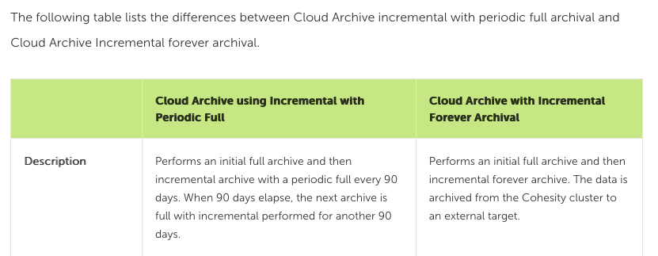
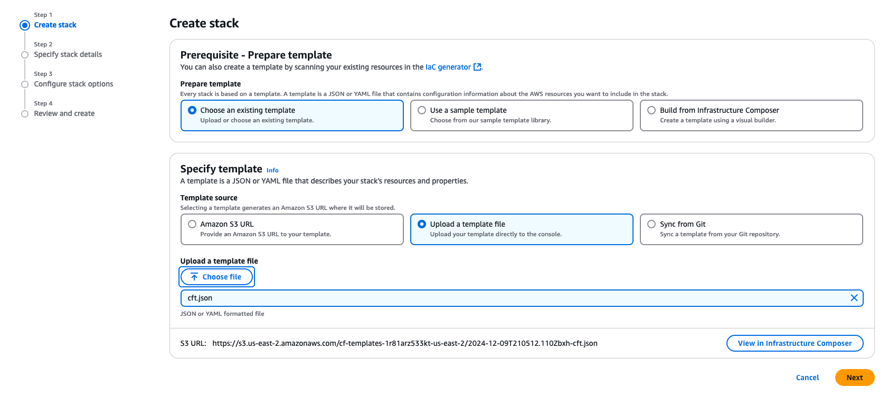
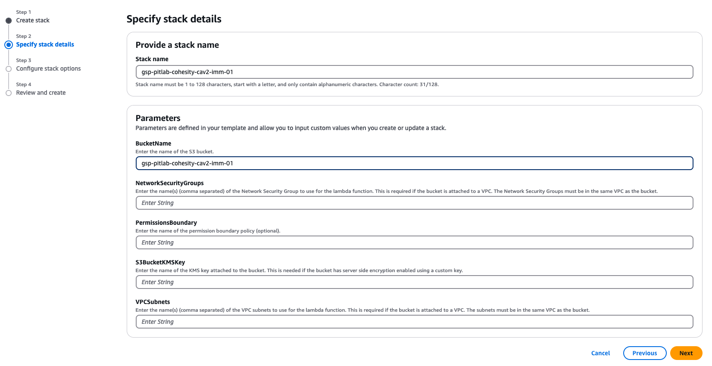
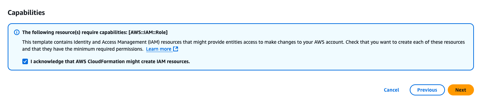
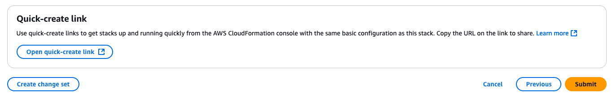
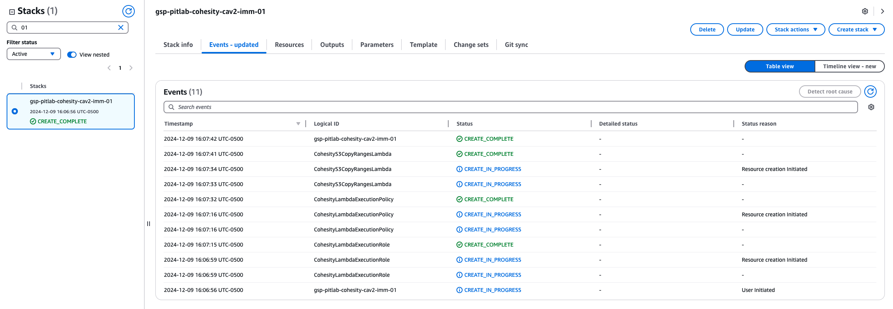
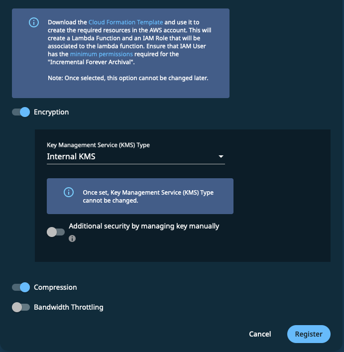
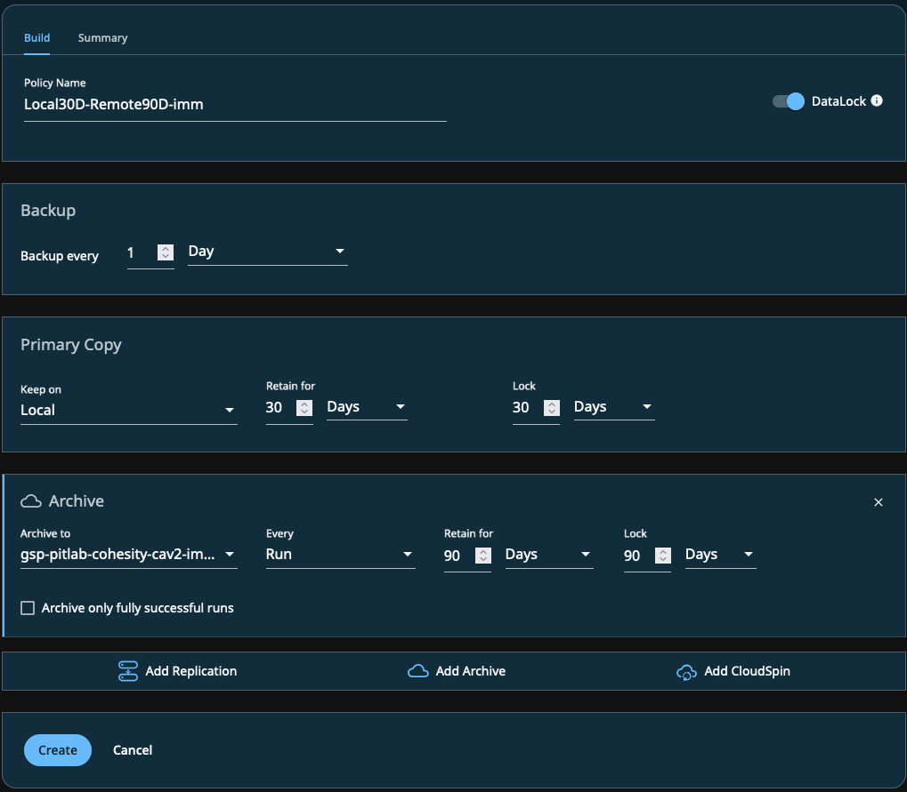
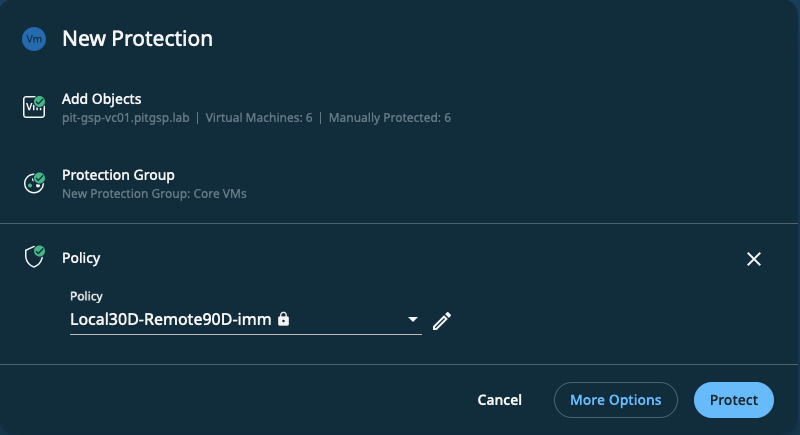

+++
title = "Configuring Cohesity CloudArchive v2 with AWS S3 Buckets"
date = "2024-12-10T11:20:09Z"
draft = false
tags = [ "AWS", "cloudarchive", "cohesity", "how to", "s3",]
categories = [ "AWS",]
featureimage = "featured.png"
+++


With the latest update to [CohesityOS, 7.1.2u2](https://www.cohesity.com/blogs/cohesity-data-cloud-7-1-release-details/), they are finally supporting object lock and immutability with both iterations of their [CloudArchive ](https://www.cohesity.com/solutions/long-term-retention-and-archival/)feature, Incremental with Periodic Full (v1) and Incremental Forever (v2). What this means is that you can add an AWS S3 bucket as an external target then make it part of your protection policy to either send a copy of backups (backup copy for those who speak other vendor) with a different retention policy and/or to allow your full retention needs to be met in object storage rather than the more costly appliance based storage while maintaining immutability throughout the lifetime of the retention policy.

## CAv1 vs CAv2

So you'll notice that I using all kinds of terms here for different things. In the Cohesity UI the differentiators in how this is implemented is between "Incremental with Periodic Full" and "Incremental Forever." That said in marketing, documentation and when you speak to people at Cohesity they are referred to as CAv1 and CAv2, respectively. The differentiation here how efficient data deduplication is once the blocks go through a full retention cycle in object storage. CAv1 is very simplistic in that it writes a restore point to object, on a regular basis also copies a full backup up and then as restore points age out they simply get deleted. While simple this does lead to a bunch of inefficiencies both in terms of deduplication as well as API calls as Cohesity has to remotely deal with all that data it's written.

Enter Incremental Forever, or CAv2, which starts with using Cloud Formation to programmatically build out Lambda functions and the infrastructure required to link them and the bucket that can be triggered by the job runs to efficiently perform deduplication across the replication set without the need for periodic fulls or repeated remote API calls against the bucket. While their documentation is gatekept by a login if you have access a longer comparison is available in their [7.1.2 LTS documentation set](https://docs.cohesity.com/7_1_2/Web/UserGuide/Content/Dashboard/Platform/archival-differences.htm?tocpath=External%20Targets%7CRegister%20an%20External%20Target%7CRegister%20an%20External%20Target%20for%20Archival%7C_____1).



## IAM Pre-Work

We need to begin in AWS by capturing the Account ID for your AWS Account. Once logged in you can click on your name in the top right corner of the console UI and your Account ID will be right there with a copy button. Do that and then note it for use later.

Next we need to create an IAM policy with the proper permissions to do all the things that the process needs. I will say that as I've been trying to work with this over the past few versions of CohesityOS two things have been consistent, that it changes with every release and the permissions are poorly documented. As of this exact release, 7.1.2\_u2\_release-20240925\_66722648, the policy below appears to be complete and functional but know that these may well change. The good news is that you can largely work your way through any changes via the error messages as you go to add buckets. I would probably make sure to add a new target anytime you update or patch the OS to to make sure any existing continue to work correctly.

To create the policy navigate in the AWS console to IAM and then Policies and create a new policy. If you click the JSON selector in the "Specify Permissions" window you can simply cut the below code block and paste it right in. Afterwards you can name your policy whatever you'd like, add description and tags as dictated by your organization's requirements and then save your policy.

```json
{
    "Version": "2012-10-17",
    "Statement": [
        {
            "Sid": "Statement1",
            "Effect": "Allow",
            "Action": [
                "s3:ListBucket",
                "s3:CreateBucket",
                "s3:PutObject",
                "s3:PutObjectRetention",
                "s3:GetObject",
                "s3:DeleteObject",
                "s3:GetLifecycleConfiguration",
                "s3:PutBucketObjectLockConfiguration",
                "s3:GetObjectVersion",
                "s3:GetObjectAttributes",
                "s3:GetObjectVersionAttributes",
                "s3:DeleteObjectVersion",
                "s3:PutBucketVersioning",
                "s3:GetBucketVersioning",
                "s3:ListBucketVersions",
                "s3:GetBucketLocation",
                "s3:RestoreObject",
                "iam:CreateRole",
                "iam:GetRole",
                "iam:PassRole",
                "iam:CreatePolicy",
                "iam:PutRolePolicy",
                "iam:GetRolePolicy",
                "lambda:GetFunction",
                "lambda:CreateFunction",
                "lambda:InvokeFunction",
                "lambda:UpdateFunctionCode",
                "cloudformation:CreateUploadBucket",
                "cloudformation:CreateStack",
                "cloudformation:ListStacks",
                "cloudformation:GetTemplateSummary"
            ],
            "Resource": "*"
        }
    ]
}
```
Finally we need to simply create a IAM user, without console access, and apply your created policy directly to it. For that user you'll also need to create an Access Key pair as this is what you'll use to link the cluster to the bucket.

## Create a Bucket

As you've seen many a time here we now need to create a bucket with object-lock enabled. While you can walk through doing this in the AWS console UI I'll challenge you to do it via AWS CLI or Powershell instead. For AWS CLI you can simply do the following given that you've setup your user access keys from above in a profile named "mycav2profile"

```bash
aws --profile mycav2profile s3api create-bucket --object-lock-enabled-for-bucket --create-bucket-configuration LocationConstraint=us-east-2 --bucket mycav2profile-cohesity-cav2-imm-02
```
Now that we've setup our access and created our bucket let's switch over to the Cohesity UI to setup our external target under Infrastructure &gt; External Targets.

## Adding an External Target

Once we click "Add External Target" we'll have a few choices to make that annoyingly their UI makes you manually walk through. As you can see in the image below there are quite a few settings with information we've created through the steps above. Of note here is I've selected the S3-IA Storage Class. I am a big proponent of this class for data backup purposes, just be mindful of the default limitations and financial aspects of it if you haven't covered those off as is done with the 1[1:11 Cloud Object Storage for Amazon S3](https://1111systems.com/services/object-storage/) product.


Once you select Incremental Forever for the Archival Format you'll be prompted to download the Cloud Formation Template (cft.json) file. Please do as we'll need this for our next steps.

## CloudFormation

If you aren't familiar [Cloud Formation](https://aws.amazon.com/cloudformation/) is an AWS Infrastructure as Code service that is designed for automated build of AWS cloud resources. The key component to Cloud Formation is the concept of stacks, which is simply a series of tasks that have to be performed for any given build. Worth noting here is that while the Cohesity template file is generic for any external target you may wish to add for CAv2 you will need a separate stack run. Essentially this is a one time run to setup the needful but as updates to the Cohesity linked appliance occur it's possible for these stacks to be updated.

To get started you will need to navigate to Cloud Formation in the AWS console and click Create Stack. In this first screen simply leave the default of using an existing template, choose upload a template file and then supply the file you downloaded from the External Target UI.



The next screen has a lot of prompts that you can largely leave empty unless you are using AWS Direct or other connectivity solutions that require the data to be routed through AWS VPC infrastructure. What you DO have to fill in is a stack name, that can be anything you want but I tend to like using the bucket name, and the BucketName parameter. This is the target bucket name and this will link your created bucket to the created Lambda resources.



In the next screen you need to acknowledge that AWS will create cloud resources on your behalf and you agree to pay for them. This is typically very important to Amazon. ;)



In the final confirmation page click submit for the stack to be created and it will think immediately kick off running.



Now that our stack is created it will then begin running. This will probably take 3-5 minutes to complete, but I will note that in my experience it's worth giving some time for global sync to complete once you see CREATE\_COMPLETE under the task on the left. In practice I've found that if you flip back over immediately after completion it tends to fail for up to 5 minutes after the stack is built out.



Now that our Cloud Formation stack has completed you can view what it's done under the Outputs tab and navigate to the Lambda service to review the code they've added or IAM to review modifications to roles and policies. Once done it's time to flip back to Cohesity UI to finish up.

## Complete External Target Registration

Now that our template has run we simply need to review any other settings at the bottom of the external target registration screen and click Register. If successful you will see your target added to the external targets list.



## Creating and Applying Policy

Now that we have our external target we need to create a policy that can be applied to our protection groups to run jobs. Let's start by navigating to Data Protection &gt; Policies in Cohesity UI and click Create Policy. What I want to be able to do is the following:

- Locally
    - Backup daily
    - Retain for 30 days
    - Keep the data immutable for 30 days
- External Target
    - My imm-01 external target
    - Retain for 90 days
    - Keep the data immutable for 90 days.

You'll need to click the "More Options" button to get into our fun stuff but once you do that it's relatively simple. Simply fill in the blanks for the primary copy then click "Add Archive" and complete as needed.



Once your policy is created it can be applied to any type of Protection you have. This can be VMs, M365 data, File Shares, etc. which is nice.



And now we're done!

## Conclusion

Cohesity's CloudArchive Incremental Forever/v2 feature is a rapidly evolving but important part of your data protection strategy in the Cohesity platform, allowing you to maintain a copies of data cost efficient AWS S3 storage while leveraging other cloud native services to optimize storage and related costs. While the implementation is not necessarily as simple as you'd like for the amount of complexity that is being masked it really does an admirable job of lowering the technical debt in providing the solution.