+++
title = "Configuring Veeam Backup &amp; Replication EntraID Protection"
date = "2025-08-13T08:14:38Z"
draft = false
tags = [ "backup", "entra-id", "vbr", "veeam",]
categories = [ "M365", "Veeam",]
featureimage = "featured.png"
+++

If you are not familiar with Entra I will forever and always think of this as “the artist formerly known as Azure Active Directory.” While functioning as a cloud Active Directory is it’s roots Entra was renamed for a reason, it’s so much more than just AD. We often have customers who are leveraging Microsoft365 or other Microsoft Azure functions which are reliant on the Entra platform and just as you’d never consider leaving your Active Directory infrastructure excluded from backups you should consider protecting your the Entra ID that is the underlying authentication mechanism of many of your SaaS applications.

Today while 11:11 provides award winning protection of M365 workloads we do not have a product for Entra ID protection itself but fear not, this is a task you can easily and cost effectively do yourself, especially if you are already using Veeam Backup &amp; Replication to protect your computing and storage workloads. In the latest version of VBR, 12.3, Veeam has begun supporting protecting both Entra ID tenant information and essential logs that may be relevant if a security event occurs. Regarding the tenant information it’s important to note what is protected:

**Backed-up Objects:**

- Users, Groups, Devices
- Role Assignments, Administrative Units
- Applications (App Registrations, Enterprise Apps, Service Principals)
- Conditional Access Policies (optional, must be enabled)
- Audit Logs &amp; Sign-in Logs

To protect these things you may need a bit of infrastructure in place. The Entra ID core components above (or Tenant as you’ll see as a Backup Job type) will all backup to a local PostgreSQL database. If you’ve already updated to 12.3 and did the “Click, click next” installation you’ll find that PSQL was automatically installed for you. This will be true even if you are still using Microsoft SQL Server to hold your configuration. The logs will use the existing NAS/S3 backup mechanism to write to a supported VBR repository such as an 11:11 Cyber Vault for Veeam which will place the data into AWS’ resilient S3 object storage platform.

The final component that you’ll need to ensure you have before getting started is sufficient licensing to protect Entra ID. Each Veeam license will protect 10 enabled users and it’s an all or nothing approach. So if you have 1000 users you will need 100 licensing units to protect it. If you are an existing 11:11 Veeam rental licensing customer or it’s time for renewal you may want to consider discussing how we can help you protect this and other workloads through our rental licensing products. In terms of sizing while you can go through the process of gathering a user count also know that Veeam always gives you 30 days of grace in terms of licensing so you can protect these workloads today then check under Home &gt; About &gt; Licensing to see how much additional licensing you’ll need.

With all that being said let’s get down to the fun work of protecting Entra ID.

## Getting Started

**Access** <https://entra.microsoft.com> **and copy your Tenant ID.** You’ll need this to add your Entra organization to Veeam Backup and Replication.

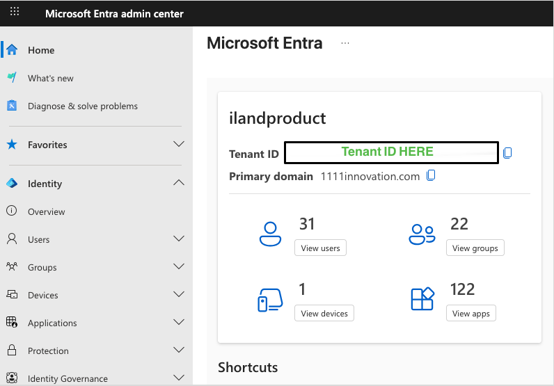

**Add your Tenant organization to VBR Inventory**

- Navigate to Inventory in VBR Console, right click Microsoft Entra ID, click “Add Microsoft Entra ID tenant…”
- In wizard paste your Tenant ID from Entra admin center

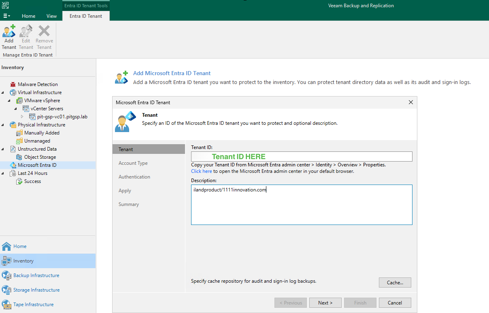

- Choose to create a new account which will have the effect of creating a new app registration. If you’ve previously protected this tenant or need to create an app registration manually for compliance reasons then you can reuse an existing app by providing the app ID.

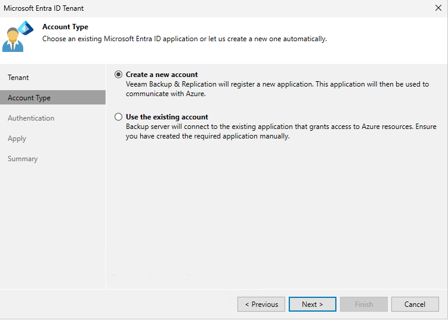

- Copy the provided passcode and enter it at <https://microsoft.com/devicelogin>.

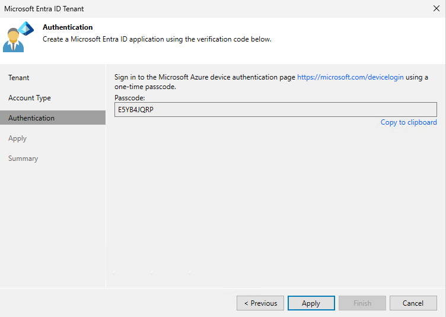

- Complete login and confirm you are logging into Azure CLI. If you have registered an organization for VB365 this is a similar workflow.

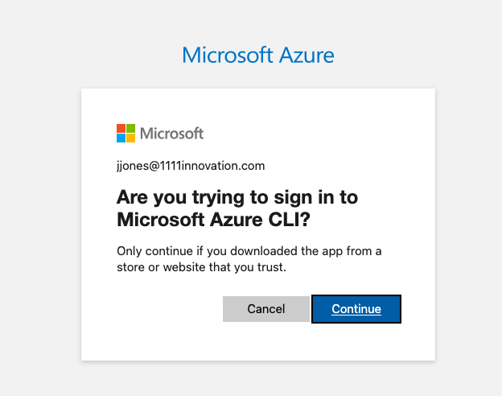

- Click Apply and Finish to complete adding your tenant organization

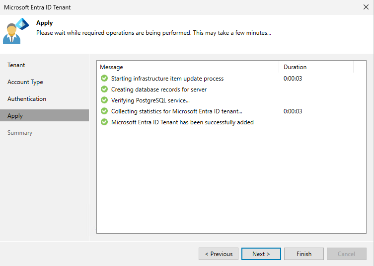

**OPTIONAL: Enabling backup of Conditional Access Policies**

If you would like to backup your [conditional access policies](https://learn.microsoft.com/en-us/entra/identity/conditional-access/overview) there are couple more steps you must do.

- Add the DWORD entry   
    `HKEY_LOCAL_MACHINE\SOFTWARE\Veeam\Veeam Backup and Replication\EntraIdBackupSupportsConditionalAccessPolicyRestore on your VBR `  
    set it to 1, restarting services
- Find your app registration created in the step above in Entra ID &gt; Applications &gt; App registrations
    - Navigate to API Permissions
    - Add Policy.Read.All under Microsoft Graph &gt; Application
    - Click “Grant admin consent”

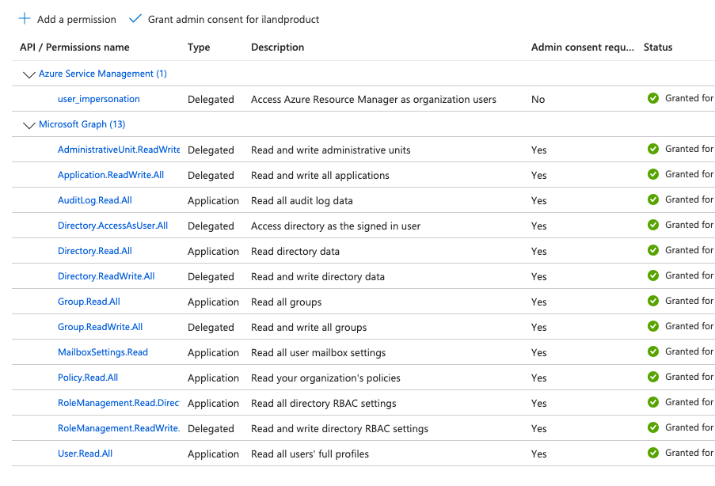

**Protect Entra ID Tenant Data**

- From Home right click Backup, choosing Backup Entra ID &gt; Tenant…

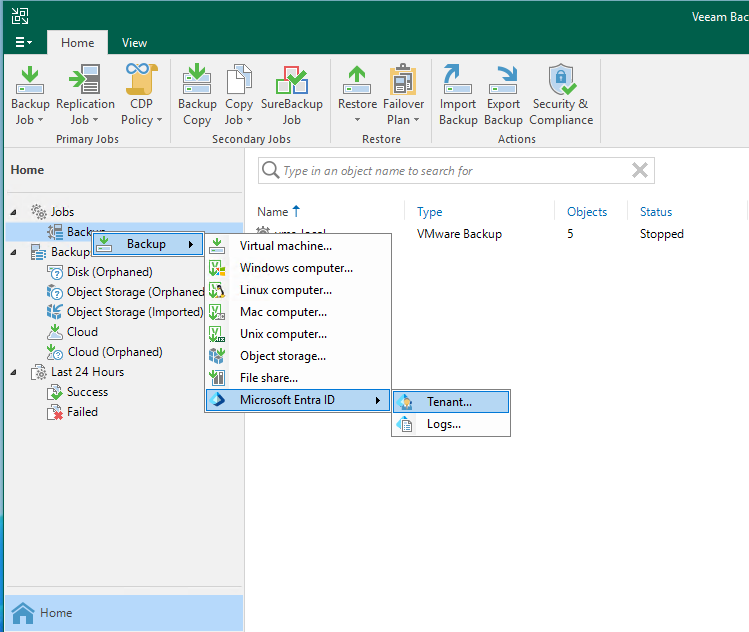

- Name your Backup Job then select your tenant, set your retention (default is 7 days), It is always recommended to encrypt your backups so be sure to click Advanced and enable Backup Data Encryption

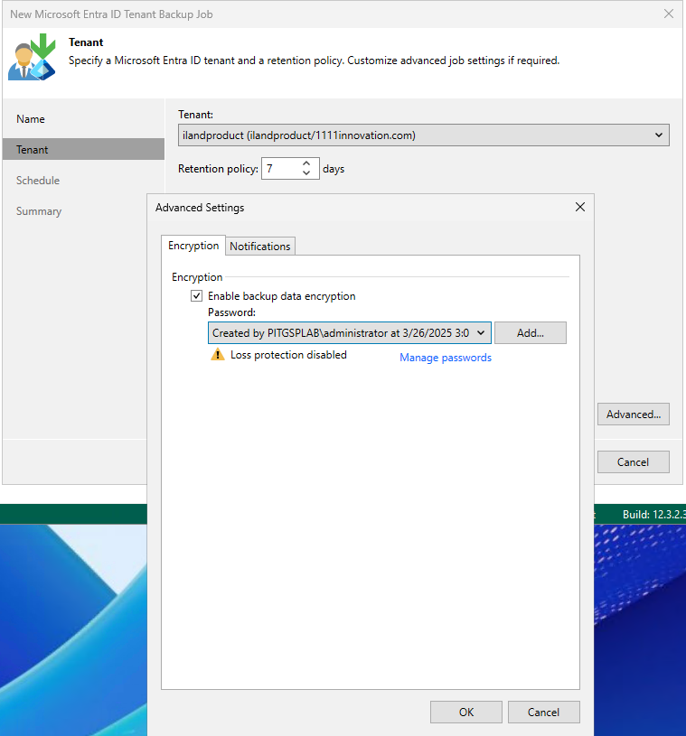

- Enable the job to run automatically on whatever schedule you need and click Apply &amp; Finish, letting the job run when finished.

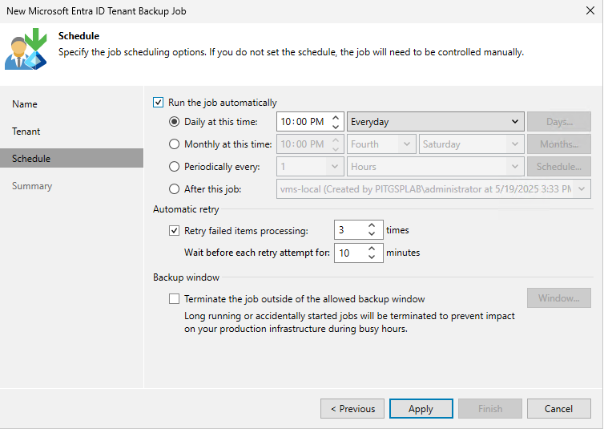

**Protect Entra ID Logs**

- Create 11:11 Object Storage repository to store EntraID Logs. You can reuse an existing one if you need to but I always like to at least segregate my repositories based on the workload type. I’ve covered how to add these repositories [in a past blog](https://1111systems.com/blog/1111-systems-object-storage-in-veeam-data-platform-12-3/) if you need help.

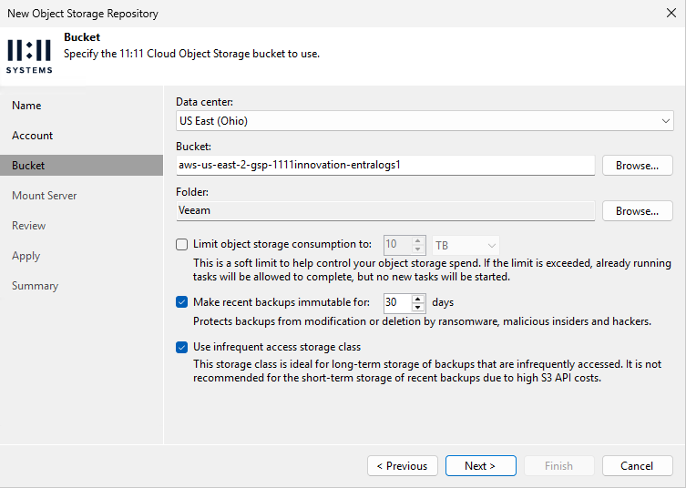

- Once the Entra ID Tenant job has successfully completed right click Backup again and choose Microsoft Entra ID &gt; Logs…, name your job and select your Tenant.

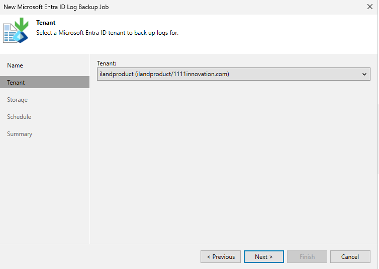

- Select your newly created repository and set retention. Once again be sure to click Advanced and at least enable Encryption as well as any other settings you might need.

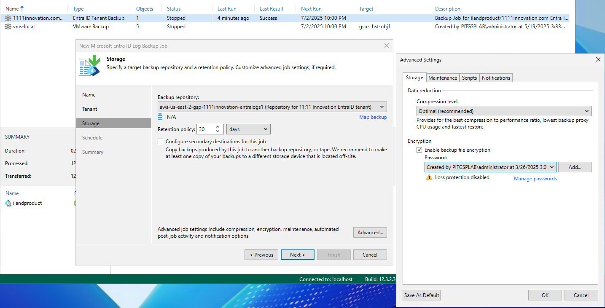

- Enable the job to run automatically on whatever schedule you need and click Apply &amp; Finish, letting the job run when finished.

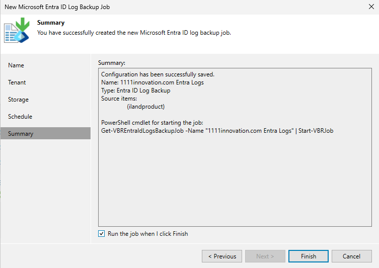

**Determine Licensing Needs**

- Navigate to Home &gt; Licensing and click “Create Report…” after your jobs have successfully ran your Tenant job. This will show you how many licenses you will need to protect your entire Tenant as well as any other workloads this VBR is protection. Remember that you will need a single composite license for all things protected by a Veeam Backup &amp; Replication installation.

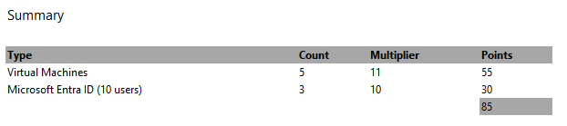

## Conclusion

As you can see protecting Entra ID can be easily performed with existing Veeam backup infrastructure and 11:11 Systems Object Storage and Rental Licensing components. Just as important as protecting data is being able to restore it so be sure to check back next week for a follow up post about recovering Entra ID objects!