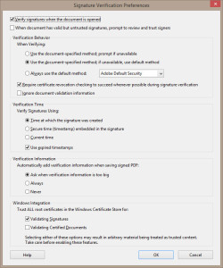
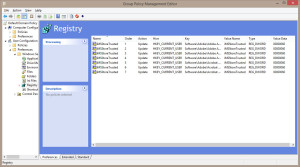

+++
title = "Support Adobe Digital ID Signing with Automated Microsoft CA User Certificate Generation"
date = "2015-04-10T15:37:00Z"
draft = false
tags = [ "Acrobat", "certificates", "security",]
categories = [ "Systems",]
featureimage = "featured.jpg"
+++

Just a quick how to, wanting to document a task I have recently had need of. This process has a perquisite of you having a Microsoft Certificate Authority already available in your environment.

1. Start &gt; Run &gt;mmc 
    1. Add Remove Snap-ins and choose the following - Certificate Authority (when prompted add the name of your CA) - Certificate Templates - Group Policy Management
2. In Certificate Templatesright click on "User" and choose "Duplicate Template" 
    1. Set compatibility settings as needed. If you have a 2008 R2 pure Active Directory environment make it match. In terms of Certificate Recipient make it match the oldest OS you have in use.
    2. Under General Change the Name to something meaningful as you'll be referencing it later.
    3. Under the Security Tab set Domain Users to have both Enroll and Autoenroll permissions
3. In Certificate Authorityright click on the "Certificate Templates"subfolder and choose New&gt; "Certificate Template to Issue" 
    1. Choose your newly created Certificate Template
4. In Group Policy Management we are going to do a couple of things; setup your domain for certificate auto enrollmentand also define registry settings for Adobe Acrobat and Acrobat Reader. 
    1. In any GPO that will hit the users you wish to have certificates (Default Domain Policy for example) choose to edit.
    2. Navigate to User Configuration&gt; Windows Settings&gt; Security Settings&gt; Public Key Policies
    3. Double click on Certificate Services Client- Auto-Enrollment and set - Configuration Model: Enabled - Check Renew expired certificates... - Check Update certificates that use certificate templates - Hit OK
5. By default Adobe Acrobat and Reader only recognize certificates that are signed by the usual public authorities as trusted, so you have to tell it to look at what is available in the local Windows Certificate Store. In Adobe Acrobat or Acrobat Reader you can do this in Preferences, under Signatures&gt;Verification and enable "Validating Signatures" under Windows Integration. This can be cumbersome across the enterprise but luckily this data is saved in a registry key, which means that through Group Policy Preferences we can manage this setting. The fix below will work for all Acrobat or Acrobat Reader versions 7 or later 
    1. Select the GPO of your choice to edit (again, I recommend the Default Domain Policy) and navigate to User Configuration&gt; Preferences&gt; Registry
    2. Right click in the window New&gt; Registry Item
    3. You will need to create an entry with the following attributes: - Hive: HKEY\_CURRENT\_USER - Key Path: Software\\Adobe\\*product*\\*versionnumber*\\Security\\cASPKI\\cMSCAPI\_DirectoryProvider *\* (Example for Acrobat Pro 11: Software\\Adobe\\Adobe Acrobat\\11.0\\Security\\cASPKI\\cMSCAPI\_DirectoryProvider)* - Value name: iMSStoreTrusted - Value type: REG\_DWORD - Value data: 60 (hexidecimal) - Hit OK
    4. Repeat steps B &amp; C for each product/version combination you have in your environment. For example, in our environment we only have one version of Reader, but 3 different major versions of Acrobat Pro, so I needed 4 variants of this key to cover each of them.
 
 And that's it! It will probably take a little while for these policy changes to naturally propagate, but once it does so it works very slickly. Once done you and your users will be able to use their generated certificate as a Digital ID to sign any documents with a digital signature field in a fillable form. Do keep in mind that while this will work and absolutely can and should be trusted within your organization, if you or your users are in need of this type of service between organizations you will probably want to call the fine folks at Verisign or Thawte. To for more information check out - <https://technet.microsoft.com/en-us/library/cc770857%28v=ws.10%29.aspx>
- <http://www.adobe.com/devnet-docs/acrobatetk/tools/PrefRef/Windows/Security.html#WindowsIntegration>