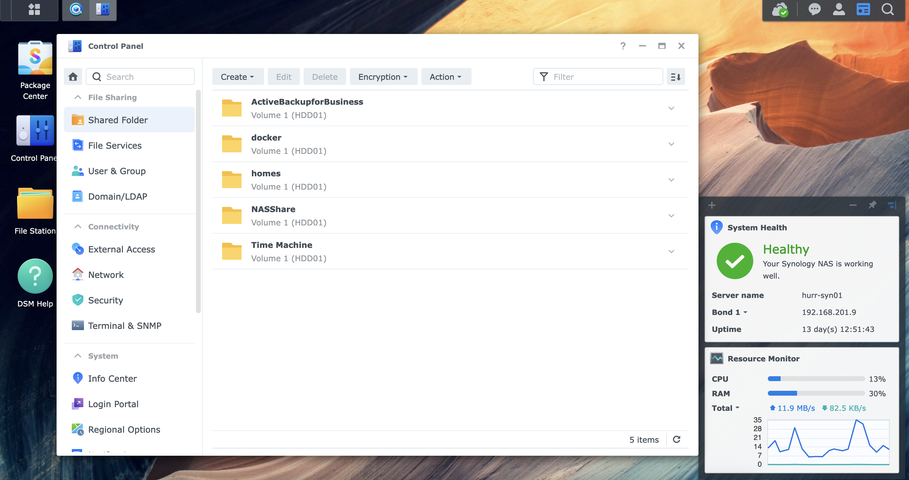
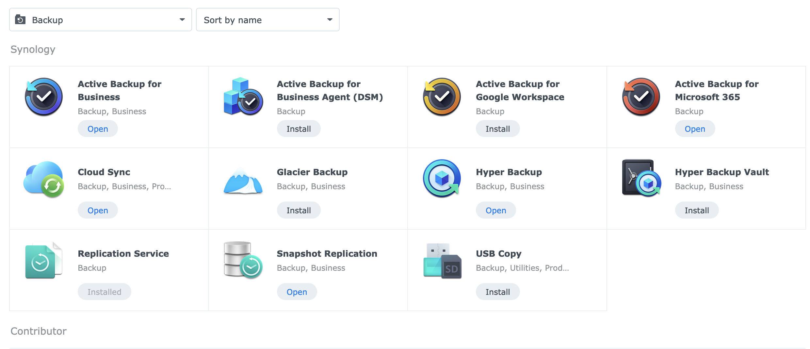
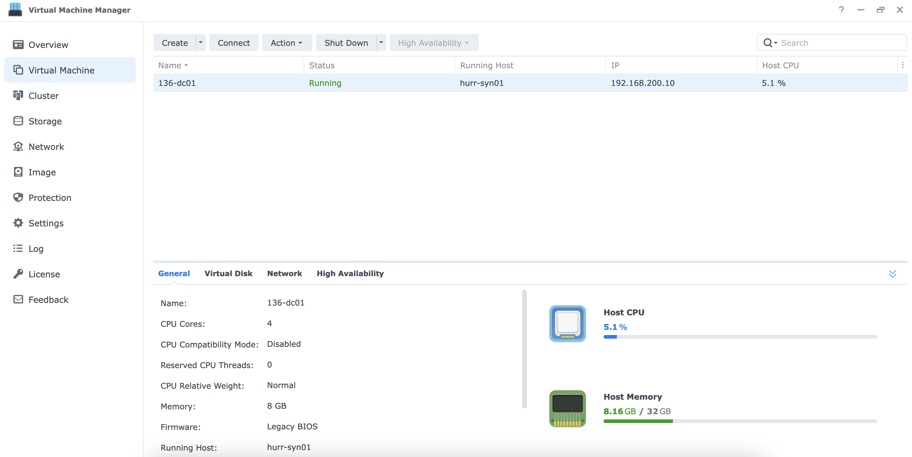
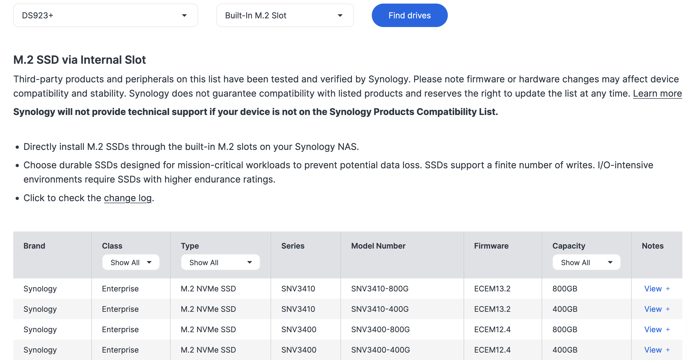

+++
title = "First Impressions with the Synology DS923+"
date = "2024-05-20T09:00:00Z"
draft = false
tags = [ "block", "DSM", "storage", "synology",]
categories = [ "Storage",]
featureimage = "featured.png"
+++

*Disclaimer: The posts in this series have been in part made possible by hardware and other services provided by Synology. In exploring the topics involving the Synology DS923+ array I was provided 1 DS923+ unit, 1 400 GB Synology nVME drive and 2 4 TB Synology hard disk drives.*

For those of us who come from a SMB background and/or have ever done homelabbing [Synology](https://synology.com) is a brand that we are well acquainted with. My first at home storage array was a [414 Slim](https://www.storagereview.com/review/synology-diskstation-ds414slim-review) that performed admirably for many years. As time has progressed these nice little storage systems have become quite powerful in regards to storage yes, but also data protection and actual virtualization.

When I was starting to look at current solutions out there for creating a data protection and object storage platform in a small footprint the fine folks at Synology, namely [Nick Kozup](https://www.linkedin.com/in/nick-kozup/), was nice enough to not only send me a [DS923+](https://www.synology.com/en-us/products/DS923+), but also a bit of nVME and hard disks to get started. As I've got this unit up and running here at the house I'm going to cover some good things, some bad things and provide my own impression. Be sure to follow along as I'll take some deeper dives in future posts.

## The Good

**The DSM platform itself.** I'm going to go ahead and start with the statement that evolution of the [DiskStation Manager (DSM)](https://www.synology.com/en-global/dsm) platform over the past 5 years since I used it in the 5.x days is impressive. As a block storage platform Synology has done an admirable job of applying easy to consume storage and security measures to make small form factor storage more of an all everything platform. I've particularly enjoyed the simplicity of the onboarding which includes MFA registration and a up front option to enable remote connectivity or not. While I'm not a fan of anything giving unfettered access to a storage array remotely their implementation seems to be well designed.

**Backup capabilities.** You can tell that they have put significant effort into creating a simple to use backup platform for all the things their core demographic, SMBs, need to protect. While they are a bit basic for many smaller and non-technical organizations basic is still much better than what may be local only. By and large their backup products are designed to land copies onto the local storage unit and then offload to either another storage array through snapshot replication or to an impressively wide selection of cloud services including their own, [C2 object storage](https://c2.synology.com/en-us/object-storage/overview).

**Virtualization and Containers.** While the 923+ is a small form factor storage array it has compute capabilities as well. This unit had x86 based hardware in an AMD Ryzen 1600 processor supplying 2 cores. While it ships with only 4 GB of RAM it is easily upgraded to 32 GB with DDR SO-DIMM chips. While you aren't going to run a full datacenter off of it for edge use cases or ROBO needs coupling it's storage share capabilities with a virtual machine or 2 with native backup capabilities would have been a great improvement over the options I had to work with back in my SysAdmin days. Here at the house I've chosen to actually run a Windows 2022 domain controller on it to give me an option outside of my lab virtualization platform.

On top of this the DSM also supports docker based container workloads with in my experience varying levels of success. While I will never proclaim to be a containerization wizard those that I've talked to who are have largely bypassed the built in capabilities and instead gone straight to docker-compose via command line.

## The Bad

**The HCL.** I'm going honest with you all, the [Synology HCL](https://www.synology.com/en-us/compatibility) truly dissapoints me. For a series of hardware devices that are largely targeting the low-end of the storage market only displaying hardware that is rebranded units under your own name and marking them up 2-3x isn't a great look. You can also find many 3rd party hard disk drives but really only on the higher end for those and no 3rd Party SSDs or nVME are supported. While it can be overcome those that may not necessarily know better are going to want to stay within the HCL and it definitely has "I void warranty" vibes. I'll be covering this more in my next post.

**Lack of Native Object Storage.** If you read this space much you'll know that I'm a big fan of object storage, especially as it pertains to backup and data protection. As much as DSM has evolved and has taken some good UI steps forward in terms of security the lack of a well designed object storage capability is glaring in my opinion. Putting on my product architect hat if when you created a volume you had the capability of specifying if it was block or object storage and then being able to prevent the removal of the hopefully first write immutability supported object storage volumes would require a physical device reset could go a long way towards making this thing a rock star. I have to assume the choice to not do this is a function of the lackluster default hardware as it can be IOPs and compute intensive to run.

**Only 2 M.2 slots.** Finally I'd like to call out the fact that in all the DS series arrays as best I can tell they all only support 2 M.2 slots per array. While this may seem ok there are 2 legitimate use cases I can see for nVME in these types of devices, compute storage and cache tiering. As I've loaded up the storage bay with big, fat HDDs those are great for shares or cheap and deep storage but I wouldn't necessarily want to run a workload from it. To combat this I've taken the 2 M.2 drives and made those a separate storage pool to run run workloads, both VM and container, from. In doing so I've limited my ability to put a caching tier in front of the spinning disk volumes which would have a positive impact on performance. In my opinion these things need at least 1 more M.2 slot and preferrably 2 to allow for mixing these use cases.

## The Conclusion

The Synology 923+ is a good block storage device, a decent compute platform and a great choice for small organizations or homes that have basic backup needs for whatever reason. While there are choices that have been made that don't necessarily reflect my expectations as someone in the enterprise data protection space it's perfectly fine to backup your photos and SMB Microsoft365/Google Workspaces organizations to, and then to be able to provide a little extra razzle dazzle on top.

In the next few posts here we'll cover some of the razzle dazzle that may have a impact on you and your organization's workflows and how the DiskStation series from Synology may help you.