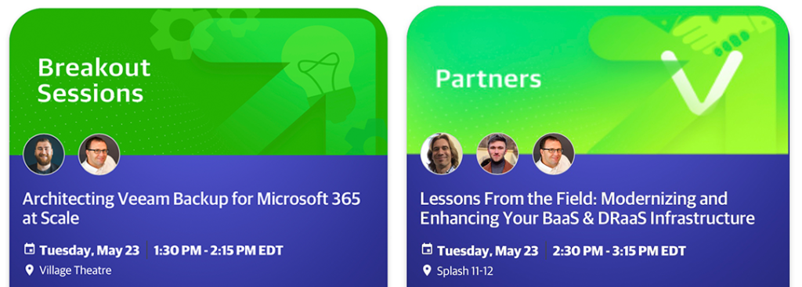

+++
title = "It’s Time for VeeamON 2023!"
date = "2023-05-22T09:00:13Z"
draft = false
tags = [ "community", "conferences", "veeam", "Veeam Vanguard", "veeamon",]
categories = [ "Community", "Veeam",]
featureimage = "featured.jpg"
+++

Today’s the day, the beginning of [Veeam Software](https://veeam.com)’s annual conference, [VeeamON](https://veeamon.com) for 2023! Just like the Blues Brothers sang before me I’m Goin’ Down to Miami to learn, connect, and this year speak at the [Fountainebleau in Miami, Florida](https://www.fontainebleau.com) and I can’t be more excited. This year Veeam has made a marked return to the community focus of the event with a significant number of the nearly 50 in-person sessions having at least one community speaker.

## What is VeeamON?

If the event is new to you this is the seventh edition of the event and marks the return to Miami where it was held in 2019. The conference itself is two days, Tuesday and Wednesday May 23-24 but with training and partner events stretches Saturday through Wednesday. To kick the weekend off attendees can choose to take a discounted, forward looking version of the [Veeam Certified Engineer (VMCE)](https://www.veeam.com/vmce-training.html) training which I highly recommend if you are new to the software or are looking to grow your skills and add credentials to your resume. I’ve been a VMCE since 2015 and it’s been a very well considered certification.

Today, Monday is both the partner day, where those of us in the Veeam Cloud Service Provider (VCSP) world gather as well as a welcome reception for all attendees in the evening. It’s worth noting there will also be a Kubernetes and Kasten K10 Workshop running through the afternoon. The next two days will be jam packed with many sessions that cover everything from getting started with their entire suite of products through exceptional deep dives in to how to make your backup and more importantly recovery needs go seamlessly. The event will wrap up with another one of Veeam’s legendary parties right on the resort’s grounds.

Throughout the event Veeam’s many partners such as my employer, [11:11 Systems](https://www.1111systems.com), will be available in the Tech Festival area. I highly recommend spending time in this area as Veeam is a very ecosystem focused software company and there any number of capabilities that partners make possible that you may not even be considering yet but should.

## Sessions You Say?

Did I mention sessions and community speakers earlier? Many of these sessions are being given by fellow Veeam Vanguards and wider Veeam 100, a group that I’m privileged to be a member of and in the spirit of full disclosure is taking care of our travel, lodging and conference attendance. There are quite a number that I’m going to make sure I check out myself this year that are both technical and career focused, these include:

- ***You're Hit by a Ransomware Attack, What's Next?*** (Julien Mousqueton, Christopher Glemot, and Eric Machabert)
- ***10 Years Working with Veeam: How it Helped Shape Our Careers*** (Ian Sanderson, Dean Lewis, and Matt Crape)
- ***A-Z Automation Journey with Veeam’s Automation Desk*** (Maurice Kevenaar and Joe Houghes)
- ***Kubernetes for the Virtualization Admin*** (Dean Lewis and Michael Cade)
- ***Veeam Replication: The do’s and don’ts of BC/DR*** (Eric Kubla)
- ***There is a Hole in my Bucket! How to Plug Security Leaks*** (Nicolas Serrecchia and Olivier Rossi)
- ***Veeam Service Provider Console v7: What’s New*** (Tim Hudson and Ivan Kochemasov)

I am also going to be a part of a couple of sessions, both on Tuesday afternoon. Starting things off will be “***Architecting Veeam Backup for Microsoft365 at Scale***” with my friend and fellow Vanguard Falko Banaszak. This session will be a very technical brain dump from both Falko and myself on many lessons learned on how to make this protection work and work well when your are talking about tens of thousands of users.

Immediately following that will be “***Lessons From the Field: Modernizing and Enhancing Your BaaS &amp; DRaaS Infrastructure***,” a joint session with Tim Hudson of the Veeam VCSP team and Ivan Kochemasov of Veeam’s Product Management group. Through my position at 11:11 Systems I work with these gentlemen constantly and we will be talking about how to make a good Partner to Veeam relationship great.

<figure class="wp-block-image size-large">

</figure>Wrapping up I expect it to be a great event as always. Veeam this year in particular seems to have picked up the mantle created by VMworld events where it very much so feels community focused and allows for learning through collaboration. If you will be at the event I would love for you to reach out so we can meet up. I can be found in most places social media [@k00laidIT](https://twitter.com/k00laidIT).