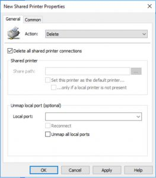

+++
title = "Making Managing Printers Manageable With Security Groups and Group Policy"
date = "2017-10-31T12:18:53Z"
draft = false
tags = [ "automation", "group policy", "Printing Sucks",]
categories = [ "Systems", "Uncategorized",]
featureimage = "featured.jpg"
+++

I don’t know about the rest of you but printing has long been the bane of my existence as an IT professional. Frankly, I hate it and believe the world should be 100% paperless by this point. That said, throughout my career, my users have done a wonderful job of showing me that I am truly in the minority on this matter so I have to do my part in making sure they are available. As any Windows SysAdmin knows installing the actual print driver and setting up a TCP/IP port aren’t even half the battle. From there you got to get them shared and have the users actually connect to them so that they can use them. It’d be awesome if they would all just sit down say “I have no printers, let me go to Active Directory and find some” but I’ve yet to have more than a handful of users who see this as a solution; they just want the damned things there and ready to rock and roll. In the past, I’ve always managed this with a series of old VBS scripts, which still works but requires tweaks from time to time. It’s possible to do this kind of stuff with Powershell these days as well as long as your user has the Active Directory module imported (Hint: they probably don’t). There are also any number of other 3rd party and really expensive Microsoft systems (Hi SCCM!) that will do this as well. But luckily we’ve had a little thing called Group Policy Preferences around for a while now too and it will do everything we need to make this really manageable, with a nice pretty GUI that you can even teach the Help Desk Intern how to manage.

1. Setup the Print Server(s)- This is the same old, same old. Pick a server or set of servers and setup all your printers and share them. This gives you centralized queue management and all the goodies we know and love.
2. Create Security Groups- Unless you work in a 10 person office most people won’t necessarily need every printer. I like to create Security groups, 1 per printer, and then assign everybody who needs that printer to the security group. I typically also like to set up these groups with a prefix, usually “prnt” so that they are all grouped together but that’s just me. Set these up now and we’ll use them in a minute.
3. Create a new GPO- Truthfully this a personal preference, but I typically like to create a separate GPO for each major task I want to achieve aside from baseline things I through in a domain default policy.
4. Navigate to Users&gt;Preferences&gt;Control Panel Settings&gt;Printers- Cool, it’s a blank screen! Let’s fill this sucker up with some printing goodness. Start by right-clicking the screen and choosing New&gt;Shared Printer.
5. Once here you will the default action is Update. While there is an option for Create we want to leave the setting at the default because this will allow you more flexibility in the future while still letting you accomplish your goal now.
6. Go ahead and fill in the share path with the full UNC path to the shared printer leaving everything else blank then click on the "Common" tab.
7. This is where the magic happens so everybody only gets what they need. Check the box for "Item-level targeting" at the bottom and then click the now available button
8. In the now open Targeting Editor window click the "New Item" button and choose "Security Group." Note: I like to do this task with Security Groups but as you can see there are lots of options to choose from. You may want to do the assignment based on Active Directory Sites if you have a rotating band of workers for example. Do what fits your organization.
9. Hit the browse "..." button and go find your group you want to have this printer added for then hit OK all the way back out to the GPO screen.
 
 \[gallery link="file" size="medium" columns="2" ids="687,688,689,690"\] That's it! you can essentially rinse and repeat these instructions for as many printers and print servers as you need to support. There really isn't even any server magic to the printing, for all GP Preferences cares these can all be printers shared off individual workstations. I wouldn't do that, but you know... My one real gripe with this is there doesn't seem to be a way to script your way out of the process yet. I was able to bulk install the printers and create the ports on the print server but doing this work out of the GUI essentially means exporting the preferences list to an XML file, editing it and then importing it back in. Eww. ## P.S. ProTip: Use Delete All For Print Server Migrations

 So the idea spark for this post was a need to recreate all the logical printers in response to an office reorganization. The old names made no sense so we just blew them away and created new. One thing I did find out is that since Windows Server 2012 you can create a Printer Preference with type Delete and choose "Delete all shared connections." Coupled with the Common options of "Apply once and do not reapply" this can be a very effective way to manage a print server migration, reorganization, or any other number of goals I can think of. If you do choose to do this be sure to 1) make sure any version of this you were using to do the "old printers" is gone before you set this to run and 2) you mess with the order of the Printer Preferences so it is number 1 in the order. In addition, when I was looking to use it I created it and then immediately right-click &gt; Disabled the preference until I was really ready for it to go.