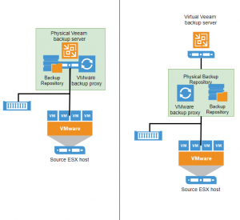

+++
title = "Notes on Migrating from an &#8220;All in One&#8221; Veeam Backup &#038; Replication Server to a Distributed System"
date = "2017-08-25T10:43:44Z"
draft = false
tags = [ "how to", "veeam",]
categories = [ "Systems", "Uncategorized", "Veeam", "Virtualization",]
featureimage = "featured.png"
+++

One of the biggest headaches I not only have and have heard about from other Veeam Backup &amp; Replication administrators have is backup server migrations. In the past I have always gone the "All-in-One" approach, have one beefy physical server with Veeam directly installed and housing all the roles. This is great! It runs fast and it's a fairly simple system to manage, but the problem is every time you need more space or your upgrading an old server you have to migrate all the parts and all the data. With my latest backup repository upgrade I've decided to go to a bit more of a distributed architecture, moving the command and control part out to a VM with an integrated SQL server and then letting the physical box handle the repository and proxy functions producing a best of both worlds setup, the speed and simplicity of all the data mover and VM access happening from the single physical server while the setup and brains of the operation reside in a movable, upgradable VM. This post is mostly composed of my notes from the migration of all parts of VBR. The best way to think of this is to split the migration into 3 major parts; repository migration, VBR migration, proxy migration, and VBR migration. These notes are fairly high level, not going too deep into the individual steps. As migrations are complex if any of these parts don't make sense to you or do not provide enough detail I would recommend that you give the fine folks at Veeam support a call to ride along as you perform your migration. **I. Migrating the Repository**

1. Setup 1 or more new repository servers
2. Add new repository pointing to a separate folder (i.e. D:\\ConfigBackups) on the new repository server to your existing VBR server exclusively for Configuration Backups. These cannot be included in a SOBR. Change the Config Backup Settings (File &gt; Config Backup) to point to the new repository. This is also probably a good time to go ahead and run a manual Config Backup while you are there to snapshot your existing setup.
3. Create one or more new backup repositories on your new repository server(s) to your existing VBR server configuration.
4. Create Scale Out Backup Repository (SOBR), adding your existing repository and new repository or repositories as extents.
5. All of your backup jobs should automatically be changed to point to the SOBR during the setup but check each of your jobs to ensure they are pointing at the SOBR.
6. If possible go ahead and do a regular run of all jobs or wait until your regularly scheduled run.
7. After successful run of jobs put the existing extent repository into Maintenance Mode and evacuate backups.
8. Remove existing repository from the SOBR configuration and then from the Backup Repositories section. At this point no storage of any jobs should actually be flowing through your old server. It is perfectly fine for a SOBR to only contain a single extent from a data locality standpoint.
 
 **II. Migrate the Backup and Guest Interaction Proxies**1. Go to each of your remaining repositories and set proxy affinity to the new repository server you have created. If you have previously scaled out your backup proxies then you can ignore this step.
2. Under Backup Proxy in Backup Infrastructure remove the Backup Proxy installation on your existing VBR server. Again, if possible you may want to run a job at this point to ensure you haven't broken anything in the process.
3. Go to each of your backup jobs that are utilizing the Guest Processing features. Ensure the guest interaction proxy at the bottom of the screen is set to either your new repository server, auto or if scaled out another server in your infrastructure.
 
 **III. Migrate the Veeam Backup &amp; Replication Server**1. Disable all backup, Backup Copy and Agent jobs on your old server that have a schedule.
2. Run a Config Backup on the old server. If you have chosen to Encrypt your configuration backup the process below is going to be a great test to see if you remember or documented it. If you don't know what this is go ahead and change it under File&gt;Manage Passwords before running this final configuration backup.
3. Shutdown all the Veeam services on your existing backup server or go ahead and power it down. This ensures you won't have 2 servers accessing the same components.
4. If not already done, create your new Veeam Backup and Replication server/VM. Be sure to follow the [guidelines on sizing](https://bp.veeam.expert/resource_planning/backup_server_sizing.html) available in the Best Practices Guide.
5. Install Veeam Backup, ensuring that you use the same version and update as production server. Safest bet is to just have both patched to the latest level of the latest version.
6. Add a backup repository on your new server pointing to the Config Backup repository folder you created in step 2 of the Migrating the Repository step.
7. Go to Config Backup and hit the "Restore" button.
8. As the wizard begins choose the Migrate option.
9. Change the backup repository to the repository created in step 5, choose your latest backup file which should be the same as the one created in step 2 above.
10. If encrypted, specify your backup password and then choose to overwrite the existing VeeamBackup database you created when you installed Veeam in step 4. The defaults should do this.
11. Choose any Restore Options you may want. I personally chose to check all 4 of the boxes but each job will have its own requirements.
12. Click the Finish button to begin the migration. From this point if any screens or messages pop up about errors or issues in processing it is a good idea go to ahead and contact support. All this process does is move the database from the old server to the new, changing any references to the old server to the new along the way. If something goes wrong it is most likely going to have a cascade effect and you are going to want them involved sooner than later.
 
 **IV. Verification and Cleanup**1. Now that your server has been migrated it's a good idea to go through all the tabs in your Backup Infrastructure section, ensuring that all your information looks correct.
2. Go ahead and run a Config Backup at this point. That's a nice low-key way to ensure that all of the basic Veeam components are working correctly.
3. Re-enable your disabled backup, backup copy and Agent jobs. If possible go ahead and run one and ensure that everything is hunky dory there.
 
 **Gotchas** This process when working correctly is extremely smooth. I'll be honest and admit that I ran into a what I believe is a new bug in the VBR Migration wizard. We had a few SureBackup jobs that had been setup and while they had been run they have never been modified again since install. When this happens VBR notes the job\_modified field of the job config database record as NUL. During the migration the wizard left those fields blank in the restored database, which is evidently something that is checked when you start the Veeam Backup Service. While the Service in the basic services.msc screen appears to be running under the hood you are only getting partial functionality. In my case support was able to go in and modify the database and re-include the NUL data to the field, but if you think you might have this issue it might be worth changing something minor on all of your jobs before the final configuration backup. **Conclusion** If you've made it this far, congrats! You should be good to go. While the process seems daunting it really wasn't all that bad. If I hadn't run into an issue it wouldn't have been bad at all. The good news is that at this point you should be able to scale your backup system much easier without the grip and rip that used to be required.