+++
title = "Recovering Entra ID Items from Veeam Backup &amp; Replication Backups"
date = "2025-08-13T08:31:51Z"
draft = false
tags = [ "entra-id", "restores-matter", "veeam",]
categories = [ "M365", "Veeam",]
featureimage = "featured.png"
+++

In [my last post ](/configuring-veeam-backup-replication-entraid-protection/)here we covered the whys and the hows of protecting Microsoft Entra ID data with Veeam Backup &amp; Replication. While it’s great to have good, encrypted backups of our data those backups mean less if you can’t recover them when needed. In this post we’ll walk through doing just that.

If you’ll remember there are a number of object types within Entra ID that can be protected at this time.

- Users
- Groups
- Roles
- Administrative Units
- Applications (App Registrations, Enterprise Apps, Service Principals)
- Conditional Access Policies (if enabled)

### Restoring Tenant Objects

The first and arguably the hardest part of restoring Entra ID tenant objects for me was finding where to kick off the restore from. As this 12.3 represents the first release of the capability it’s natural to realize that the full UI implementation may not be complete, especially with the upcoming UI overhaul coming in v13. To begin a restore session navigate to Home &gt; Backups in the VBR UI, expand your tenant job and click on your protected tenant. Once done you’ll have a “Entra ID Tenant Restore” option available in the task bar or your can simply right click on the tenant under the job.

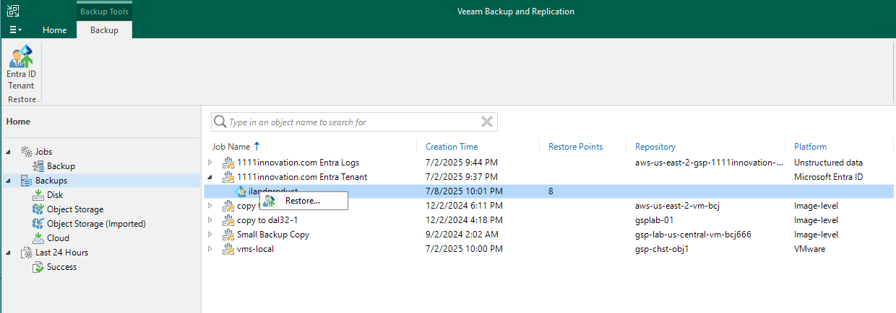

### Metadata Comparison

Once clicked you will be met with the modern version of a Veeam Explorer, if you’ve ever had to recover Active Directory objects from Veeam this should feel familiar, but with new and exciting capabilities.

One of the things I love about the Entra ID restore workflow is that they’ve included a metadata comparison option, allowing you to pull a selected restore point and compare that against what’s present in Entra ID. As somebody who’s had to deal with permissions mess ups and group memberships in AD in the past this is a very welcome change. To use it select an item in the restore window and from the restore button choose “Metadata Comparison.”

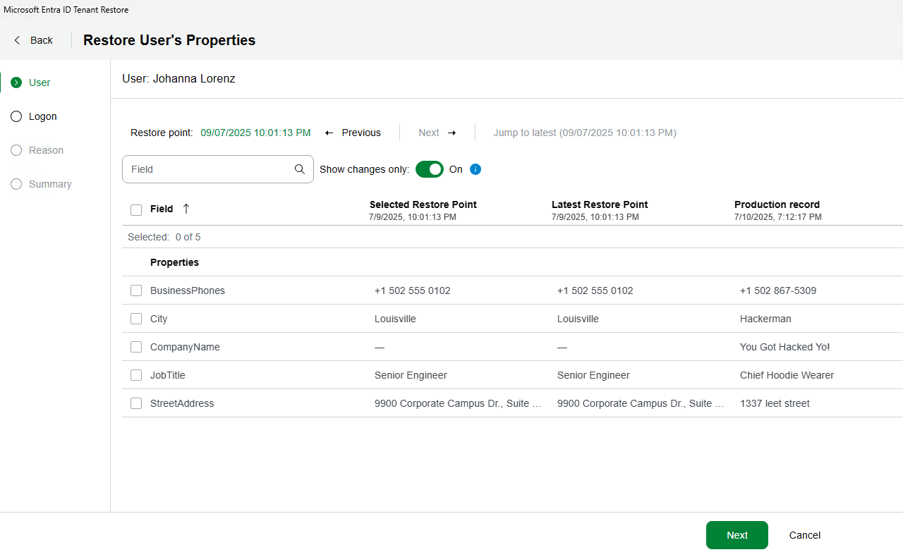

Oh no, it looks like Hackerman’s got to me! I should go restore these properties on my user. I can do that by simply selecting all the fields and hitting next. This will prompt me to login to Entra ID with the regular device code method.

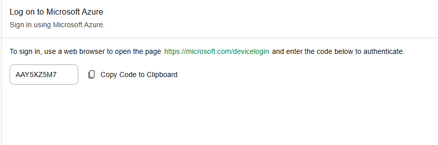

Once you successfully authenticate it will inform you and you can proceed.

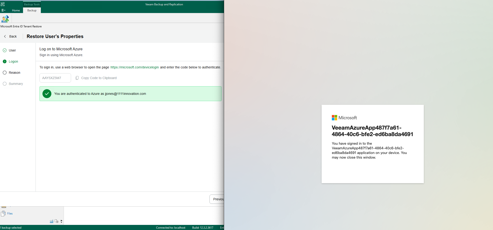

You will need to provide a restore reason as is common with standard Veeam restores.

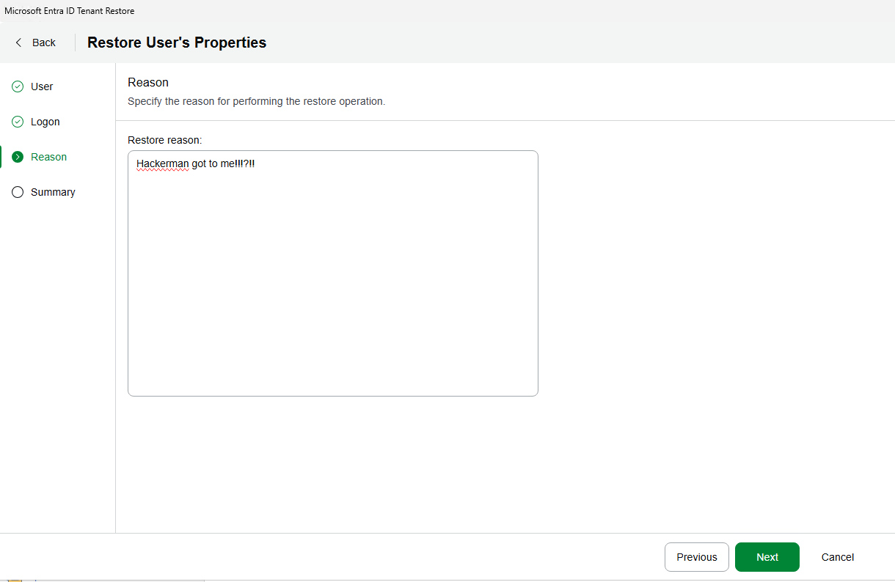

Once you hit Next and finish the protected metadata will be sent back to the user and restored. Success can be tracked within the job.

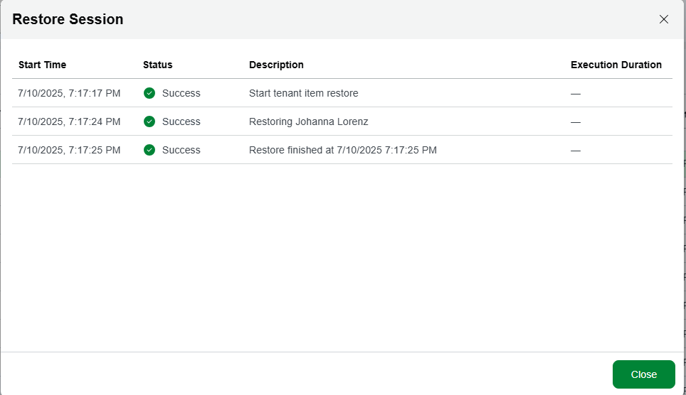

As you can see the user properties have now been restored.

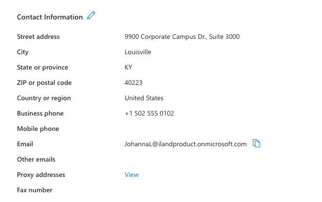

### Full User/Object Recovery

While the metadata recovery is great what if my entire user account (or other protected Entra object) is deleted or corrupted? While the hackerman is always a threat this is just as likely to be an administrative flub in the cloud. Not to worry, we can recover from scratch as well.

Similar to our metadata restore we select the account(s) we want to restore and then click Full Restore.

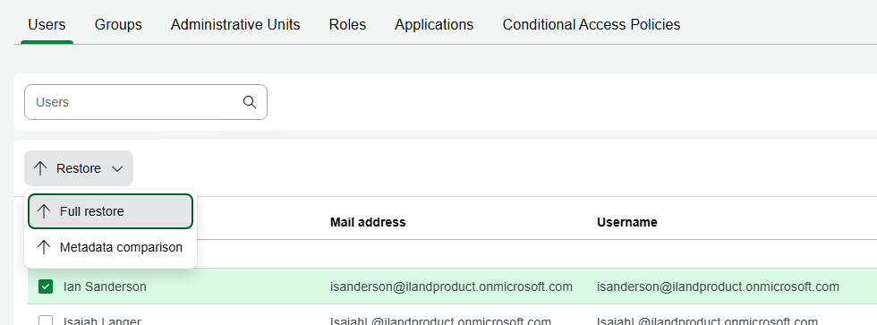

We do have to select them again on the next screen to begin the wizard

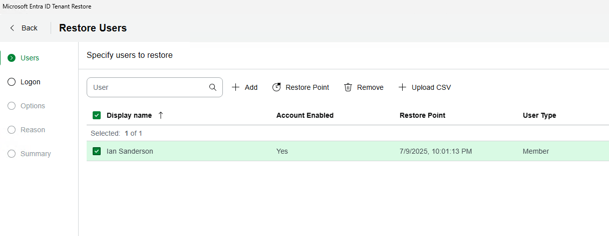

We will once again login with the device ID and then be presented a number of restore options. Most noticeably is the need to set a default password and how you want to handle if the object is present.

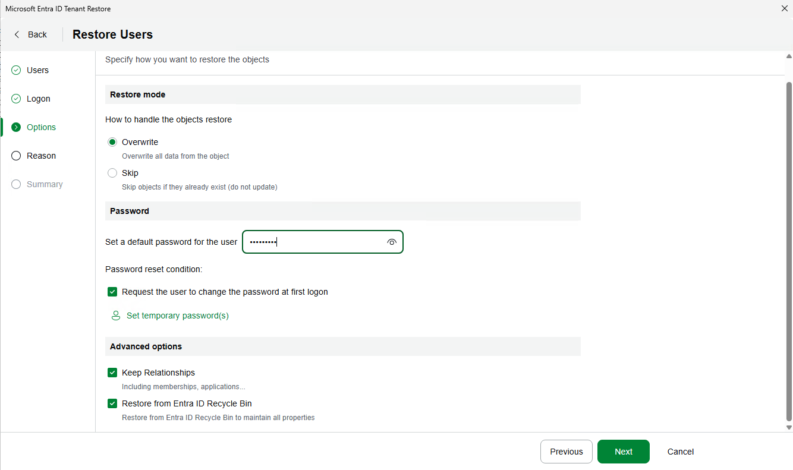

If you are bulk restoring users you can click the “Set temporary passwords” link and it will let you set separate passwords or auto-generate them all for you.

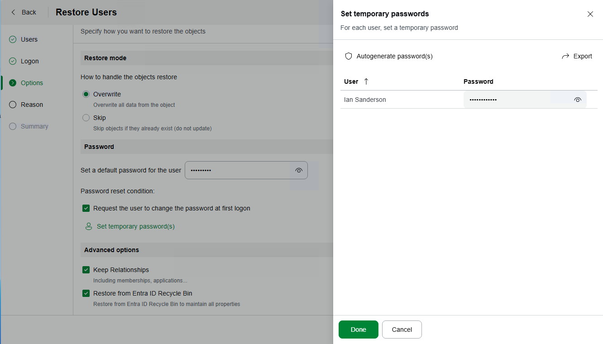

Once you supply a reason, or not, you will be able to finish up. Unless you’ve used something common I recommend you click the Passwords link on the Summary page so you can download a CSV file with any passwords used.

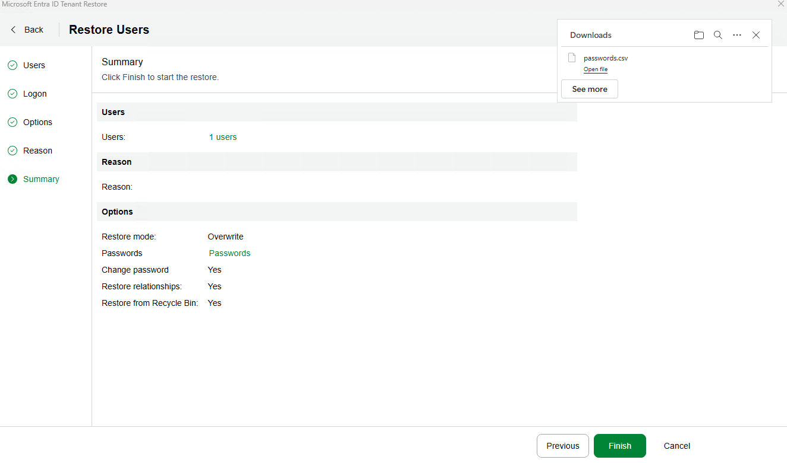

If you chose to overwrite existing then you will be prompted to do so if you are sure.

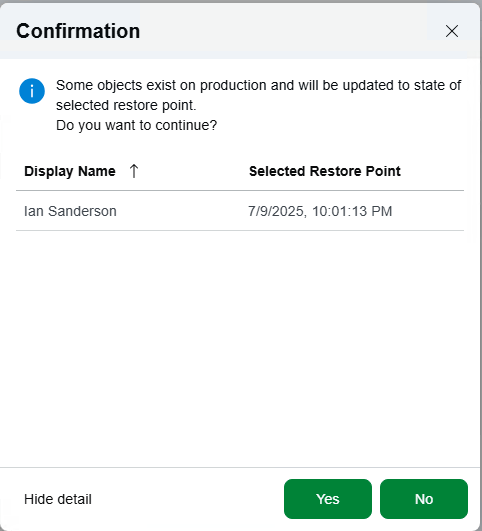

Once you hit yes it will complete the process. If this was a recent deletion it will pull the data from the Entra Recycle Bin rather than the backup itself making for a very fast restore.

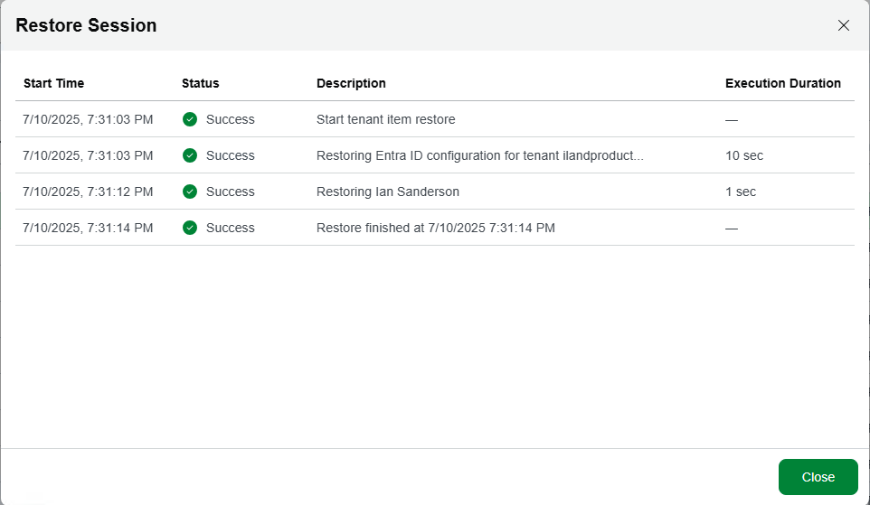

It’s worth noting that while this has restored the Entra ID user it has not recovered any data within it. This is because Microsoft365 data is a function of the Entra user but not protected in the same process.

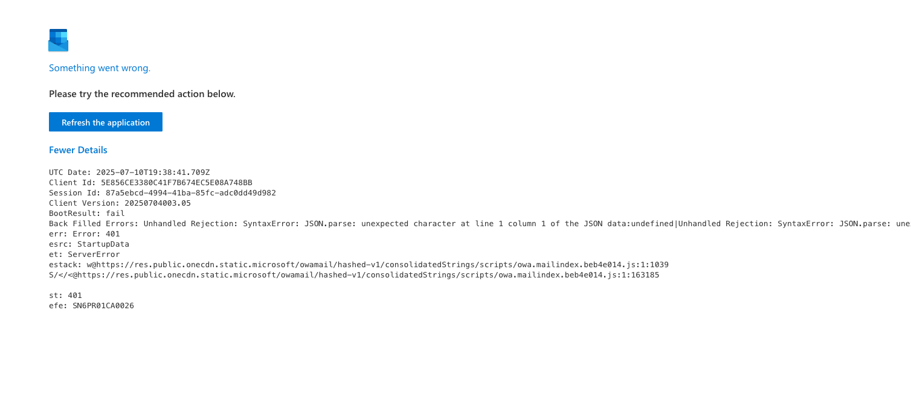

If you are protecting this with 11:11 Office 365 backup you will simply need to hop over to [11:11 Console](https://console.1111systems.com) and recover all of your Microsoft365 data back to the now recovered Entra ID user.

Restores via the [11:11 console](https://success.1111systems.com/docs/cloud-backup-for-microsoft-365/restoring-and-exporting-items-with-the-11-11-console) or via the [Veeam Explorers (VEX)](https://success.1111systems.com/docs/cloud-backup-for-microsoft-365/view-backups-with-veeam-explorer-vex) connected remotely are both well covered in the 11:11 Success Center so I’ll not recreate that documentation.

## Conclusion

As you can see recovery of protected Entra ID objects is a relatively painless process. While 11:11 plans to integrate this capability into it’s SaaS based Microsoft365 backup product in the future for now you can easily protect this data and recover as needed through your own on-premises Veeam Backup &amp; Replication server leveraging 11:11 Cyber Vault for Veeam to capture log backups and Veeam Rental Licensing for any additional licensing required.