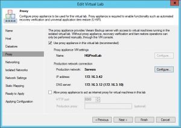
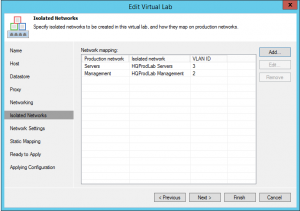
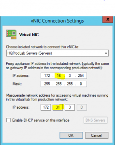
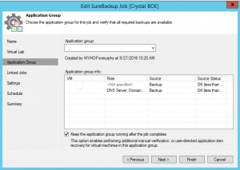
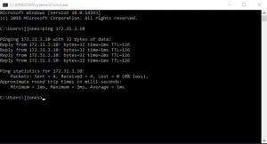
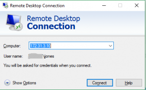

+++
title = "Setting Up External Access To A Veeam SureBackup Virtual Lab"
date = "2016-11-04T13:54:38Z"
draft = false
tags = [ "backup", "vDM30in30", "veeam", "Veeam Vanguard", "vSphere",]
categories = [ "Systems", "Veeam", "Virtualization",]
featureimage = "featured.png"
+++


Hey y'all, happy Friday! One of the things that seems to still really fly under the radar in regards to Veeam Backup &amp; Replication is its SureBackup feature. This feature is designed to allow for automated testing via scripts of groups of your backups. An example would be if you have a critical web application. You can create an application group that includes both the database server and the web server and when the SureBackup job is run Veeam will connect a section of its backup repository to a specified ESXi host as a datastore and, start the VMs within a NAT protected segment of your vSphere infrastructure, run either the role based scripts included or custom ones you specify to ensure that the VMs are connecting to the applications correctly, and then when done shut the lab down and fire off an e-mail. That workflow is great an all but it only touches on the edge of the power of what SureBackup can do for you. In our environment not only do we have a mandate to provide backup tests that allow for end-user interaction, but we also use SureBackup for test bed type applications such as patch tests. An example of the latter here is when I was looking to upgrade our internal Windows-based CA to Server 2012 R2. I was able to launch the server in the lab, perform the upgrade and ensure that it behaved as expected WITHOUT ANY IMPACT ON PRODUCTION first and then tear down the lab and it was like it never happened. Allowing the VMs to stay up and running after the job starts requires nothing more than checking a box in your job setup. By default access to a running lab is fairly limited. When you launch a lab from your Veeam server a route to the NAT'd network is injected to the Veeam server itself to allow access, but that doesn't help you all that much if you are wanting others to be able to interact; we need to expand that access outwards. This post is going to walk you through the networking setup for a Virtual Lab that can be accessed from whatever level of access you are looking for, in my case from anywhere within my production network. **Setting Up the Virtual Lab** The first step if you haven't setup SureBackup in your environment at all is to set up your Virtual Lab. The first of two parts here that are critical to this task is setting up the Proxy IP, which is the equivalent to your outside NAT address if you've ever worked on a firewall. This IP is going to essentially be the production network side of the Lab VM that is created when you setup a Veeam Virtual Lab. [



](1.-Set-NAT-host.png) Next we need to set up an isolated network for each production port group you need to support. While I use many VLANs in my datacenter I try to keep the application groups I need to test on the same VLAN to make this setup simple, but it doesn't need to be, you can support as many as you need. Simply hit add, browse out and find the production network port group you need to support, give the isolated network a name and specify a VLAN. [



](2a.-Setup-VLANs.png) The last step of setting up the Virtual Lab in this regard is creating a virtual NIC to map to each of your isolated networks. So where I see a lot of people get tripped up with this is always make the proxy appliance IP address here map to the default gateway of the production network it is reflecting. If you don't do that the launched lab VMs will never be able to talk outside of the lab. Second, in regard to the Masquerade IP try to aim for some consistency. Notice that in my production network I am using a Class B private address space but with a class C mask. By default this will throw off the automatic generation of the Masquerade IP and I've found it isn't always consistent across multiple Virtual NIC setups. If you setup multiple isolated networks above you need to repeat this process for each network. Once you are done with this you can complete your Lab Setup and hit Finish to have it build or rebuild the appliance. [



](2.-Create-NAT-Network.png) **Tweaking the SureBackup Job** For the sake of brevity I'm assuming at this point that you've got your Application Groups setup without issue and are ready to proceed to fixing your SureBackup job to stay up and running. To do so on the Application Group screen All you have to do is check the "Keep the application group running after the job completes" box. That's it. Really. Once you do that this lab will stay up and running until you right click on the job in the Veeam Backup &amp; Replication Console and choose stop. I've been lobbying for year for a "stop after X hours" option but still haven't got very far with that one, but really the concern there is more performance impact from doubling a part of your load since you are essentially running 2 copies of a segment of your datacenter. If you have plenty to burn it isn't an issue. [



](3.-Keep-Lab-Up.png) **Fixing the Routing** Now the final step is to either talk to your network guy or go yourself to where your VLAN routing is taking place and add a static route to the IP range of your inside the lab into the routing table through the Proxy Appliance's IP. For the example we've been working through in this post our Proxy appliance has an IP of 172.16.3.42 and all of our Lab networks are within the 172.31.0.0/16 network. If you are using a IOS based Cisco switch to handle your VLAN routing the command would be

```
ip route 172.31.0.0 255.255.0.0 172.16.3.42
```
 After that is done, from anywhere that route is accessible from you should now be able to pass whatever traffic inbound to the lab network addresses. So sticking with our example, for a production VM with the IP address 172.16.3.10, you would interact with the IP 172.31.3.10 in whatever way needed. Keep in mind this is for lack of a better word one way traffic. You can connect in to any of the hosts within the lab network but you can't really have them reach directly out and have them interact on the production network. [



](4a.-Testing.png) **One More Thing...** One final tip that I can give you on this if you are going to let others in to play in your labs is to have at least one workstation grade VM that you include in each of your Applications Groups with the software needed to test with loaded. This way you can enable RDP on that VM and they user can just double-click an icon and connect into the lab, running their tests from there. Otherwise if you have locally installed applications that need to connect to hosts that are now inside the lab you are either going to need to reconfigure the application with the corrected address or modify the user's hosts file temporarily so that they connect to the right place, neither of which is particularly easy to manage. The other nice thing about a modern RDP session is you can cut and paste files in and out of it, which is handy if the user wants to run reports and the like. [



](4.-Connecting-into-the-lab.png) As an aside I'm contemplating doing a video run through of the setting up a SureBackup environment to be added to the blog next week. Would you find such a thing helpful? If so please let me know on twitter [@k00laidIT](https://twitter.com/k00laidIT).