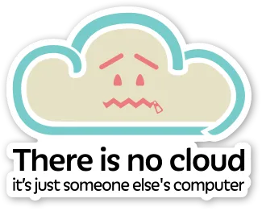

+++
title = "Thinking About&#8230; Hybrid Cloud"
date = "2023-07-06T13:08:43Z"
draft = false
tags = [ "AWS", "gcp", "hybrid cloud", "on prem", "thinking about",]
categories = [ "AWS", "Thinking About",]
featureimage = "featured.png"
+++

Recently I've found myself thinking deep thoughts about a variety of subjects. Like any normal person glutton for punishment I find that writing these thoughts down helps me to process and further I've decided that if I'm going to write it down why not put these thoughts out for to world see! It's worth noting that these are not going to be the most polished posts you see in this space as it's more like long form notes, but on the flip side I truly plan on coming back and revising content here regularly as well as these thoughts evolve and flesh themselves out more.

First up in this hopefully successful series is quite a lot of thoughts around the concept of Hybrid Cloud. If you aren't familiar with the idea of Hybrid Cloud you probably at least have heard about the mythical and ever evolving "Cloud" in a computing sense; a location where things work and you just shouldn't think or know about what happens under the covers. Hybrid cloud is the concept of needing to mix and match services between your on-premises datacenter(s) and the public cloud(s).

### Hybrid-Cloud vs Multi-Cloud

For the purposes of this post and how I tend to think about single clouds I think about each cloud is a where you have to define users, either directly or via some form of integration into an authentication service. For example, when if I have a user john.smith in my on-prem Active Directory and I begin to expand to AWS I would need to reprovision john.smith either directly or through a synchronizer to AWS Identity Access Management (IAM). The same would hold true for Microsoft Azure, Google Cloud Platform (GCP) and on and on. Each of those represent a single cloud.

Make this even murkier is the concept of multi-cloud. Again, there are lots of definitions but to me with Hybrid Cloud there is definitely a on-prem to public cloud relationship and by and large workloads are siloed into locations; this application runs on-prem, this application is running in AWS, this one is SaaS running in Azure. To me with multi-cloud it is a single application that may or may not have portions in the on-premises datacenter but is functioning across 2 or more clouds to present to the user. This may be done for workload type optimization but more likely it is done for resiliency's sake; the application will keep functioning even if an AWS region goes down (I'm looking at you us-east-1) or AWS all together has an outage. This is because the dataset is replicated between cloud providers and the application tier pulls from local datasets.

### The Modern Evolution of Computing

As someone who is a "well seasoned" IT professional I've seen the gamut of IT compute from individual physical servers through the glory days of on-prem virtualization into the "let's move it all to the cloud" and now back to the hybrid cloud sanity we see today. Each of the arcs of the post Y2K computing evolution have had their reasons, most of which have to do with cost and efficiency.

Virtualization really started the revolution leading to where we are today, allowing for multiple VMs to run within a single or small cluster of servers which in turn allowed those physical servers to be better utilized. This was great except you still either had to own your own to power those hypervisors or lease it, a long term commitment no matter how you sliced it. For organizations that prioritize flexibility this was a challenge because they desire to move as much as possible into Operational Expenses (or OpEx as you'll hear it called) and away from Capital Expenditures (or CapEx).

Next as cloud computing came to be with the launch of AWS there was a push to move EVERYTHING to public cloud. This allowed those OpEx preferring organizations to essentially lease computing power, storage and most of the networking by the hour if they so desired. That may make sense if you are trying to see if something will work or if you are dealing with a known limited time requirement but subscribing to cloud services like this is the equivalent to buying anything at the MSRP price.

To get to the better pricing all cloud providers allow for reserve pricing, essentially negotiating long term minimum spend in exchange for better pricing, for workloads that aren't as dynamic in nature. Even with that because you are abstracting away caring about the infrastructure underneath of the cloud platform you are losing the capability of choosing where that datacenter is, or how much it costs, or how much to pay the engineers that keep it running on or how many engineers are employed to do so. Because you are giving all that up you are losing the ability to control "the floor" for how cheap you can offer a given workload bringing people eventually back to "do I really want to run everything in the cloud?"

This is what brings us back to where I think we are today, the modern hybrid cloud. While OpEx may still be preferrable there are simply just some workloads that either do not perform as well in the public cloud or do not perform efficiently in that way. Netflix famously launched all of its streaming service in AWS at the beginning of the cloud computing era and then just as famously began building its own datacenters and moving those workloads back because at scale the fee structure of public cloud just didn't work as well.

Further, there may become regulatory reasons why you may have to keep some things running on-premises or in a situation where you have full control over the computing environment. Many healthcare and financial systems are subject to regular audit where questions are asked about protections to the physical hardware; if you don't own it you can't guarantee those protections except to point at one of the many security related certifications public cloud providers subject themselves to. That may or may not make the cut for you and your needs.

### Conclusion

In the end we are into the era of hitting the mid-point of the pendulum where we are not doing all of on-prem or all in the cloud but rather making per application or workload decisions on where that need will best and most efficiently operate. This is a great place to be and allow for more flexibility. The challenge to organizations as well as IT professionals is the skillsets for each will need to grow. What we know about on prem does not necessarily cut it to cloud computing and as we focus on cloud or clouds, learning as we go, on-prem is still evolving and we have to keep up with that too.