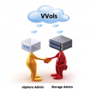

+++
title = "Thoughts on the vSphere 6 Open Beta"
date = "2014-08-13T08:47:15Z"
draft = false
tags = [ "beta", "vmware", "VMworld", "vSphere",]
categories = [ "Virtualization",]
featureimage = "featured.png"
+++

Ahead of its annual [Vmworld conference](http://www.vmworld.com/) (which I will be attending this year, yay!) VMware has announced the version 6.0 of its vSphere line of products including ESXi, vCenter and just about every other VMware related topic I've written about here. The company has chosen to mix it up a little bit this year in that they have made the [beta program itself](https://communities.vmware.com/community/vmtn/vsphere-beta) public, but in joining the actual program you are required to sign a NDA keeping anything you learn private. To me I take this to mean that while the wire structure is there this is still very much a work in progress, with the community at large having the opportunity to greatly influence what we are going to be seeing in the final product. As I cannot directly talk about anything I'm learning from the beta itself I highly recommend anybody with a little space to lab go sign up for the beta, start providing feedback and try it out for yourself. Instead what I'm going to discuss here is my wish list for things to be included when 6.0 finally hits gold as well as the basics of the long discussed Virtual Volumes product that was released into beta along with vSphere. **Wish List** As I mentioned above, the beta for vSphere 6 requires a non-disclosure agreement, even if it is open to the public. To learn what is actually coming in vSphere 6 I urge you to go join the beta for yourself as there is a great deal of information in there for those who wish to really learn and understand the product(s). Below is a list of things that generically myself and a great many others very much so wish to see as this release comes to be.

- Bye Bye VI- Consider this your warning, the desktop Virtual Infrastructure client should be no more this time around. We've been warned for a couple of years ago that when the next major release of vSphere comes the Web Client will be the only option. While it's a great idea and vendor integration to it seems to be becoming very handy it does make me wish for…
- HTML 5 based web client- Seriously VMware, 2005 called and wants its website back. The current iteration of the web client is based on Adobe Flash which means proprietary code, security bug and no iPads. In a day and time when you have available open standards to allow for similar functionality, why aren't you using it?
- A full featured vCenter Appliance- with vSphere 5 we began to start to see the vCenter Server Appliance (vCSA) presented as a viable option to the application running on top of a Windows Server. That said it's got some major drawbacks that in my opinion are deal breakers in terms of replacing my Windows vCenter boxes. These include 
    - Update Manager support
    - Linked Mode
    - Greater database support (at a bare minimum MS-SQL)
- Fix SSO/ Directly utilize AD/LDAP for an identity source- SSO got better with vSphere 5.5 as compared to 5.0 and 5.1, but I am still flummoxed by the idea that Vmware feels that they need to reinvent the authentication wheel. I would guess that the implementations they are in where there isn't already some form of available authentication source such as Active Directory or Kerberos are few. Please leverage those system and cut out the middle man.
- Virtual Volumes- see below but this is a pretty good bet to be there
- Greater IPv6- IPv6 support has been around for a while but if utilized in vSphere 5 it will break some things and still requires you to at least have a IPv4 loopback configured.
- Marvin related things- VMware has been hinting at this all summer, the super-secret "[Project Marvin](https://twitter.com/cocquyt/status/475133344837935104)." There is a little real information and a lot of speculation going on around the internet. Essentially it is described as "the first hyperconverged infrastructure appliance" leading many to think that either VMware is about to get into the hardware game or is partnering with somebody to do the same.
 
 **Virtual Volumes** Virtual Volumes is storage centric feature that has been discussed and released to the public as a technical preview since at least 2012 and is a spin off idea from the original concept of VAAI. Typically when creating a new VM a VMware Admin needs to either contact the Storage Admin carve out a LUN each time, do so themselves, or what many, myself included do, create impossibly large LUNs and then have multiple VMs within which is actually pretty wasteful and negatively impacts system performance. The goal of VVOLs is to make storage VM-centric rather than LUN-centric by leveraging that vSphere API for Array Integration (VAAI) to make the deployment of storage just a component of deploying a VM in whatever manner you choose to do so. Put as simply as possible… > **VVOLs is the storage of VM files directly on the storage system without a LUN middle man.**

 If you think about all the different ways you utilize storage with your virtualization strategy this makes even more sense. You can take snapshots and create at both the VM and LUN level, what if they are one and the same? Of course this is not going to be possible without some support from vendor ecosphere and that apparently is coming in droves. As VVOLS enters into [the beta program](http://blogs.vmware.com/vsphere/2014/06/virtual-volumes-beta.html) alongside vSphere 6 we are seeing demonstrations of support from a variety of storage providers including Dell, NetApp, EMC, HP, Nimble Storage, Solid Fire, Tintri and open beta programs from HP, NetApp, IBM and Dell. To really take the deep dive into what VVOLs is and how to implement I recommend reading these posts from [Cormac Hogan](http://blogs.vmware.com/vsphere/2012/10/virtual-volumes-vvols-tech-preview-with-video.html) and [Duncan Epping](http://www.yellow-bricks.com/2012/08/07/vmware-vstorage-apis-for-vm-and-application-granular-data-management/) as well as enrolling in [the beta](https://communities.vmware.com/community/vmtn/beta/vsphere-beta/vvols) for yourself if you have some supported hardware.