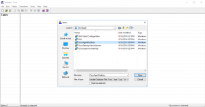
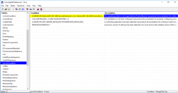
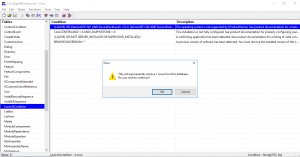
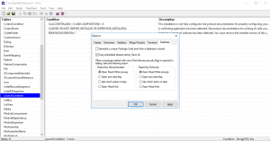
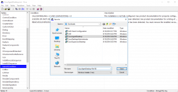
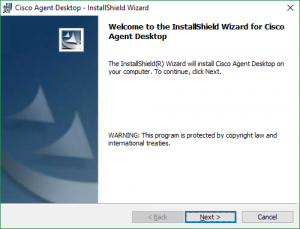

+++
title = "Upgrading Cisco Agent Desktop on Windows 10"
date = "2016-11-03T10:56:53Z"
draft = false
tags = [ "uccx", "vDM30in30", "Windows 10",]
categories = [ "Uncategorized", "Voice",]
featureimage = "featured.png"
+++

So we recently had the joys of upgrading our Cisco Voice setup to version 11, including our Unified Contact Center Express (UCCX) system. In the process of our upgrade we had to do a quick upgrade of UCCX to 9.02 from 9.01 to be eligible to go the rest of the way up to 11, allowing us to run into a nice issue I'm thinking many others are running into. As far as 11 is concerned the big difference is it is the first version where the Cisco Agent Desktop (CAD) is not an option as it has been replaced by the new web-based Finesse client for Agents and Supervisors. For this reason many Voice Admins are choosing to take the leap this year to 10.5 instead as it gives you the option of Cisco Agent Desktop/Cisco Supervisor Desktop (CSD) or Finesse. The problem? These MSI installed client applications are not Windows 10 compatible. In our case it wasn't a big deal as the applications were already installed when we did an in place upgrade of many of our agent's desktops to Windows 10, but attempting to do an installation would error out saying you were running an unsupported operating system. \*DISCLAIMER: While for us this worked just fine I'm sure it is unsupported and may lead to TAC giving you issues on support calls. Use at your own discretion. **Fixing the MSI with Orca** Luckily there is a way around this to allow the installers to run even allow for automated installation. Orca is one of the tools available within the [Windows SDK Components](https://www.microsoft.com/en-us/download/details.aspx?id=3138) download and it allows you to modify the parameters for Windows MSI packages and either include those changes directly into the MSI or to create a transform file (MST) so that the changes can be saved out-of-band to the install file so that it can be applied to different versions as needed. As my needs here are temporary I'm simply going to just modify the in place MSI and not bother with the MST, which would require additional parameters to be passed for remote installation. Once you have the SDK Components downloaded you can install Orca by running the Orca.msi within and then just run it like any other application. The first step is to open the program and go to File&gt;Open and open the MSI package. In this case we are looking for CiscoAgentDesktop.msi  Once open you will see a number of Tables down the left side. The easiest way I know to explain this is an MSI is simply a sort of database wrapping the installer with parameters. Scroll down the list until you see LaunchCondition and double-click on that. You will now see a list of list of conditions the MSI package is checking before the installer is allowed to launch. Reading the description of the first one this is our error message, right?  Now we need to remove the offending condition which can be done by simply right clicking on it and choosing "Drop Row." It will prompt you to confirm, just hit OK to continue.  Finally before we save our new MSI we need to go to Tools and Options, choosing the Database tab. Here we need to check the "Copy embedded streams during 'Save As' so that our changes will be rolled into the package.  Now simply go to File&gt;Save As... and save as you would any other file. Easy peasy...  Now if we run our new MSI package it will allow you to proceed to install as expected. Again, let me say this won't magically tell TAC that this is a supported solution. If you run into problems they may still tell you either to upgrade to 10.6 (which supports Windows 10) or later or roll back Windows version to 8.1 or older. 