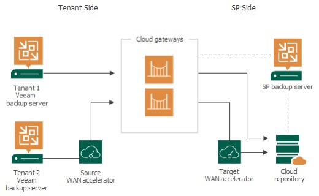
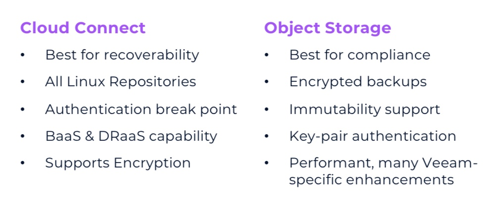

+++
title = "v12 Preview: Ding, Dong, Veeam Cloud Connect&#8217;s Not Dead"
date = "2023-02-21T09:00:00Z"
draft = false
tags = [ "object storage", "v12 launch", "VCSP", "veeam", "Veeam Vanguard",]
categories = [ "Systems", "Veeam",]
featureimage = "featured.jpg"
+++

With the upcoming [version 12 release of Veeam Backup &amp; Replication](https://go.veeam.com/v12) the platform will start to support object storage as a primary location for backups. This is not a new idea, it feels like we’ve been talking about this forever, but it is a radical shift for the company and frankly one that for reasons many in the [Veeam Certified Service Provider](https://www.veeam.com/service-providers.html) community have been dreading. While I believe object storage has its place, even within a VCSP, it should not in general practice be a replacement for Veeam Cloud Connect as VCC-B and VCC-R offer capabilities and enhancements that object storage services all by themselves will never be able to replicate.

## What is Veeam Cloud Connect?

It's appropriate to level set on the technologies at hand first. [Veeam Cloud Connect](https://anthonyspiteri.net/veeam-vcsp-reverse-roadmap/) was first announced at VeeamON 2014 and became available through partners shortly thereafter. There are two sides to today's Cloud Connect Service: Veeam Cloud Connect Backup (VCC-B) and Veeam Cloud Connect Replication (VCC-R).

<figure class="wp-block-image size-large">

<figcaption class="wp-element-caption">https://helpcenter.veeam.com/archive/backup/120/cloud/cloud\_infrastructure.html</figcaption></figure>Veeam Cloud Connect Backup allows for a service provider to provision a slice of cloud storage and securely provision that a customer as a tenant. That storage can have further enhancements such as Immutability if on Linux repositories or with v12 object storage and Insider Protection, an out-of-band temporary storage location for deleted cloud backups as part of a ransomware mitigation strategy. Once the tenant is provisioned on the SP side a customer only needs to enter 3 pieces of information to add that storage as a repository or repositories to their backup infrastructure. Afterwards they can simply target that repo for backup copy or in some situations even direct backup jobs.

Veeam Cloud Connect Replication is the same general concept as VCC-B, but just with VMs being stored directly in IaaS. Your Service Provider would provision quotas in a VMware Cloud Director or vCenter environment in which powered off copies of the source VMs are copied. These replicas maintain a shorter maximum number of restore points which are stored as snapshots on the replica. In conjunction with either a VPN connection or the Veeam Network Extension Appliance you can extend your on-prem environment into your replicated IaaS one and run those systems remotely for several reasons.

## Object Storage Review

Veeam has been slowly building support for object storage over a few releases now. In short order the progression has been:

- 9.5u4 (2019): Support for the ability to archive or dehydrate older restore points to object storage, known as move mode. This functionality is powered by the Scale Out Backup Repository (SOBR) construct in VBR, defining performance tier (on-prem block storage) and cloud or archive tier (object storage). With this support cloud tier can only support a single bucket per SOBR which can cause scaling issues.
- 10.0 (2020): Copy mode is added which allows that same SOBR to make an immediate copy of any restore point that hits the performance tier to be immediately copied to the cloud tier. This is commonly seen as the capability that best competes with the VCC-B functionality. Support for Immutability and mounting backups regarding cloud tier happens in this release as well.
- 11.0 (2021): Addition of support for Google Cloud Platform (GCP) Storage.
- 12.0 (2023): Host of improvements to object storage support.
    - Object in the performance tier with multiple buckets supported as extents.
    
    
    - Support for multiple buckets of the same type in the cloud tier.
    
    
    - Reconfiguration of the bucket folder structure to allow for optimized performance especially around API calls.

In all there has been a steady line of improvement and innovation towards object storage making it the first-class citizen it will be with v12's release.

## Verdict

All that begs the question, should I as a Veeam Backup &amp; Replication administrator be migrating my offsite backups from Cloud Connect Backup to object storage? In my opinion, probably not. The compelling use case today regarding offsite backups is the same that's been around since v10; if you are only sending a copy of backups offsite for the purpose of compliance, checking the box if you will, then object storage may be a good fit for you. It is exceptional in how it supports Object Lock (Immutability). Further it is more efficient than anything else to date in how it writes data which makes it well suited for on-premises storage if available, but for cloud copy usage the capabilities quickly fall off.

<figure class="wp-block-image size-large">

</figure>In the end my biggest reason why I would still choose VCC-B today is the restore scenarios. With Object Storage unless you are utilizing a VCSP like [11:11 Systems](https://www.1111systems.com) you aren't going to be able to have the object storage close enough to a VMware native compute to facilitate timely restore. Your other options are the opposite ends of the spectrum; low cost providers who have no compute capabilities and may have extra charges that may apply to your organization depending on deletion.Data egress or API calls along with hyperscalers that do have compute adjacent but are a completely different architecture to vSphere are other concerns. These scenarios require conversion of backups to instances and rely on your IT staff having the skillset to securely create an environment for these workloads to run from.

When you consider the tiered approach to Disaster Recovery, pairing a broad spectrum copy of backups to VCC-B with Tier 0 or 1 targeted VCC-R you gain 2 things by sticking to VCC-B:

1. Support for seeding replicas from VCC Backups
2. A defined DRaaS environment pre-created for your organization that in the event of on-prem not being available that you can boot replicas quickly and less quickly begin restoring backups into.

While not necessarily as important as restorability one other major difference to be aware of is the ability to control how much of your on-prem backups you keep off site. Keep in mind that copy mode works on the principle that you want to keep everything you have on-site in an offsite location, so if you want to have 30 days on prem and 7,14,60, or 90 days offsite there really isn't a path besides Grandfather-Father-Son (GFS) to get there with just copy mode. Further it's going to be everything that targets the given repository, if you have VMs you don't necessarily want to keep off prem (think of like a door control system that does you no good anywhere but in the physical location) your only option is to create separate repositories and jobs. With VCC-B and backup copy all these things can be done in a very granular manner.

Finally, you have the issue of expertise. While many of us might be conversant in object storage and how it works you may not necessarily know the ins and outs of bucket policy, ACLs, versioning, etc. It's a technology you do need to know but when it comes to backups and especially the need to restore them in anger using Veeam Cloud Connect not only gets you an easy path to restore. VCSP employs experts in Veeam software and access to this expertise with best practices for Veeam backups and replicas can be critical, ensuring a more seamless restoration of services when the pressure is already on.

## Conclusion

While the promise and the capabilities of object storage are exciting as of the v12 release Veeam Cloud Connect Backup offers many more options when it comes to the restore and management of your backup data and for that reason should still be the go-to for offsite backup copies. If you are wanting to begin leveraging the technology an on-premises object storage platform for your local backups is a far better solution and can give you an out of the box upgrade to what you are using today.