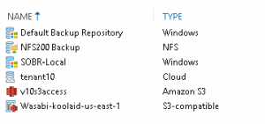
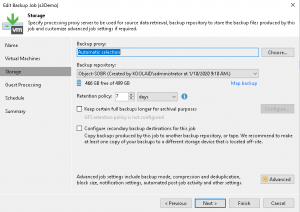

+++
title = "VBR v10: A Few of My Favorite Things Part 2"
date = "2020-02-05T09:00:45Z"
draft = false
tags = [ "v10", "veeam", "virtualization",]
categories = [ "Systems", "Veeam",]
featureimage = "featured.png"
+++

If you have been around the Veeam world for very long, you know they don't do small releases; each new version comes with literally hundreds of enhancements and bug fixes. While my last post covers many of the headliners there is still a lot of great things left to see. In this post, I'm going to discuss some of the "little things" that aren't so little that are going to make this a great release.

#### Object Storage

 One of the long asked for features of Veeam was greater ability to leverage public cloud capabilities for backups and data management in general. In 9.5 update 4, we got the ability to offload local storage to object as a way of extending on-prem resources through dehydrating local backup copies to S3, Azure Blob and the like. In v10 we now have what they call [Copy mode](https://www.veeam.com/blog/v10-sneak-peek-cloud-tier-copy-mode.html) which is the next step in the evolution. With Copy mode you will create a Scale Out Backup Repository containing any number of on-premises repository extents and a cloud storage provider, referred to as an External Repository. You will have the ability to have it mirror the local extent to cloud to give you a somewhat simplified method to getting your backups off-site. We've also already talked about the capability built in for the NFS backup capability. While Veeam Backup and Replication is the star of this post, it is worth noting here that the recently released Veeam Backup for Office 365 version 4.0 has the ability to address object storage as a direct repository with no need for local storage at all. This totally makes sense in this case; effectively it empowers you to take a cloud workload in location/system A and place the backups in location/storage B, while all the time maintaining control in an on-prem system, if you choose. End of the day, the day is coming where object storage is going to become THE first-class citizen in the Veeam ecosphere. Does this mean you have to start using Amazon, Microsoft, or Google for your backup storage, either as a backup copy or even for initial backups? Heck no! Any number of Veeam Cloud Service Providers (VCSPs) including, I don't know, [OffsiteDataSync](https://www.offsitedatasync.com), are capable of offering these solutions themselves along with more of the hands on assistance you've come to know and love. #### Restore Here, There and Everywhere

 Over the last few releases, we've steadily been getting more and more places and ways to restore our data. If you think about it, that's what it is all about, isn't it? Backups without an easy way to restore them are just blobs of data taking up disk space. With our traditional VM-based workloads, we've been able to have the ability to restore to Azure and Amazon EC2 instances. That's great, as long as you have no problem with public cloud. It can also be a time-consuming process if you are restoring there from your on-premises backup repositories. Now with v10, we have the capability to have copies of our backups in object or blob storage buckets, putting those backups much closer to their Cloud Compute counterparts. While there are still quite a few steps involved in making this viable, as my friend [Anthony Spiteri](https://twitter.com/anthonyspiteri) demonstrated, you can [perform these restores while on airplane Wi-Fi](https://anthonyspiteri.net/instant-vm-recovery-at-40000-feet-streamed-from-amazon-s3/) in the time it takes for a normal flight. The restore capability that really gets me excited is a feature they call "restore anything to vSphere." In this if Veeam is ingesting the backup as a traditional .VBK file, you now will have the capability to restore it directly to a vSphere VM. Hyper-V backups? Restore to vCenter. Physical boxes protected with Veeam Agents for Windows or Linux? Right click, restore to vCenter. For those doing mixed production workloads, this has great potential as a migration tool or powering a single Disaster Recovery Site with only a single framework to support. #### On-Premises GFS

 One final thing of note is Veeam and the Backup industry as a whole has long advocated for the concept of Grandfather Father Son; Where you have your normal backup that runs for a given period, but outside of that, you have sealed backups on other given time periods created from the backup runs. For example, you might have a normal run job of 30 daily backups, but from that, you seal 12 monthly and 6 yearly backups to give you historical coverage. Traditionally with Veeam Backup and Replication, this is done as a function of the Backup Copy job, but now with version 10, we have the capability to make GFS restore points right on the primary backup job. #### Conclusion

 As you can see there's a lot to like with version 10. Some of these things are answers to long term requests, other are keeping up with today's computing landscape. Either way it exciting to see what is coming next!