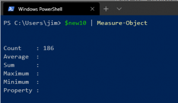

+++
title = "VBR v10 Powershell What&#8217;s New"
date = "2020-02-10T09:44:45Z"
draft = false
tags = [ "powershell", "scripting", "v10", "veeam",]
categories = [ "Automation", "Systems", "Veeam",]
featureimage = "featured.png"
+++


[



](pwsh-2.-measure-object.png)So one of the things that I always find interesting with each new Veeam Backup &amp; Replication release is the additions to the PowerShell cmdlets list. PowerShell was first introduced to the VBR universe with version 7 and with each release we have got more and more commands to play with. It still hurts me to this day that they haven't converted their Snap-In to a module yet but to quote my daughter's teacher, you get what you get and you don't throw a fit. In the spirt of this curiosity I decided to do a little differential fun with 9.5 update 4 and the soon to be GA version 10 Snap-Ins. I'm not going to bore you with all the commands and stuff that led us to here but if you want to reproduce any of this consider my work shown: ```
asnp VeeamPSSnapin

#On 9.5u4 Server
Get-Command | where {$_.Source -eq "VeeamPSSnapin"} | select Name | Export-Csv -Path "desktop\95commands.csv"
#On 10 Server
Get-Command | where {$_.Source -eq "VeeamPSSnapin"} | select Name | export-csv -Path .\Desktop\10commands.csv"

#load the 2 csv files as reference objects in the hash table
 $objects = @{
	ReferenceObject = (Get-Content -Path '.\OneDrive\Desktop\95commands.csv')
	DifferenceObject = (Get-Content -Path '.\OneDrive\Desktop\10commands.csv')
}

#Compare the objects
$new10commands = Compare-Object @objects

#make a new variable to only give you the new items in v10, saving only the commands and export to file
$new10 = $new10commands | where {$_.SideIndicator -eq '=>'} | select InputObject
$new10 | Export-Csv -Path '.\OneDrive\Desktop\newcommandsonly.csv'

#let's see how many there are!
$new10 | Measure-Object

#finally let's get a variable with the commands and their descriptions from get-help and export that
$descriptions = foreach ($command in $new10) {get-help $command.InputObject | select name,description}
$descriptions | fl > difference.txt
```
 So with the hard work now out of the way we are left with the question, what's new? Quite a lot actually as there are 736 commands in 9.5 update 4 and and 920 commands in v10, leaving us with a total of 186 new or changed commands. A look at these provides a good idea of where the focus is in this release, lots of "cloudy" things, NAS items and license management. With the releases and now updates to how Veeam Universal Licensing works automated management just makes sense. I am very happy to see all kinds of new commands related to the SureBackup features as the automation capabilities for this have always been sorely lacking. From the looks of things I can now create my virtual lab, create applications groups and sure backup jobs, actually edit them some using Set commands, and start and stop jobs at will. This is going to lead to a more robust capability to script out your environment and then turn it around into a virtual lab appliance, something needed for consistency. All that being said my end in the script above was to give a list of each new command and it's description. So without further comment here they are. **Add-VBRAzureComputeBackupCopyJob** This cmdlet creates Azure IaaS backup copy jobs of Azure VMs that are stored on a Microsoft Azure Blob Storage repository. Azure IaaS backup copy jobs will copy the backups from Microsoft Azure Blob Storage external repositories to target repositories. The cmdlet creates jobs in a disabled state. Run Enable-VBRJob to enable jobs. **Add-VBRAzureDataBoxRepository** This cmdlet adds Azure Data Box storage as an object storage repository to the Veeam Backup &amp; Replication infrastructure. **Add-VBRAzureExternalRepository** This cmdlet adds Microsoft Azure Blob storage as an external repository. **Add-VBRCatalystCopyJob** This cmdlet creates backup copy jobs for HPE StoreOnce repositories. **Add-VBRComputerBackupCopyJob** This cmdlet creates Veeam Agent backup copy jobs. **Add-VBRNASBackupJob** This cmdlet creates file backup jobs. **Add-VBRNASFileServer** This cmdlet adds managed Windows or Linux file servers to the Veeam Backup &amp; Replication infrastructure. **Add-VBRNASNFSServer** This cmdlet adds NFS network shared folders to the Veeam Backup &amp; Replication infrastructure. **Add-VBRNASProxyServer** This cmdlet adds file backup proxy servers to the Veeam Backup &amp; Replication infrastructure. **Add-VBRNASSMBServer** This cmdlet adds SMB network shared folders to the Veeam Backup &amp; Replication infrastructure. **Add-VBRPluginBackupCopyJob** This cmdlet creates plug-in backup copy jobs. To create plug-in backup copy jobs, you must specify at least one source that contains the data you want to add to the copy job. Plug-in backup copy jobs use either of the following sources: · The existing plug-in backup job created to back up Oracle RMAN or SAP HANA. Run the Get-VBRPluginJob cmdlet to get the plug-in backup job. · Backup files that are stored in the source repositories. Run the Get-VBRBackupRepository cmdlet to get the source repository. NOTE: The backup copy job is created in the disabled state. Run the Enable-VBRPluginJob cmdlet to run the job manually. **Add-VBRvCloudJobObject** This cmdlet adds VMs to vCD backup jobs. **Add-VBRViAdvancedVirtualLab** This cmdlet creates a VMware advanced virtual lab. **Add-VBRViApplicationGroup** This cmdlet creates application groups for SureBackup jobs. **Add-VBRViLinuxProxy** This cmdlet adds Linux backup proxy servers to the Veeam Backup &amp; Replication backup infrastructure. **Add-VBRViSimpleVirtualLab** This cmdlet creates a VMware basic virtual lab. **Add-VBRViSureBackupJob** This cmdlet creates SureBackup jobs. **Apply-VBRManagedByAgentPolicy** This cmdlet assigns Veeam Agent backup policies to protected computers. **Assign-VBRInstanceWorkload** This cmdlet sets the product edition for standalone Veeam Agents to either of the following: · Server edition · Workstation edition **Clear-VBRManagedByAgentPolicyCache** This cmdlet removes backup cache from protected computers. **Connect-VBRAzureDataBoxService** This cmdlet connects to Azure Data Box storage. **Connect-VBRViVirtualLab** This cmdlet adds VMs created on VMware to Veeam Backup &amp; Replication. **Copy-VBRComputerBackupJob** This cmdlet clones Veeam Agent backup jobs and Veeam Agent backup policies. **Disable-VBRCapacityExtentSealedMode** This cmdlet disables sealed mode for for extents of a scale-out backup repository. Run the Enable-VBRRepositoryExtentSealedMode cmdlet to enable sealed mode for extents of a scale-out backup repository. **Disable-VBRCatalystCopyJob** This cmdlet disables backup copy jobs for HPE StoreOnce repositories. Run the Enable-VBRCatalystCopyJob cmdlet to enable backup copy jobs for HPE StoreOnce repositories. **Disable-VBRComputerBackupJob** This cmdlet disables Veeam Agent backup jobs and Veeam Agent backup policies. Run the Enable-VBRComputerBackupJob cmdlet to enable Veeam Agent backup jobs and Veeam Agent backup policies. **Disable-VBRFreeAgentInstanceConsumption** This cmdlet disables instance consumption by non-licensed Veeam Agents. Run the Enable-VBRFreeAgentInstanceConsumption cmdlet to enable this option. **Disable-VBRLicenseAutoUpdate** This cmdlet disables the automatic license update option. Run the Enable-VBRLicenseAutoUpdate cmdlet to enable the automatic license update option. **Disable-VBRPluginJob** This cmdlet stops plug-in backup jobs and plug-in backup copy jobs. Run the Enable-VBRPluginJob cmdlet to start plug-in backup jobs and plug-in backup copy jobs. **Disable-VBRRepositoryExtentSealedMode** This cmdlet disables sealed mode for for extents of a scale-out backup repository. Run the Enable-VBRRepositoryExtentSealedMode cmdlet to enable sealed mode for extents of a scale-out backup repository. **Disable-VBRSureBackupJob** This cmdlet disables running SureBackup jobs. Run the Enable-VBRSureBackupJob cmdlet to enable SureBackup jobs. **Enable-VBRCapacityExtentSealedMode** This cmdlet enables sealed mode for object storage repositories. Run the Disable-VBRCapacityExtentSealedMode cmdlet to disable the sealed mode for object storage that are added as extents to the scale-out backup repository. **Enable-VBRCatalystCopyJob** This cmdlet enables backup copy jobs for HPE StoreOnce repositories. Run the Disable-VBRCatalystCopyJob cmdlet to disable backup copy jobs for HPE StoreOnce repositories **Enable-VBRComputerBackupJob** This cmdlet enables Veeam Agent backup jobs and Veeam Agent backup policies. Run the Disable-VBRComputerBackupJob cmdlet to disable Veeam Agent backup jobs and Veeam Agent backup policies. **Enable-VBRFreeAgentInstanceConsumption** This cmdlet enables instance consumption by unlicensed Veeam Agents; this option allows Veeam Agents to create backups to Veeam Backup &amp; Replication. Run the Disable-VBRFreeAgentInstanceConsumption cmdlet to disable this option. **Enable-VBRLicenseAutoUpdate** This cmdlet enables the automatic license update option. For more information on the automatic license update option, see the Updating License Automatically section of User Guide for VMware vSphere. **Enable-VBRPluginJob** This cmdlet starts plug-in backup jobs and plug-in backup copy jobs. Run the Disable-VBRPluginJob cmdlet to stop plug-in backup jobs and plug-in backup copy jobs. **Enable-VBRRepositoryExtentSealedMode** This cmdlet enables sealed mode for extents of a scale-out backup repository. Run the Disable-VBRRepositoryExtentSealedMode cmdlet to disable sealed mode for extents of a scale-out backup repository. **Enable-VBRSureBackupJob** This cmdlet disables running SureBackup jobs. Run the Disable-VBRSureBackupJob cmdlet to disable SureBackup jobs. **Export-VBRAudit** This cmdlet exports report that contain information on actions performed by an administrator in Veeam Backup &amp; Replication. **Export-VBRRestorePoint** **Generate-VBRLicenseUsageReport** This cmdlet creates a report on license usage. **Get-VBRApplicationGroup** This cmdlet returns VMware and Hyper-V application groups. **Get-VBRAzureComputeBackup** This cmdlet returns an array of Azure backups. **Get-VBRAzureNetworkSecurityGroup** This cmdlet returns Microsoft Azure security groups. **Get-VBRCapacityLicenseSummary** This cmdlet returns details on capacity of licenses installed on a backup server. **Get-VBRCapacityTierSyncInterval** This cmdlet returns a time period that contains details on checkpoints in object storage. IMPORTANT! This cmdlet applies only for object storage that support the Immutability option. **Get-VBRCatalystCopyJob** This cmdlet returns backup copy jobs for HPE StoreOnce repositories. **Get-VBRComputerBackupCopyJob** This cmdlet returns Veeam Agent backup copy jobs. **Get-VBRComputerBackupJob** This cmdlet returns an array of Veeam Agent backup jobs and Veeam Agent backup policies. **Get-VBRComputerBackupJobSession** This cmdlet returns Veeam Agent job sessions. You can get sessions of Veeam Agent jobs that are managed by Veeam Backup &amp; Replication and Veeam Agent backup policies. **Get-VBRComputerNetworkInfo** This cmdlet returns the VBRComputerNetworkInfo\[\] object that contains an array of networks connected to Veeam Agent computers. You can use this object to perform instant recovery of Veeam Agent computers. **Get-VBREC2Backup** This cmdlet returns an array of EC2 instance backups. **Get-VBRFreeAgentInstanceConsumptionStatus** This cmdlet returns a state of the instance consumption by non-licensed Veeam Agents. · False - indicates that the instance consumption by non-licensed Veeam Agents option is disabled. · True - indicates that the instance consumption by non-licensed Veeam Agents option is enabled. **Get-VBRHvServerConfiguration** This cmdlet returns the following settings of Microsoft Hyper-V hosts that are added to the backup infrastructure: · EnableCBT: Specifies changed block tracking settings. o If set to True, the changed block tracking option is enabled. o If set to False, the changed block tracking option is disabled. · EnableFailover: Specifies the failover option settings. o If set to True, the failover option is enabled. o If set to False, the failover option is disabled. o Default: True. · ServerId: Specifies the Microsoft Hyper-V hosts ID. For more information on settings of Microsoft Hyper-V hosts that are added to the backup infrastructure, see the Specify Settings for Connected Volumes section in the User Guide for Microsoft Hyper-V. **Get-VBRHvServerVolume** This cmdlet returns volume-specific settings for Microsoft Hyper-V hosts. **Get-VBRHvVssProvider** This cmdlet returns an array of VSS providers that are available on Microsoft Hyper-V hosts. **Get-VBRInstanceLicenseSummary** This cmdlet returns the VBRInstanceLicenseSummary object that contains details on the per-instance license usage. These details include the following information: · LicensedInstancesNumber - specifies a total number of instances that are available in the license scope. · UsedInstancesNumber - specifies the number of instances that have already been used. · NewInstancesNumber - specifies the number of new instances. · RentalInstancesNumber - specifies the number of instances that are available for the rental license. **Get-VBRLicenseAutoUpdateStatus** This cmdlet returns a state of the automatic license update option. · False - indicates that the automatic license update option is disabled. · True - indicates that the automatic license update option is enabled. **Get-VBRLicensedCapacityWorkload** **Get-VBRLicensedInstanceWorkload** This cmdlet returns the VBRLicensedSocketWorkload object that contains details on protected workloads for the per-instance license that Veeam Backup &amp; Replication applies to back up these workloads. **Get-VBRLicensedSocketWorkload** This cmdlet returns the VBRLicensedSocketWorkload object that contains details on licensed hosts for the per-socket license that Veeam Backup &amp; Replication applies to back up these hosts. **Get-VBRNASBackup** This cmdlet returns backup files created by the file backup job. **Get-VBRNASBackupFLRItem** This cmdlet returns an array of objects that contain settings of guest OS files and folders backed up by file backup jobs. **Get-VBRNASBackupFLRItemVersion** This cmdlet returns versions of objects backed-up by file backup jobs. IMPORTANT! This cmdlet runs only with file-level restore sessions that are created to restore all versions of backups on file shares. **Get-VBRNASBackupFLRSession** This cmdlet returns restore sessions started to recover backups created by file backup jobs. **Get-VBRNASBackupJob** This cmdlet returns file backup jobs. **Get-VBRNASBackupRestorePoint** This cmdlet returns restore points created by file backup jobs. **Get-VBRNASProxyServer** This cmdlet returns an array of file backup proxy servers added to the Veeam Backup &amp; Replication infrastructure. **Get-VBRNASServer** This cmdlet return backup files created by the file backup job. **Get-VBRPluginJob** This cmdlet returns the VBRPluginBackupJob and VBRPluginBackupCopyJob objects that contains settings of the following types of jobs: · A plug-in backup job that was created to back up Oracle RMAN or SAP HANA. · A plug-in backup copy job. **Get-VBRPrivateFixes** **Get-VBRPublishedBackupContentInfo** This cmdlet returns details on the mounted content of backup files. **Get-VBRPublishedBackupContentSession** This cmdlet returns an array of sessions that are running to mount the content of backup files to iSCSI target servers. **Get-VBRPublishedBackupDiskInfo** **Get-VBRPublishedBackupDiskSession** **Get-VBRSocketLicenseSummary** This cmdlet returns the VBRSocketLicenseSummary object that contains details on the per-socket license usage. These details include the following information: · LicensedSocketsNumber - specifies a total number of CPU sockets on protected hosts. · UsedSocketsNumber - specifies the number of CPU sockets that have already been used. · RemainingSocketsNumber - specifies the number of CPU sockets that remain available. · Workload - specifies the name of the licensed host. **Get-VBRSureBackupJob** This cmdlet returns SureBackup jobs. **Get-VBRTestQuickMigrationSession** **Get-VBRVirtualLab** This cmdlet returns the VBRVirtualLab&gt;\[\] object that contains an array of virtual labs and their main settings. You can use this object with the following cmdlets: · Remove-VBRVirtualLab - to remove virtual labs from Veeam Backup &amp; Replication infrastructure. · Add-VBRViSureBackupJob - to create a SureBackup job. · Set-VBRViSureBackupJob - to modify settings of a SureBackup job. **Get-VBRViVirtualDevice** This cmdlet returns details on virtual disks of VMs from backups. **Get-VBRViVirtualLabConfiguration** This cmdlet returns the VBRViVirtualLabConfiguration object that contains an array of virtual labs and all their settings. You can use this object to modify settings of virtual labs. Run the Set-VBRViVirtualLab cmdlet to modify settings of virtual labs. **Install-VBRLicense** This cmdlet installs licenses on a backup server. **Mount-VBRObjectStorageRepository** This cmdlet mounts an object storage repository. You can use the mounted object storage to import backups from these object storage. **New-VBRAmazonEC2Tag** This cmdlet creates the VBRAmazonEC2Tag object that contains settings of AWS tags. **New-VBRBackupCacheOptions** This cmdlet creates the VBRBackupCacheOptions object. This object defines backup cache settings of backup files that are stored on the following types of repositories: · Veeam backup repository. · Veeam Cloud Connect repository. **New-VBRBackupCopyJobStorageOptions** This cmdlet creates the VBRBackupCopyJobStorageOptions object that contains storage optimization settings for backup copy jobs. These settings allow you to modify the following options for the storage: · Data compression options · Data optimization options · Encryption options For more information about job storage settings, see the Data Compression and Deduplication section of User Guide for VMware vSphere. **New-VBRComputerGFSMonthlyOptions** This cmdlet creates the VBRComputerGFSMonthlyOptions object that contains settings of a monthly GFS retention policy for Veeam Agent backup jobs. **New-VBRComputerGFSOptions** This cmdlet creates the VBRComputerGFSOptions object that contains settings of a GFS retention policy for Veeam Agent backup jobs. **New-VBRComputerGFSWeeklyOptions** This cmdlet creates the VBRComputerGFSWeeklyOptions object that contains settings of a weekly GFS retention policy for Veeam Agent backup jobs. **New-VBRComputerGFSYearlyOptions** This cmdlet creates the VBRComputerGFSMonthlyOptions object that contains settings of a yearly GFS retention policy for Veeam Agent backup jobs. **New-VBRMySQLProcessingOptions** This cmdlet creates the VBRMySQLProcessingOptions object that contains settings for processing MySQL database transaction logs for Veeam Agent backup jobs **New-VBRNASBackupArchivalOptions** This cmdlet defines retention policy for file versions that are kept on the long-term repository. **New-VBRNASBackupJobObject** This cmdlet creates the VBRNASBackupJobObject object. This object contains settings of files and folders that will be added to the file backup job. **New-VBRNASBackupSecondaryTarget** This cmdlet creates secondary backup repositories. These repositories will keep copies of backups that were created by file backup jobs. **New-VBRPluginCopyJobStorageOptions** This cmdlet creates the VBRPluginCopyJobStorageOptions object. This object contains storage optimization settings for plug-in backup copy jobs. These settings allow you to modify the following options for the storage: · Data compression options · Data optimization options For more information about job storage settings, see the Data Compression and Deduplication section of User Guide for VMware vSphere. **New-VBRPostgreSQLProcessingOptions** This cmdlet creates the VBRPostgreSQLProcessingOptions object that contains settings for processing PostgreSQL database transaction logs for Veeam Agent backup jobs. **New-VBRRPONotificationOptions** This cmdlet creates RPO notification options. Veeam Backup &amp; Replication will display a warning in the backup copy job if the newly created restore point is not copied within the desired recovery point objective. **New-VBRSureBackupJobScheduleOptions** This cmdlet creates the VBRSureBackupJobScheduleOptions object that defines a SureBackup job schedule. **New-VBRSureBackupJobVerificationOptions** This cmdlet creates the VBRSureBackupJobVerificationOptions object that defines additional settings for the SureBackup job. You can define the following types of settings: · Backup file integrity scan · Malware scan · Notifications **New-VBRSureBackupLinkedJob** This cmdlet creates the VBRSureBackupLinkedJob object that defines linked jobs with VMs to verify with the SureBackup job. **New-VBRSureBackupStartupOptions** This cmdlet creates the VBRSureBackupStartupOptions object that defines startup settings for VMs that are added to application groups and to jobs that are linked to SureBackup jobs. **New-VBRSureBackupTestScript** This cmdlet creates the VBRSureBackupTestScript object that defines recovery verification scripts for VMs that are added to application groups and to jobs that are linked to SureBackup jobs. Veeam Backup &amp; Replication will run this script to verify that the VM that has been assigned the specific role has up and running applications for this role. **New-VBRSureBackupVM** This cmdlet creates the VBRSureBackupVM object that defines VMs that you want to add to the application group. **New-VBRViNetworkMappingRule** This cmdlet creates the VBRViVirtualLabNetworkMappingRule object that defines network mapping rules of isolated networks. Veeam Backup &amp; Replication will map isolated networks to production networks that are specified in this rule. You can use this object to specify network mapping rules in network settings of isolated networks. Run the New-VBRViVirtualLabNetworkOptions cmdlet to specify network settings of isolated networks. **New-VBRViVirtualLabIPMappingRule** This cmdlet creates the VBRViVirtualLabIPMappingRule object that defines static IP address mapping rules. **New-VBRViVirtualLabNetworkOptions** This cmdlet creates the VBRViVirtualLabNetworkOption object that defines network settings of isolated networks and how to map it to production networks. **New-VBRViVirtualLabProxyAppliance** This cmdlet creates the VBRViVirtualLabProxyAppliance object that defines settings of proxy appliances that are added to the virtual lab. **Publish-VBRBackupContent** This cmdlet mounts the content of backup files using the iSCSI protocol. You can use this content to explore or get the backed-up data. You can mount the following types of backed-up data: · VM backup · VM disks **Publish-VBRBackupDisksNFS** **Remove-VBRApplicationGroup** This cmdlet removes application groups from the Veeam Backup &amp; Replication infrastructure. **Remove-VBRCatalystCopyJob** This cmdlet removes backup copy jobs for HPE StoreOnce repositories. **Remove-VBRComputerBackupJob** This cmdlet removes Veeam Agent backup jobs and Veeam Agent backup policies from Veeam Backup &amp; Replication infrastructure. **Remove-VBRNASBackup** This cmdlet removes backup files created by the file backup job. **Remove-VBRNASBackupJob** This cmdlet removes file backup jobs from Veeam Backup &amp; Replication infrastructure. **Remove-VBRNASProxyServer** This cmdlet removes file backup proxy servers from the Veeam Backup &amp; Replication infrastructure. **Remove-VBRNASServer** This cmdlet removes file shares that are added to the Veeam Backup &amp; Replication infrastructure. **Remove-VBRPluginJob** This cmdlet removes plug-in backup jobs and plug-in backup copy jobs from the Veeam Backup &amp; Replication infrastructure. **Remove-VBRSureBackupJob** This cmdlet removes SureBackup jobs from the Veeam Backup &amp; Replication infrastructure. **Remove-VBRVirtualLab** This cmdlet removes virtual labs from Veeam Backup &amp; Replication. **Restore-VBRNASBackupFLRItem** This cmdlet restores objects that have been backed up by file backup jobs to original file shares. **Save-VBRNASBackupFLRItem** This cmdlet restores objects backed up by file backup jobs to the specified file shares. **Set-VBRAzureComputeBackupCopyJob** This cmdlet modifies Azure IaaS backup copy jobs. **Set-VBRAzureDataBoxRepository** This cmdlet modifies Azure Data Box storage that is added as an object storage repository to the Veeam Backup &amp; Replication infrastructure. **Set-VBRAzureExternalRepository** This cmdlet modifies settings of Microsoft Azure Blob storage added as an external repository. **Set-VBRBackupCacheOptions** This cmdlet modifies backup cache settings. **Set-VBRBackupCopyJobStorageOptions** This cmdlet modifies storage optimization settings for backup copy jobs. **Set-VBRCatalystCopyJob** This cmdlet modifies backup copy jobs that are created for HPE StoreOnce repositories. **Set-VBRComputerBackupCopyJob** This cmdlet modifies Veeam Agent backup copy jobs. **Set-VBRComputerGFSMonthlyOptions** This cmdlet modifies settings of a monthly GFS retention policy for Veeam Agent backup jobs. **Set-VBRComputerGFSOptions** This cmdlet modifies settings of a GFS retention policy for Veeam Agent backup jobs. **Set-VBRComputerGFSWeeklyOptions** This cmdlet modifies settings of a weekly GFS retention policy for Veeam Agent backup jobs. **Set-VBRComputerGFSYearlyOptions** This cmdlet modifies settings of a yearly GFS retention policy for Veeam Agent backup jobs. **Set-VBRHvServerConfiguration** This cmdlet modifies settings of Microsoft Hyper-V hosts added to the backup infrastructure. **Set-VBRHvServerVolume** This cmdlet modifies volume-specific settings for Microsoft Hyper-V hosts. **Set-VBRMySQLProcessingOptions** This cmdlet modifies settings for processing MySQL database transaction logs for Veeam Agent backup jobs. **Set-VBRNASBackupArchivalOptions** his cmdlet modifies settings of retention policy for file versions that are kept on the long-term repository. **Set-VBRNASBackupJob** This cmdlet modifies settings of file backup jobs. **Set-VBRNASBackupJobObject** This cmdlet modifies settings of files and folders that will be added to the file backup job. **Set-VBRNASBackupSecondaryTarget** This cmdlet modifies settings of secondary backup repositories. **Set-VBRNASFileServer** This cmdlet modifies managed Windows or Linux file serves added to the Veeam Backup &amp; Replication infrastructure. **Set-VBRNASNFSServer** This cmdlet modifies settings of NFS network shared folders added to the Veeam Backup &amp; Replication infrastructure. **Set-VBRNASProxyServer** This cmdlet modifies settings of file backup proxy servers added to the Veeam Backup &amp; Replication infrastructure. **Set-VBRNASSMBServer** This cmdlet modifies settings of SMB network shared folders added to the Veeam Backup &amp; Replication infrastructure. **Set-VBRPluginBackupCopyJob** This example modifies plug-in backup copy jobs. **Set-VBRPluginCopyJobStorageOptions** This cmdlet modifies storage optimization settings for plug-in backup copy jobs. **Set-VBRPostgreSQLProcessingOptions** This cmdlet modifies settings for processing PostgreSQL database transaction logs. **Set-VBRSureBackupJobScheduleOptions** This cmdlet modifies settings of a SureBackup job schedule. **Set-VBRSureBackupJobVerificationOptions** This cmdlet modifies additional settings for the SureBackup job. **Set-VBRSureBackupLinkedJob** This cmdlet modifies settings of jobs linked with the SureBackup job. **Set-VBRSureBackupStartupOptions** This cmdlet modifies startup settings for VMs that are added to application groups and to jobs that are linked to SureBackup jobs. **Set-VBRSureBackupTestScript** This cmdlet modifies settings of custom recovery verification scripts for VMs that are added to application groups and to jobs that are linked to SureBackup jobs. **Set-VBRSureBackupVM** This cmdlet modifies settings of VMs to add to application groups. **Set-VBRViApplicationGroup** This cmdlet modifies settings of application groups. **Set-VBRViLinuxProxy** This cmdlet modifies settings of Linux backup proxy servers to the Veeam Backup &amp; Replication backup infrastructure. **Set-VBRViNetworkMappingRule** This cmdlet modifies network mapping rules of isolated networks. **Set-VBRViSureBackupJob** This cmdlet modifies settings of SureBackup jobs. **Set-VBRViVirtualDevice** This cmdlet modifies settings of VM virtual disks. **Set-VBRViVirtualLab** This cmdlet modifies settings of WMware virtual labs of the following kinds: · WMware Basic Virtual Lab · WMware Advanced Virtual Lab **Set-VBRViVirtualLabIPMappingRule** This cmdlet modifies static IP address mapping rules. **Set-VBRViVirtualLabNetworkOptions** This cmdlet modifies network settings of isolated networks and how to map it to production networks. **Set-VBRViVirtualLabProxyAppliance** This cmdlet modifies settings of proxy appliances. **Start-VBRCatalystCopyJob** This cmdlet starts backup copy jobs for HPE StoreOnce repositories. **Start-VBRComputerBackupJob** This cmdlet starts Veeam Agent backup jobs and Veeam Agent backup policies. **Start-VBRDownloadTenantBackup** This cmdlet downloads tenant backups from capacity tier to performance tier. **Start-VBRNASBackupFLRSession** This cmdlet starts a restore session to explore objects backed-up by file backup jobs. You can restore files to either of the following options: § Restore backups to the specific restore point. § Restore all versions of backups that are located on the specific file share. The cmdlet will restore all versions of backup files that are located on the short-term and long-term repositories. **Start-VBRNASBackupHealthCheck** This cmdlet performs a health check for file backup jobs. **Start-VBRNasBackupRestore** This cmdlet starts a restore of backups created by the file backup job. **Start-VBRScaleOutBackupRepositoryOffload** **Start-VBRSureBackupJob** This cmdlet starts SureBackup jobs. Run the Stop-VBRSureBackupJob cmdlet to stop SureBackup jobs. **Start-VBRViComputerInstantRecovery** This cmdlet starts an instant recovery of Veeam Agent computers to the VMware infrastructure. You can restore the following types of computers backed up by Veeam Agent: · MIcrosoft Windows computers · Linux computers **Start-VBRViInstantVMDiskRecovery** This cmdlet starts restore of VM virtual disks from backups. **Stop-VBRComputerBackupJob** This cmdlet stops Veeam Agent backup jobs and Veeam Agent backup policies. **Stop-VBRNASBackupFLRSession** This cmdlet stops restore sessions started to recover backups created by file backup jobs. **Stop-VBRSureBackupJob** This cmdlet stops SureBackup jobs. Run the Start-VBRSureBackupJob cmdlet to start SureBackup jobs. **Stop-VBRViInstantVMDiskRecovery** This cmdlet stops a restore of VM virtual disks. **Sync-VBRNASBackupMetadata** This cmdlet downloads metadata of backup files from the long-term backup repository to the short-term repository. You can use this cmdlet to restore backup files that are located on the long-term repository but are no longer available on the short-term repository. IMPORTANT! Before downloading metadata from the long-term repository, you must run the Sync-VBRBackupRepository cmdlet to rescan this repository. **Sync-VBRSOBREntityState** This cmdlet synchronizes the state of data stored in object storage to the state of data stored on extents in the scale-out backup repository for the specified period of time. You can run this cmdlet when data on the extents is corrupted or you want to restore data to the specific point-in-time. Every time when data is moved to object storage, a checkpoint is created on object storage. The checkpoints that have been created before are not overwritten and are stored in object storage, so multiple restore points are created. You can use these restore points to specify the necessary point-in-time and restore data to a specific state. When you run the Sync-VBRSOBREntityState cmdlet, Veeam Backup &amp; Replication performs the following actions to synchronize data: 1. Removes backups and their metadata indexes stored on the extents of scale-out backup repositories. 2. Downloads metadata and metadata indexes of backups that are stored in the object storage to the extents of scale-out backup repositories for the specified period of time. The backups are not downloaded to the extents of scale-out backup repositions and are stored in object storage. Run the Get-VBRCapacityTierSyncInterval cmdlet to get details on checkpoints available in object storage for a specific period of time. **Test-VBRMetadata** **Uninstall-VBRDiscoveredComputerAgent** This example removes Veeam Agent from a specific protected computer. **Uninstall-VBRLicense** This cmdlet removes a license from a backup server. NOTE: By default, details about both per-instance and per-socket objects are removed. To remove details about either per-instance or per-socket objects, you must specify the necessary parameter. **Unmount-VBRObjectStorageRepository** This cmdlet unmounts object storage repositories. **Unpublish-VBRBackupContent** This cmdlet unmounts the content of backup files from iSCSI target servers. **Unpublish-VBRBackupDisk** **Update-VBRLicense** This cmdlet updates licenses. For more information on updating licenses, see the Updating License section of User Guide for VMware vSphere. **Validate-VBRCloudTenantCredentials** **Conclusion** In the end there's lots of new capabilities here to work with. I'm sure there'll be more information in the upcoming What's New document on GA day but for the automation buffs out there maybe this will give you a jump start on how you'll be doing things after upgrading.