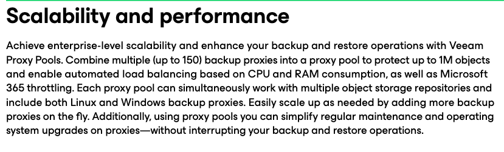
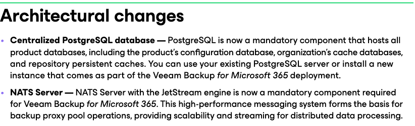
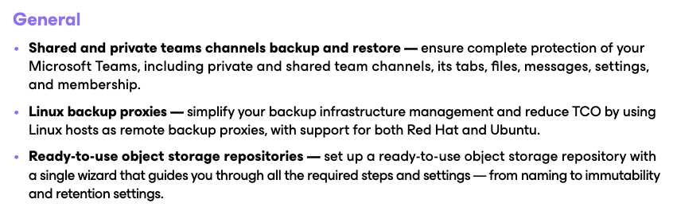
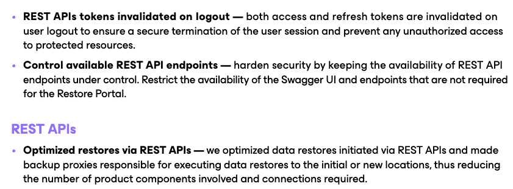
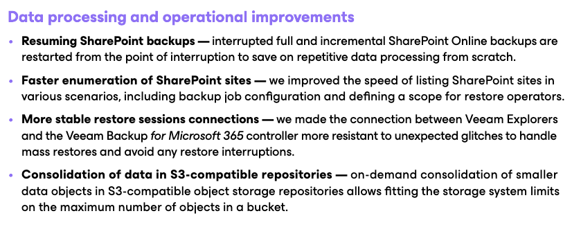
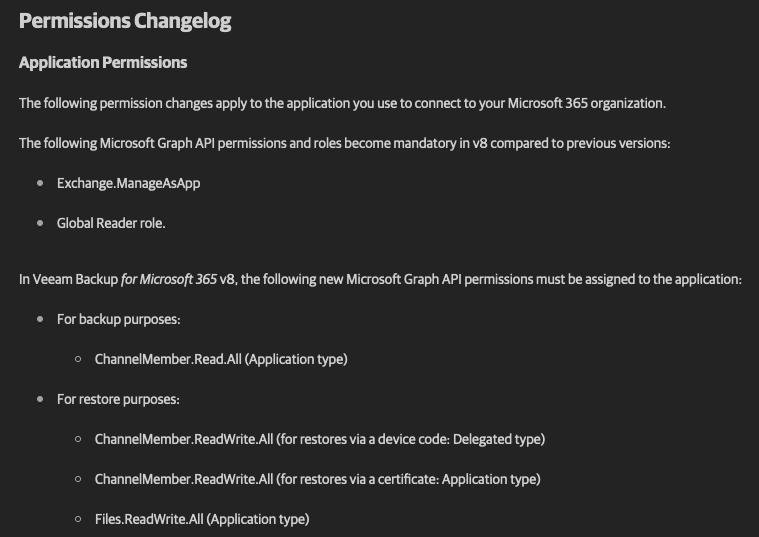
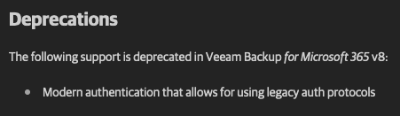

+++
title = "Veeam Backup for Microsoft365 v8 Release Thoughts"
date = "2024-09-03T09:48:30Z"
draft = false
tags = [ "nats", "postgres", "VB365", "veeam", "whats_new",]
categories = [ "Veeam",]
+++

Today Veeam released the long awaited version 8 of their Microsoft365 Backup product commonly referred to as VB365. I've had the opportunity to be somewhat involved in some of the new capabilities of this release and I'm excited to see it released. This version will not only have the normal complement of new features and capabilities but also some significant architectural changes that should make it more usable for the large enterprise and service provider customer bases.

In this post I'm going to go through the [What's New](https://www.veeam.com/veeam_backup_m365_8_whats_new_wn.pdf) and [Release Notes](https://helpcenter.veeam.com/rn/veeam_backup_m365_8_release_notes.html) documents and provide a bit of insight about some of what it particularly impactful to me. As also you should keep the [user guide](https://helpcenter.veeam.com/docs/vbo365/guide/vbo_introduction.html?ver=80) handy as well but we'll focus on the shiny for now.

First and foremost I think of this release as a scalability release and I believe Veeam does as well. While there are new data protection capabilities the focus is making it more performant for more customer personas. At the top of the ways they are doing that is through the concept of proxy pools. Before each job you created mapped to a single repository which then mapped to a single proxy/worker machine. These proxies are compute wise "expensive," typically 8 vCPU, 32 GB of RAM and each maintained a metadata cache in a jetDB. This could be problematic in a number of ways; in sizing knowing how many "objects" you have assigned to a given proxy, in processing if you have a noisy neighbor it can make the proxy server less performant for other workloads, etc.

With proxy pools the concept is that each repository (object storage only) is still related to a job but it's proxy relationship is now to a pool of proxies allow it to be more ephemeral and only make a relationship to a given proxy at the time of job kick off, resulting in better performance and scalability. VB365 itself will look at the pool and decided which proxy to put a job run onto based on performance at the time. If you find you've over assigned a given proxy pool you can simply add more proxies to the pool up to the 150 maximum mentioned in the What's New. Considering the Veeam best practice is up to 4,000 objects per proxy (i personally prefer to stay in the 2,000 range to allow for the unknown) that's 300,000- 600,000 per proxy pool!

Another consideration in regards to proxy pools and performance is that you can have multiple proxy pools per VB365 server. Those of us have known for quite a while that Exchange based workloads (Mail) and Sharepoint based workloads (Sharepoint, OneDrive for Business, Teams) perform differently so for those operating at scale you may want to consider having 2 separate pools and dividing between them based on workload type.

You know how I mentioned above that you in previous versions VB365 maintained a JetDB with the metadata cache on each proxy for the repositories it manages? Well in order to make that more transient it requires large scale architectural changes that should pay dividends moving forward. First off all of that metadata for the repositories but also the configuration DB is being moved to a PostgreSQL instance. Much like how Veeam Backup &amp; Replication the default is to install Postgres right onto the controller server it is also possible to build it on another VM/elsewhere (on Linux, in a cloud DB service, etc.) and then link the controller to it during upgrade/install. There is also a powershell cmdlet ([`set-VBOPSQLDatabaseServerLimits`](https://helpcenter.veeam.com/docs/vbo365/powershell/set-vbopsqldatabaseserverlimits.html?ver=80)) that will right size the Postgres settings for the size virtual machine you are running it on. I've written on [how to do external Postgres for Veeam](https://www.koolaid.info/postgresql-on-ubuntu-2022-4-installation-configuration-for-veeam-purposes/) before and that's still very much so relevant to this.

The second change needed to make proxy pooling work is to implement some form of a message queue. There are many of these out there, [AWS SNS](https://aws.amazon.com/sns/), [Azure Service Bus](https://azure.microsoft.com/en-us/products/service-bus/), [RabbitMQ](https://www.rabbitmq.com/) all come to mind but Veeam has chosen to go with the open source [NATS.io](https://nats.io/) project for it's needs. NATS will essentially allow Veeam to treat each M365 item (think email message or document level) as a task to be handled independently to allow for fault tolerance of the proxies in the pool and to handle the management of those tasks. Again, by default the Windows version of NATS will be installed on the controller VB365 system but you can also pre-build this as a standalone external system or even a cluster depending on the size of the environment.

Even as we get into the "other" features we have soem real bangers to lead off. I'm going to rearrange their order a bit because to me the Linux backup proxies is massive. As you can have 10s if not 100s of proxies in a given environment that is a lot of cost uplift to put Windows licensing on to every single one of those proxies. Linux based proxies also are typically also more accepting of IaC or DevOps methodologies allowing for better uptime and management. One thing I'll call out from other notes is that the Linux proxy is reliant on the Microsoft feed of the dotnet runtime as opposed to the version that's available in the Ubuntu package manager. Microsoft themselves have [depreciated this capability](https://learn.microsoft.com/en-us/dotnet/core/install/linux-ubuntu) so at this time you cannot setup a Linux Proxy on Ubuntu 24.04.

Prior to this release in the modern API era of Teams backup support Veeam has only protected the Channel based chats. With this release they are adding support for shared and private teams chats as well. Be mindful though that because they used the metered Teams Export Graph APIs for there will be in some cases significant costs related to protecting this data. I'm not saying you shouldn't do it, but just be aware.

Finally Veeam has got around to simplifying the process to adding Object Storage as a repository to VB365. It used to be you had one workflow to add the object storage and another to make it a repository. That's now 1 step.

As my employer works heavily with the Veeam APIs to deliver a console wrapper for this and other services I'm happy to see quite a few optimizations in regards to VB365's APIs. Starting with the bottom in the screenshot above they've pushed restore operations (for Rest API initiated restores only) out to the proxies as just another task. Before and still when done with the console or Powershell the restores actually have to flow through the controller VM, creating a noisy neighbor situation.

The top two above have to do with API security which means a great deal in 2024. Invalidating tokens at logout is always a best practice and because the API and the swagger document both share the same access port (8443) being able to limit access to those is very helpful.

I completely agree with Veeam here that the top 2 items are being able to resume SharePoint backups and faster enumeration of sites. I'll be honest everybody, I see a very wide range of Microsoft365 customers making questionable decisions when it comes to their architecture and almost every single one of them has to do with Sharepoint. These deal with both sides of the coin; either customers will create "monster" sites with millions of objects that take forever to backup, thus running into job run limits, or they create sites for every single project or thing and find themselves with thousands of sharepoint sites that then have to be managed and protected. I am hopeful that these will help.

We'll skip over the restore session connnections for now even though they are important and I'd like to say I'll be very interested to see what the consolidation data in S3-compatible repositories looks like. I have to think that this is targeting on premises options such as Object First, Scality and Ceph which often have more stringent limits on the number of objects you can have in a bucket but I'll be interested to see how that plays out with cloud based solutions that leverage the same technology such as [Wasabi](https://wasabi.com/) or [Backblaze B2](https://www.backblaze.com/cloud-storage) but also have either metered API calls or a fair use policy around them.

Quickly turning to the release notes, while I've covered a few things in talking about the What's New the section about new permissions required to the Microsoft365 tenant are worth discussing. There are quite a few new permissions that will be required to successfully backup your organization with this new version. This is a simple fix though, once you have updated your environment you will simply need to right click your organization, choose Edit and re-walk through the registration process. As it completes it will use your existing Azure application and update permissions as needed.

Finally this shouldn't be a thing for anybody anymore but if by chance your M365 organization still works using any form of the username and password method of adding before (what's called Basic authentication or basic+modern auth) then that will all now be impossible with the new version (well, outside of China). Be sure to validate that you are fully using modern authentication only prior to upgrade for a seamless process.

## Conclusion

I'll be honest, I have been looking forward to this release for well over a year as it is going to (hopefully) solve many of the problems that my company and anybody who has to deal with VB365 at scale have to deal with. I'm excited to get in the lab and start this party rolling!