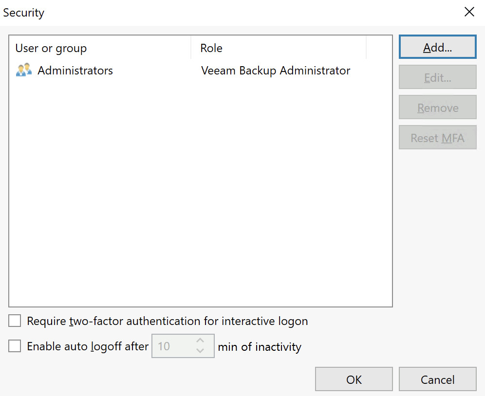
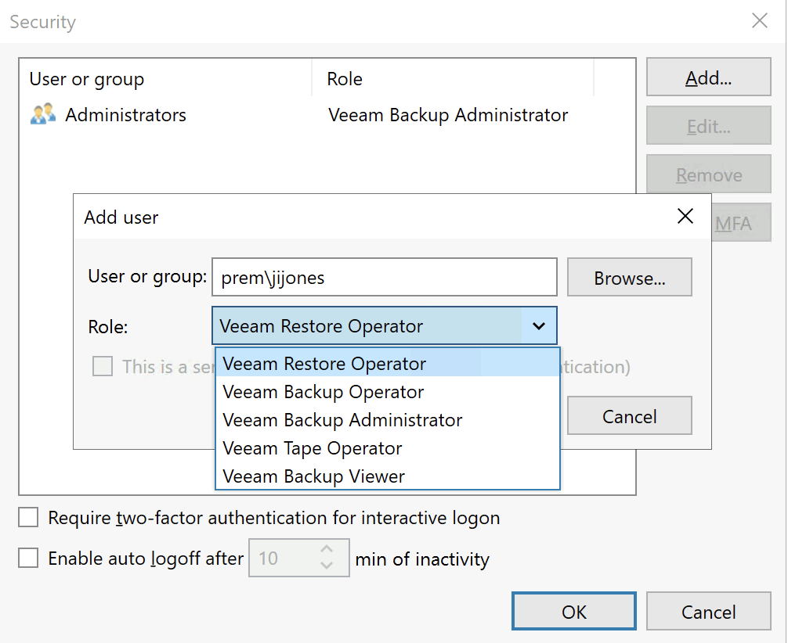
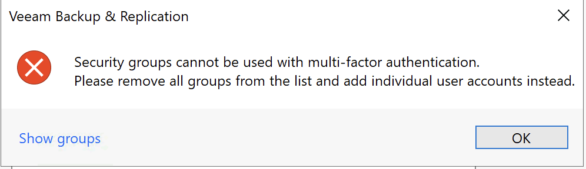
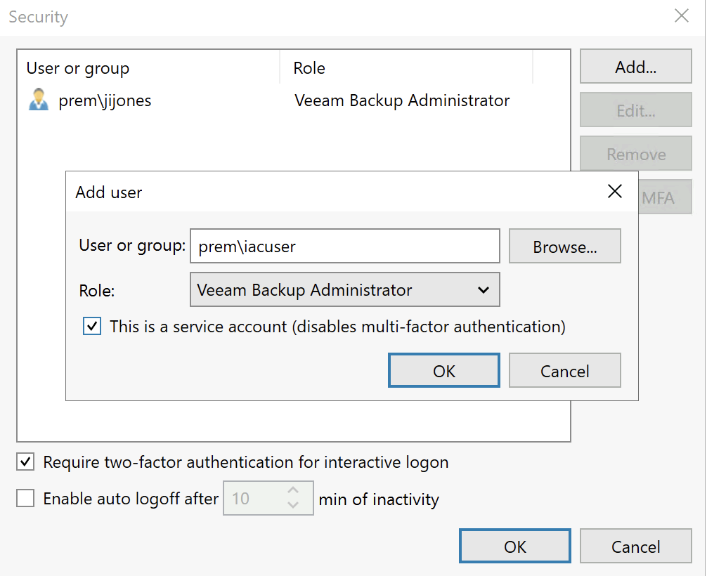
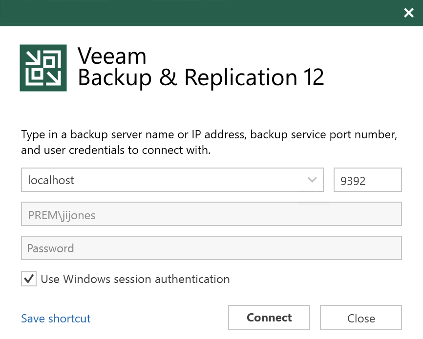
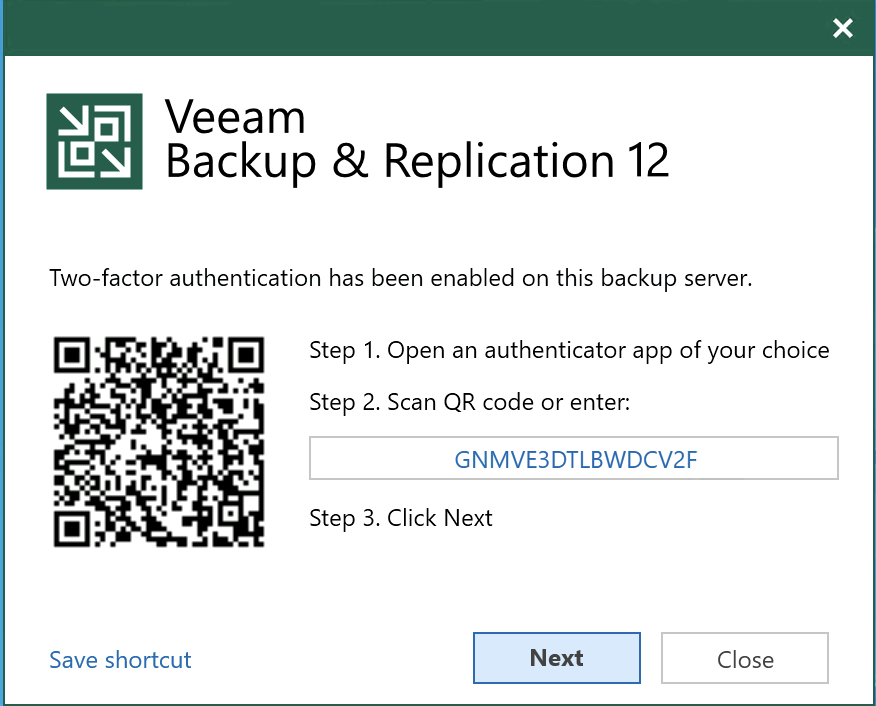
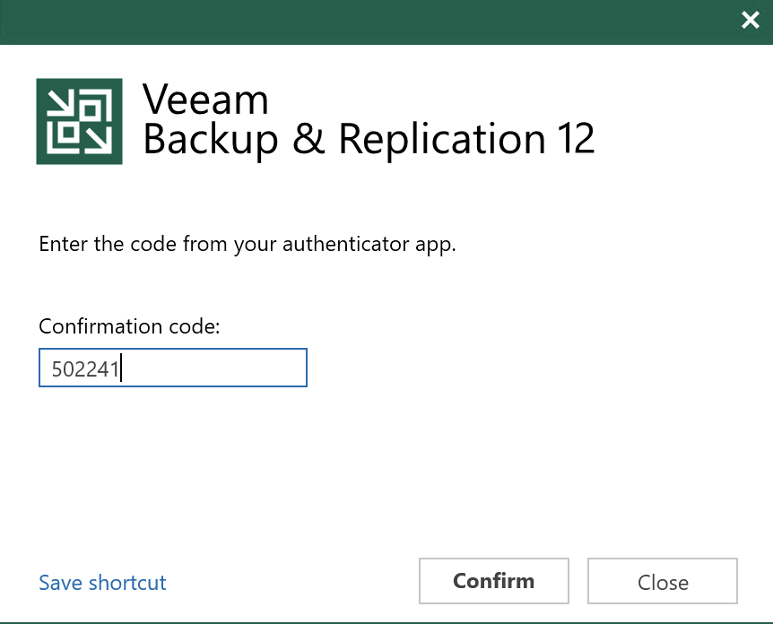

+++
title = "Veeam v12: MFA All The Things (part 1)"
date = "2023-02-14T09:00:00Z"
draft = false
tags = [ "mfa", "security", "v12 launch", "veeam", "Veeam Vanguard",]
categories = [ "Security", "Uncategorized", "Veeam",]
featureimage = "featured.png"
+++

In the time of ransomware and and cybersecurity attacks being in the news almost daily things like our disaster recovery applications have to start taking those protections very seriously. Often the easiest rung to reach in terms of good application security is having [Multi-Factor Authentication (MFA)](https://www.cisa.gov/publication/multi-factor-authentication-mfa) required for logins. For most MFA is old hat but for those unfamiliar modern MFA can take various forms including:

- [SMS One Time Passcode (OTP)](https://www.okta.com/blog/2020/10/sms-authentication/): codes that are pushed from the website to you via SMS text messages. Better than nothing but easily spoofable.
- OTP Apps: apps such as [Google Authenticator](https://googleauthenticator.net/), [Authy](https://authy.com/download/) or [1password](https://1password.com/) that provide the codes based on scanning a QR code typically to setup then using your mobile device to generate the code
- Push MFA: apps such as [Duo](https://duo.com/) or [Gmail](https://gmail.com) that when you authenticate it triggers a push notification to a particular instance of a mobile app that is also authenticated

With Veeam's [upcoming v12 release](https://go.veeam.com/v12) of Veeam Backup and Replication they are now supporting [OTP App MFA](https://helpcenter.veeam.com/archive/backup/120/vsphere/mfa.html) in their console application. This takes a little bit of setup and in my particular case is a little quirky to setup but it does definitely work. Let's walk through how to put this in effect.

## Enable MFA in VBR v12

1\. Once you have v12 Console installed, either the local or remote version, open it and navigate to Users and Roles

2\. MFA in VBR is not supported with any use of groups. By default members of the local Adminstrators group are given the Veeam Backup Administrator role so we need to start by adding your own login first. You can do this with the Add... button.

If you weren't already aware you'll notice that there are number of roles that can be selected. More information about what each of these can do is available in the [helpcenter documentation](https://helpcenter.veeam.com/archive/backup/120/vsphere/users_roles.html).

***Bug:*** One other thing I'll add here is that I noticed a quirk in some of our setups. If you use the browse method and if for some reason the NetBIOS domain is not just the portion before the first dot in the FQDN domain (for example prem for prem.lab.internal) then by default the User or group in the blank above is filled in incorrectly. In a few of our test environments we use the full FQDN without the dots as the NetBIOS name and it led to some issues that were easily fixed by just typing the correct domain in the blank. This feedback has been shared and I imagine it will be fixed before GA.

2a. If by chance you do not remove the groups before enabling MFA and hitting OK you will be presented with an error. Again, simply remove the groups to get past this.

3\. It is important to understand that once you protect an account with MFA you will not be able to use it with automation methods such as PowerShell. To allow for this you will need to create an automation specific user, preferably with a very robust and often changed password, and set it in VBR as a service account to disable MFA. Complete adding your needed users and check the "Require two-factor authentication for interactive logon" to complete the server setup portion.

4\. Once you setup your accounts in Veeam Console you will need to close out and relaunch to get into the MFA registration wizard. You would do this as you normally would, either using Windows session authentication or filling in the username and password.

5\. Once you hit Connect you will get the standard MFA QR code for registration. Simply open the app of your choice and add by scanning the QR code then supply an active confirmation code to complete setup.

And with that you have now enabled 2 factor authentication for your Veeam Backup and Replication Users. You can potentially increase this further by not giving permissions to the user's Windows logon account but instead doing a secondary, application specific account making them type in a username and password in step 4 above. With that you would have to authenticate to Windows, authenticate to Veeam and then provide an MFA code. That would all just depend on your organization's security needs.

## Conclusion

At the end of the day security practices should be a part of everything we do as IT and Disaster Recovery administrators. Little things like requiring MFA for our critical backups add up to a well design, layered security model.