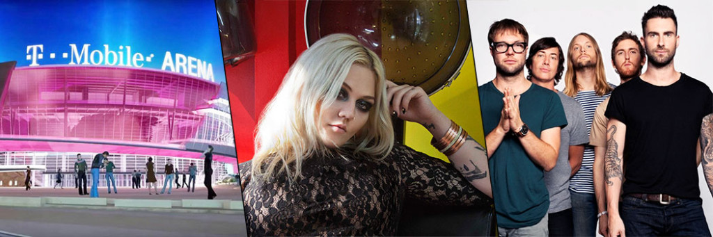
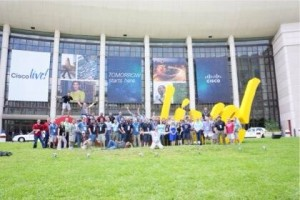

+++
title = "Vegas Baby! Heading to CiscoLive! 2016"
date = "2016-04-13T09:03:48Z"
draft = false
tags = [ "cisco", "CLUS", "community", "conferences",]
categories = [ "Education", "Networking",]
featureimage = "featured.png"
+++

As 2016 moves into April we find ourselves ready to go into the conference season once again. For the past couple of years I've been to VMworld because that is where my work has had me focused, but for the same reason I will be heading the [Cisco Live](http://www.ciscolive.com/us/?cid=000925706) in Las Vegas, NV this year. The event will be held at the Mandalay Bay Resort July 10-14. Yes it will be hot, but let's be honest you are going to be inside most of the time. This is the 2nd time I've attended Cisco Live US (you may see it referred to as #CLUS quite a bit) and if this is anything like the last time it's going to be great. I have been particularly impressed with the content they make available and the community that has grown around it. **What to do** The first and foremost thing you should check out at Cisco Live is the always excellent sessions throughout the conference. If you are new to conferences this is actually something to consider sooner than later; the [session catalog is currently up](http://www.ciscolive.com/us/learn/sessions/session-catalog/?cid=000925706) and the scheduler will open on May 3. I recommend that if you have any particular sessions or focus you are looking at with this trip go ahead and have a list done early and then be ready on the 5/3, many popular sessions will fill up quickly and nobody wants to wait in the overflow line. ;) To be honest if you just look at the scope of topics covered in the session list it is a bit overwhelming. While I'm no grizzled veteran of conferences by any means what I've found best is to pick a focus or two and then start there. For example this year we have a big focus on upgrading our edge security and our production datacenter to include Cisco UCS solutions. What sessions I pick will almost entirely be from either the Security and Datacenter &amp; Virtualization tracks to support those goals. Keep in mind all of these sessions will be available to you online after the fact so keep in mind the people giving them as well.  If you have never been to one of the major tech conferences (20k attendees and up) there is never really a shortage of things to do, ranging from the educational to the social to just straight fun. Cisco Live is in my opinion a great event with a better than most mix of content and social, the highlight of which is the [Customer Appreciation Event](http://www.ciscolive.com/us/activities/customer-appreciation-event/?cid=000925706). The CAE this year will be held at the T-Mobile Arena and features concerts with Maroon 5 and Elle King. I saw Maroon 5 in a very cold field a couple of years ago and they are a pretty good show and I've really liked what I've heard from Elle King on the radio. Besides the concert event there will be no shortage of things to do if you are socially inclined. Besides the [mixers each evening](http://www.ciscolive.com/us/activities/exhibitors/#receptions/?cid=000925706) there are a wide array of events from different vendors in the Cisco ecosystem each evening. Many of these are by invite only so now would be an appropriate time to be reaching out to Account Execs you have at the various vendors and see if they are doing anything there. **Go forth and be social** This will be my 6 tech conference in 4 years and while the content of the sessions is great and extremely helpful like I mentioned above all of that content is available online, 24/7/365 after the conference. What is not is the ability to meet and have conversations with some of the best minds of our chosen field. My very first major conference was CLUS 2013 in Orlando, FL and as I got myself out of my shell and started to meet people I was frankly floored by the combined brain power in such a small area. The way I've often put this to people is that the entire state of West Virginia, where I am from, has a total of 3 CCIEs in it. While this is not a normal demographic, there are only 50,000 some worldwide. At one point that first year I found myself sitting in a discussion where out of 20 people I was the only person NOT a CCIE and really it is amazing what you can absorb in the social settings at Cisco Live. If you are willing to put yourself out there and not be the cave-dwelling geek many of us are naturally drawn to be you will find a community of people who will readily accept you in. So how do I find such social people and befriend them? Well fear not there are plenty of ways. To start with if you are just starting out in your tech career the very first advice is to get yourself on twitter if you haven't already. I literally setup my twitter account walking down the main concourse of CLUS 4 years ago and it has presented no end of enjoyment, help and opportunity since. Once you have said account head on over to Tom Hollingsworth's site and sign yourself up for the [annual twitter list](https://networkingnerd.net/cisco-live-2016-twitter-list/). Now that you are in the social mood right off the bat one of the first places I will be locating is the Social Media Hub. This is pretty much the main congregation area for the socials types. At some point in the early evening Sunday there will be an opening Tweetup there, if you attend be sure to say hi! If you are interested in going yourself but haven't registered yet you can do so [on the Cisco Live 2016 website](http://www.ciscolive.com/us/registration-packages/?cid=000925706).