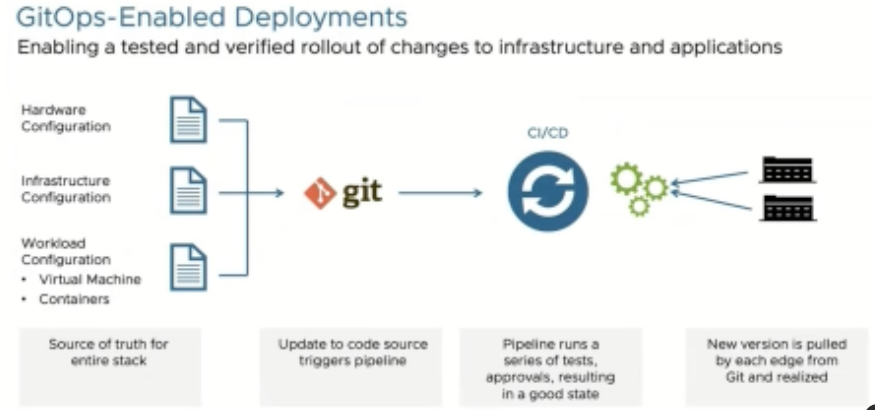

+++
title = "VMware Edge Cloud Orchestrator: VMware For The Very Small Masses"
date = "2024-10-05T08:43:47Z"
draft = false
tags = [ "edge", "efd3", "tech field day", "virtualization", "vmware",]
categories = [ "Automation", "Virtualization",]
featureimage = "featured.png"
+++

> *Not everybody who needs on-premises virtualization and wants to use VMware vSphere needs full blown VCF.* ~Me

That leading quote is just as jump off the page as VMware's presenters, [Alan Renouf](https://www.linkedin.com/in/alanrenouf/) and [Chris Taylor](https://www.linkedin.com/in/christaylor17/), ask that we forget everything we know about Broadcom's acquisition of VMware. This was done during their presentation at [Edge Field Day 3](https://techfieldday.com/event/efd3/) about their product, [VMware Edge Cloud Orchestrator (VECO)](https://www.vmware.com/products/software-defined-edge/edge-compute/stack). The reason being that Cloud Edge Orchestrator does not work, either in technology or licensing, like it's much more publicized sister product [VMware Cloud Foundation](https://www.vmware.com/products/cloud-infrastructure/vmware-cloud-foundation).

As someone thinking about the edge but who has also worked as both a SMB virtualization administrator and now working in the managed cloud space VECO presents a very interesting use case in my mind for both the edge but also the very small SMB company. In this post I'll cover a bit about what VMware Edge Cloud Orchestrator is and how it can be used to help your organization

## What Is VECO Anyway?

VMware Edge Cloud Orchestrator is built upon the basic VMware hypervisor ESXi and can make use of technology such as VSAN but that is where the similarities end. To start with the ESXi build is customized for VECO, allowing for remote acceptance into the management overlay which comes in both SaaS and On-Premises varieties. This image is designed for minimal footprint as the hosts at the edge are largely far smaller in both size and capability than their datacenter cousins, the example given that many will have just 16 GB of RAM. While ESXi is minimized it still supports robust capabilities, capable of serving out both virtual machines and containers to support your workload's needs and modernization.

The mentioned management overlay is where I think the true differentiator lives. As opposed to the vCenter server that we all know and love these hosts report directly to the SaaS service in most cases today. While there is no right click &gt; create virtual machine native capability the configuration of both the hosts as well as any workloads that run on them is provided by Infrastructure as Code style deployment, with each virtual machine or container deployed and managed via a git repositories through CI/CD pipelines. Some example workloads and configurations can be found in Alan's [GitHub repository](https://github.com/alanrenouf/ECSExample).

While I appreciate the focus on a more modern deployment mechanism that allows for zero touch orchestration I do wish that VMware would have leaned on their pointy clicky past here to allow for modernization of administrators themselves. By all means, back the configuration of workloads with GitOps but if administrators were to be able to define those workloads via UI and have it spit out well formatted YAML files out the back can you imagine the evolution those admins would have?

## Applications For VECO

VMware's Edge Cloud story is somewhat similar to others in the market today. Fist is to maintain support for current use cases for compute at the edge including retail, manufacturing automation management, or sensor data gathering and pruning. They further want to be able to support next generation applications that are more modernized and distributed, allowing for more resilient application design. Where VMware differentiates is that in the full VMware Cloud Edge Stack is that this can be married with their Velocloud SD-WAN business to have one holistic solution from demarc through application. In this way it's a mature, well thought out solution for the widely distributed edge need.

I will add that I am interested in looking at this for another angle, the traditional ultra small SMB organization largely managed by a MSP or SaaS. Think of your local coffee shop, a boutique or a book store. These today run their businesses on a never-ending series of SaaS applications or the owner's laptop with varying levels of success. Further because they know they have a captive market these services continue to go up in price at an impressive rate. As we've seen in the datacenter this has created a market for ambitious organizations to consider repatriation from the cloud and in this case I could see a MSP with VMware competency using the multi-tenant nature of VECO and velocloud to design and manage ultra small datacenters for these small businesses at a reasonable cost.

## Conclusion

VMware's Edge Cloud Stack is the segment of their product portfolio that doesn't look like the others and as such you should consider taking a look. I think for any small case this solution could be considered appealing as it will get you past the some of the things that make VMware less appealing in its modern form at the small end of the scale. With a well defined, multi-tenant management overlay, integration to a edge neworking solution and Infrastructure as Code first mentality this solution seems ripe for use by either the distributed enterprise or the Managed Service Provider.