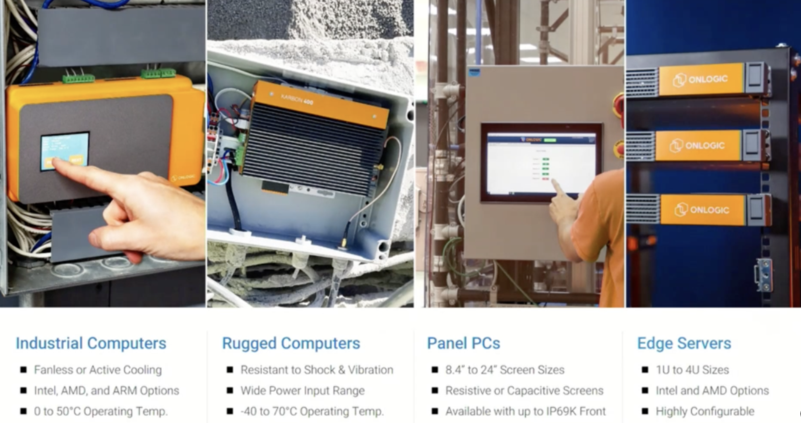
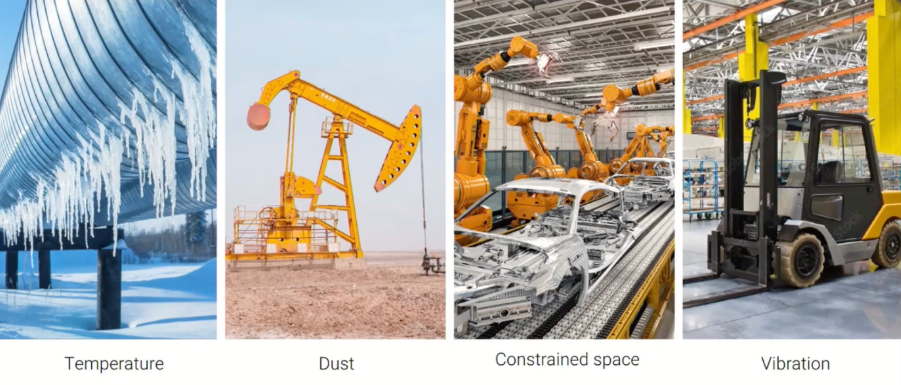

+++
title = "What Problems Are Modern Edge Computing Solving For?"
date = "2024-10-01T09:23:15Z"
draft = false
tags = [ "edge", "efd3", "onlogic",]
categories = [ "Automation", "Tech Field Day",]
+++

I was recently honored to be selected as a delegate at the [Futurum Group](https://futurumgroup.com/)'s [Edge Field Day 3](https://techfieldday.com/event/efd3/) event in Santa Clara, California. There we heard from companies about their solutions and products that pertain to this smaller but ever growing segment of the enterprise IT landscape.

In the next few posts I'll cover those companies visions specifically but before we get to that I think it is worth discussing the common issues that they are all trying to solve. While each of these companies are differentiated in their solution to the needs of computing in remote places there are many commonalities that came through as to what is seen as the challenges before them.

## What is Edge Computing

In the Datacenter or the cloud the edge is that firewall or gateway you have setting between your widespread storage and application estate and the big, bad Internet. For those who are working in Edge computing they are more concerned with ensuring that applications and data are available in a distributed manner that allows for processing to be completed where it's created and then siphoned upstream for collation and analysis.

Before we start defining problems it's worth calling out some normal use cases for edge computing. As we said edge computing exists outside of our normal boundaries. These use cases can be anything from an evolution of how we handle remote retail locations and traditional Remote Office, Branch Office (ROBO) to more modern use cases including manufacturing, agricultural monitoring and management and even smart car enablement.

In all of these use cases one solution commonality that I found during the course of the presentations is that most of the software based solutions either already had a defined partnership with [OnLogic](https://www.onlogic.com/) or are in the process of it because they've solved the hardware problem for most if not all of the edge use cases. It was a great presentation that highlighted a company that puts customer and partner success above all else, finding solutions to some frankly hard problems.

## Problem #1: Be Lightweight

The first thing that was consistently stated was that physical devices you deploy in these remote locations, regardless of the use case, will need to be lightweight. In the Datacenter it is common for us to consider hundreds of GB of RAM and dozens of CPU cores per host as well as access to specialized cooling and 3 phase power the norm. In edge deployments this often can be a couple of small consumer units thrown on a shelf in a closet or embedded in industrial controllers, in neither case do you have space or support systems to allow for power. Often designs today are around ultra small form factor units such as those from OnLogic, purpose built for the solution to provide sufficient capability in an efficient manner.

## Problem #2: Resilience

When you deploy computing to the edge you are most likely going to find yourself dealing with new environmental concerns that you don't typically in the Datacenter. First off is these locations often rely on connectivity that includes WiFi or 5g which will not always be available. As such you have to design systems as well as applications to handle being offline for periods of time.

Next is the true environmental concern, these compute and storage nodes are often deployed in locations that deal with complications like extreme heat or moisture. Again this is another place where OnLogic truly shines, allowing for all the power that the solution needs in highly resilient system designs that are often fanless and sealed to allow for deployment where ever needed.

Finally we come back to the fact that these things can be just sitting on a shelf in a closet so physical loss through theft or disaster is a very real possibility. In that case the devices should be well secured and monitored so any loss can be mitigated and reported.

## Problem #3: Dealing with the Past, Building for the Future

Today's Edge computing in many ways is an evolution of the old ROBO solutions we as IT Pros have been deploying for decades at this point. Whether it's a SD-WAN device with an IP phone, printer and laptop behind it for home workers or a small Windows server running SQL server and various applications for Point of Sale and Inventory Management Edge Computing vendors have figured out that their solutions often have things that came before them and they have to support a path to migrate legacy systems. In the 2 days at EFD3 every single company providing edge compute was supplying mixed support for both Virtual Machines as well as containers.

The virtual machines are designed to be transient in most solutions, a short term solution to allow workloads to be migrated to modern hardware while the applications they provided were modernized piece by piece to more cloud native options. I'll make an argument that in my experience this short term solution will often become more long term than anybody would like them to be due to just the nature of how enterprise systems often crawl but I'll save that for another post.

But once these short term workloads are migrated the bread and butter of any of these edge computing solutions is to leverage containerized applications to allow for both security requirements and to make the applications as lightweight as possible. While Kubernetes is what you hear the most of in the Datacenter at the edge the preference seems to be more towards treating each host as an island and letting the applications provide their own resiliency between hosts and the cloud.

## Problem #4: Work at Scale

The last common problem to be covered in this post would be that these solutions need handle at scale. For all the talk in the Datacenter over the years about breaking down silos and minimizing effort to support I was very impressed to see the 3 different management overlays for potentially globally distributed edge nodes and how they can be easily templatized to allow for easy of management.

Much like how we approach remote work computing requirements you will rarely have IT staff available where the edge nodes are, meaning that you'll have to rely on your centralized support teams, monitoring and a well used shipper account. As we look at the software side of presenting organizations at this event, [Avassa](https://avassa.io/), [VMware](https://www.vmware.com/products/software-defined-edge/edge-cloud-orchestrator), and [Zededa](https://zededa.com/), they each look to leverage Infrastructure as Code principles to allow for that centralized, light touch management, where a box can be drop shipped, plugged in and then build itself once accepted into the organization. When this is paired with sufficient monitoring and alerting you can really go a long way towards making both the admins of these systems and the consumers lives better.

## Conclusion

In the end while there are many solutions in the market today for handling Edge Computing at scale they are all trying to solve a common set of problems that are somewhat unique to the the Edge use cases. While I'm not going to necessarily worry about my Datacenter being in the Midwestern sun I may well worry about that when it's tied to an irrigation monitoring system. In addition to their common problems on the hardware side they are finding a common solution to the hardware problem in partnering with OnLogic to build purpose-built solutions for a wide variety of use cases.