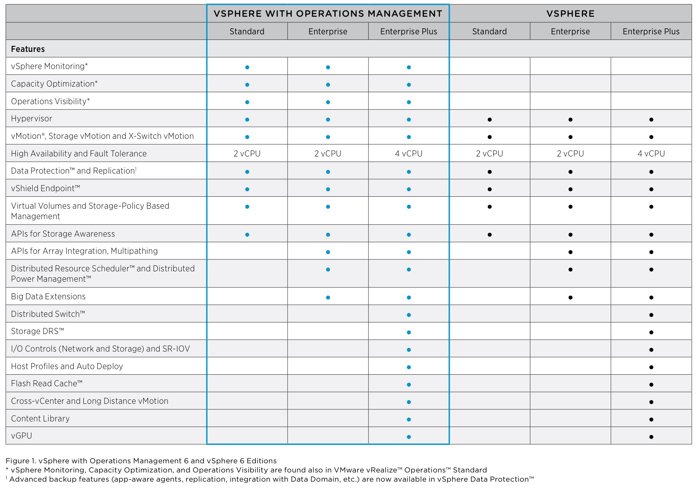

+++
title = "What&#8217;s New in vSphere 6: Licensing"
date = "2015-02-02T18:45:13Z"
draft = false
tags = [ "announcements", "virtualization", "vmware", "vSphere", "vsphere 6",]
categories = [ "Virtualization",]
featureimage = "featured.jpg"
+++

Today's release of vSphere 6 brings about quite a few new technologies worth getting excited for. This includes things such as Virtual Volumes (VVOLs), Open Stack Integration, global content library and long distance vMotion. Now for many of us, especially in the SMB space, the question is can we afford to play with them. As usual VMware very quietly released the [licensing level breakout](http://www.vmware.com/files/pdf/products/vsphere/VMware-vSphere-Pricing-Whitepaper.pdf) of these and other new features and I have to say my first take is this is another case of the rich getting richer.

If you are already Enterprise Plus level licensed you are in great shape as everything discussed today except VSAN is included. Specifically this includes

- cross vCenter/ long distance vCenter
- Content Library
- vGPU
- VMware Integrated OpenStack

While that's great and all and I applaud their development, they have quite a few other licensing levels that have been left out. Personally my installations are done at either Standard or Enterprise levels. The only major feature with across the product line support is VVOLs, which is nice but I honestly expected them to at least move some version 5 features such as Storage DRS down a notch to the Enterprise level and I figured the Content Library would maybe come in at the Essentials Plus level or Enterprise.

As Mr. Geitner alluded to in his talk about half of all vSphere licenses are Enterprise Plus, my guess is the company really want to see that number grow. Here's to hoping that like vRAM this recent trend of heavily loading features into the highest level is a trend that will be quickly rectified because I think this is going to be just as popular.