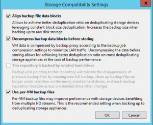
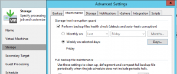

+++
title = "Windows Server Deduplication, Veeam Repositories, and You!"
date = "2017-01-31T11:12:59Z"
draft = false
tags = [ "how to", "veeam", "Veeam Vanguard", "virtualization",]
categories = [ "Virtualization",]
featureimage = "featured.jpg"
+++


Backup, among other things, is very good at creating multiple copies of giant buckets of data that don't change much and tend to sit for long periods of time. Since we are in modern times, we have a number of technologies to deal with this problem, one of which is called deduplication with quite a few implementations of it. Microsoft has had server-based storage versions since Windows 2008 R2 that has gotten better with each release, but as any technology still has its pitfalls to be mindful of. In this post I'm going to look a very specific use case of Windows server deduplication, using it as the storage beneath your Veeam Backup and Replication repositories, covering some basic tips to keep your data healthy and performance optimized. **What is Deduplication Anyway?** For those that don't work with it much imagine you had a copy of War and Peace stored as a Word document with an approximate file size 1 MB. Each day for 30 days you go into the document and change 100 KB worth of the text in the document and save it as a new file on the same volume. With a basic file system like NTFS this would result in you having 31 MB tied up in the storage of these files, the original and then the full file size of each additional copy. Now let's look at the same scenario on a volume with deduplication enabled. The basic idea of deduplication replaces identical blocks of data with very small pointers back to a common copy of the data. In this case after 30 days instead of having 31 MB of data sitting on disk you would approximately 4 MB; the original 1 MB plus just the 100 KB of incremental updates. As far as the user experience goes, the user just sees the 31 files they expect to see and they open like they normally would. So that's great when you are talking about a 1 MB file but what if we are talking about file storage in the virtualization world, one where we talking about terabytes of data multi gigabyte changes daily? If you think about the basic layout of a computer's disk it is very similar to our working copy of War and Peace, a base system that rarely changes, things we add that then sit forever, and then a comparatively few things we change throughout the course of our day. This is why for virtual machine disk files and backup files deduplication works great as long as you set it up correctly and maintain it. **Jim's Basic Rules of Windows Server Deduplication for Backup Repositories** I have repeated these a few times as I've honed them over the years. If you feel like you've read or heard this before its been part of my VeeamON presentations in both 2014 and 2015 as well as part of blog posts both here and on 4sysops.com. In any case here are the basics on care and feeding your deduplicated repositories.

1. **Format the Volume Correctly.** Doing large-scale deduplication is not something that should be done without getting it right from the start. Because when we talk about backup files, or virtual disks in general for that matter, we are talking about large files we always want to format the volume through the command line so we can put some modifiers in there. The two attributes we really want to look at is **/L** and **/A:64k**. The /L is an NTFS only attribute which overrides the default (small) size of the file record. The /A controls the allocation unit size, setting the block size. So for a given partition R: your format string may look like this: ```
    format R: /L /A:64k /V:BackupRepo1
    ```
2. **[



](Per-VM.png)Control File Size As Best You Can.** Windows Server 2012 R2 Deduplication came with some pretty stringent recommendations when it came to maximum file size and using deduplication, 1 TB. With traditional backup files blowing past that is extremely easy to do when you have all of your VMDKs rolled into a single backup file even after compression. While I have violated that recommendation in the past without issue I've also heard many horror stories of people who found themselves with corrupted data due to this. Your best bet is to be sure to enable Per-VM backup chains on your Backup Repository (Backup Infrastructure&gt; Backup Repositories&gt; \[REPONAME\] &gt; Repository&gt; Advanced).
3. **Schedule and Verify Weekly Defragmentation.** While by default Windows schedules weekly defragmentation jobs on all volumes these days the one and only time I came close to getting burnt but using dedupe was when said job was silently failing every week and the fragmentation became too much. I found out because my backup job began failing due to corrupted backup chain, but after a few passes of defragmenting the drive it was able to continue without error and test restores all worked correctly. For this reason I do recommend having the weekly job but make sure that it is actually happening.
4. [



](Storage-level-corruption-guard.png)**Enable Storage-Level Corruption Guard.** Now that all of these things are done we should be good, but a system left untested can never be relied upon. With Veeam Backup &amp; Replication v9 we now have the added tool on our backup jobs of being able to do periodic backup corruption checks. When you are doing anything even remotely risky like this it doesn't hurt to make sure this is turned on and working. To enable this go to the Maintenance tab of the Advanced Storage settings of your job and check the top box. If you have a shorter retention time frame you may want to consider setting this to weekly.
5. **Modify Deduplication Schedule To Allow for Synthetic Operations.** Finally the last recommendation has to do more with performance than with integrity of data. If you are going to be doing weekly synthetic fulls I've found performance is greatly decreased if you leave the default file age before deduplication setting (3 or 5 days depending on version of Windows) enabled. This is because in order to do the operation it has to reinflate each of the files before doing the operation. Instead set the deduplication age to 8 days to allow for the files to already be done processing before they were deduplicated. For more information on how to enable deduplication as well as how to modify this setting see my [blog over on 4sysops.com](https://4sysops.com/archives/how-to-install-data-deduplication-in-windows-server-2012-r2/).
 
 Well with that you now know all I know about deduplicating VBR repositories with Windows Server. Although there is currently a [bug in the wild](https://forums.veeam.com/veeam-backup-replication-f2/corrupted-files-on-win2016-deduplication-t40406.html) with Server 2016 deduplication, with [a fix available](https://support.microsoft.com/en-us/help/4011347/windows-10-update-kb3216755), the latest version of Windows Server shows a lot of promise in its [storage deduplication abilities](https://technet.microsoft.com/en-us/windows-server-docs/storage/data-deduplication/whats-new). Among other things it pushes the file size limit up and does quite a bit to increase performance and stability.